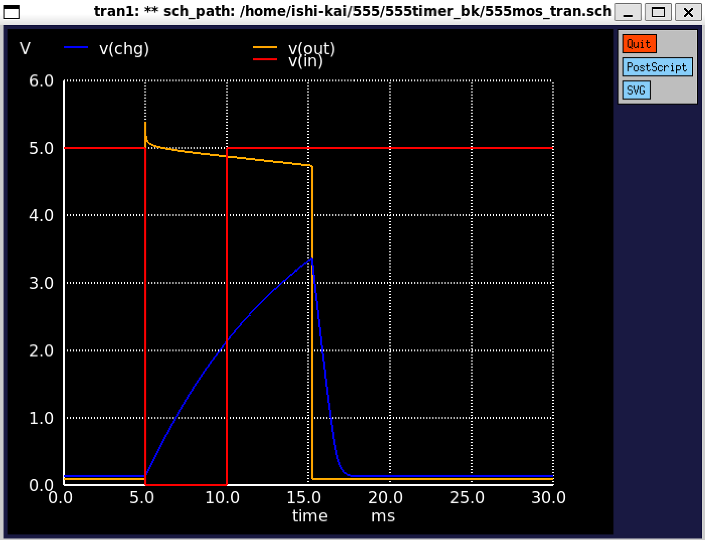

# 555 timer簡易版)

# 〇設計の説明

555タイマーは電子工作界隈では超有名なICですが、外付けする部品により
いろいろな動作ができるため超ロングセラーです。
下の記事を参考に、部品点数を極力減らして作成しました。

#　参考にした記事・回路図

▽周辺回路で用途が変わる555タイマIC CQ出版社
https://cc.cqpub.co.jp/system/contents/2914/

# 〇工夫したポイント

MOSでの設計は全く不慣れでしたのでLTspiceで
MOSFET FDC638P/FDC637ANを組み合わせた回路で動作確認をしてから
取り組みました。

# 〇苦労したポイント

抵抗体を作成するのが初めてで、今回もFETのBGの配線先同様に
cont g,cont nの接続方法を教えた頂き知るまで苦労しました。

# 謝辞

〇ISHI会の皆さんが、丁寧、親切にサポートしてくだったおかげて何とかできました。
感謝いたします。