Yamada3チーム用ディレクトリ
『なーんもよくわかってないけどAMラジオチップを作ったら可愛いんじゃないかな？』って思ったYamada3が毎週木曜日22時からのもくもく会でAMラジオチップに挑戦します！一緒に考えてくれたり、覗きにきてくれる人大募集

# ブロック図
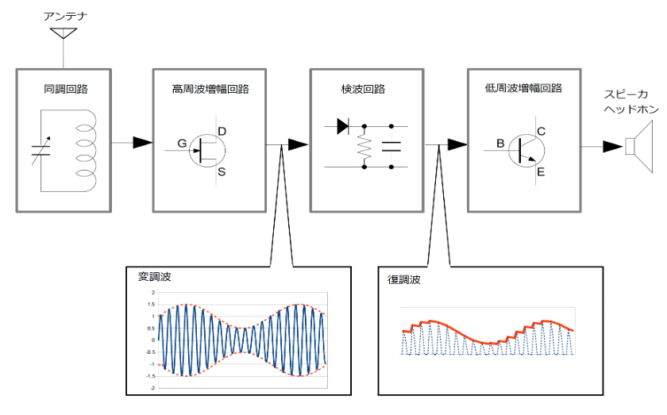

# 設計上の制約条件

## 検波器
4-5ピン＋共通VSS
使用可能領域:500um x 2000um,

## OPAMP（下記のOTAフィルターなど）系（OPAMP枠を2枠利用）
4ピン＋ESD共通VDD（ほんとは分けたいけど…無理！）＋共通VSS
使用可能領域:500um x 2000um

# 全体
ラジオ受信からスピーカ出力までの全体の信号処理を確認するためのシミュレーションを作成しました。
ラジオ受信処理を処理ステップごとに波形を表示しているので、比較的わかりやすいかと思います。
個々の回路は、理想素子（電圧依存電圧源、電圧依存電流源）をつかって実装しているので、実際の回路は、目標となるゲインを達成可能なように個々にトランジスタを使った設計が必要です。しかしながら、全体と個々の回路で、目標とするゲインや回路構成をどのようにすればよいかという設計検討には役立つと思います。
## トランジェント解析
[tb_all_tran.sch](xschem/tb_all_tran.sch)
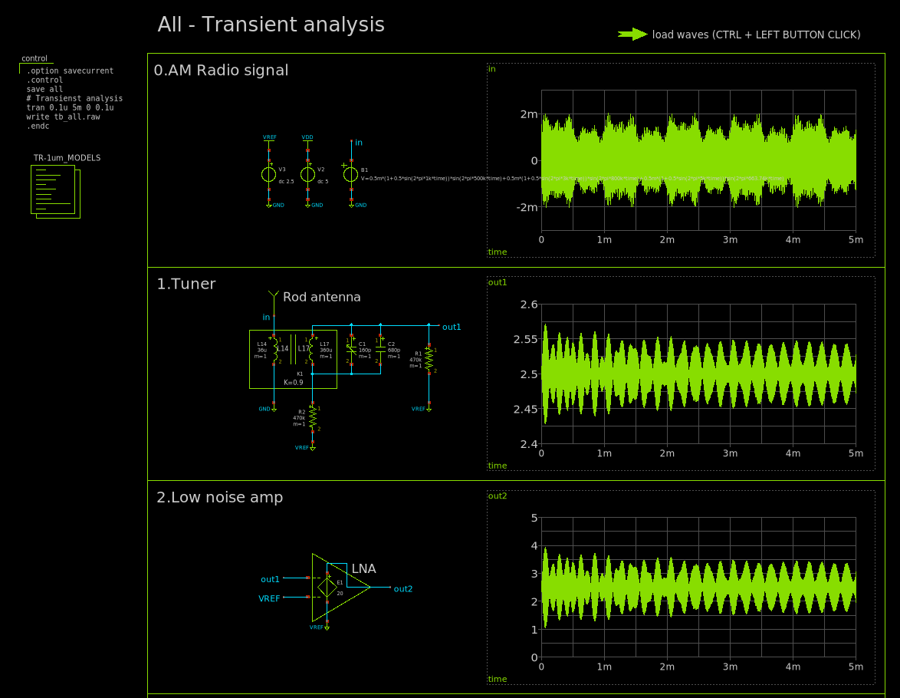
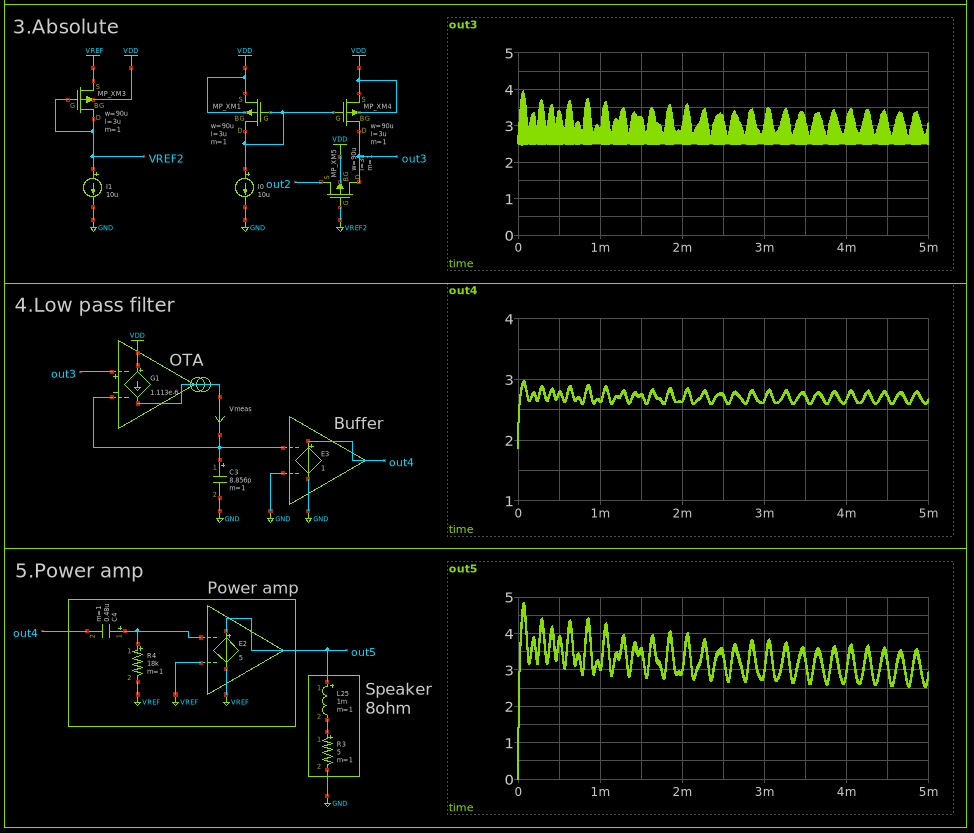

# 高周波増幅回路
## トランジェント解析
[tb_lna_tran.sch](xschem/tb_lna_tran.sch)
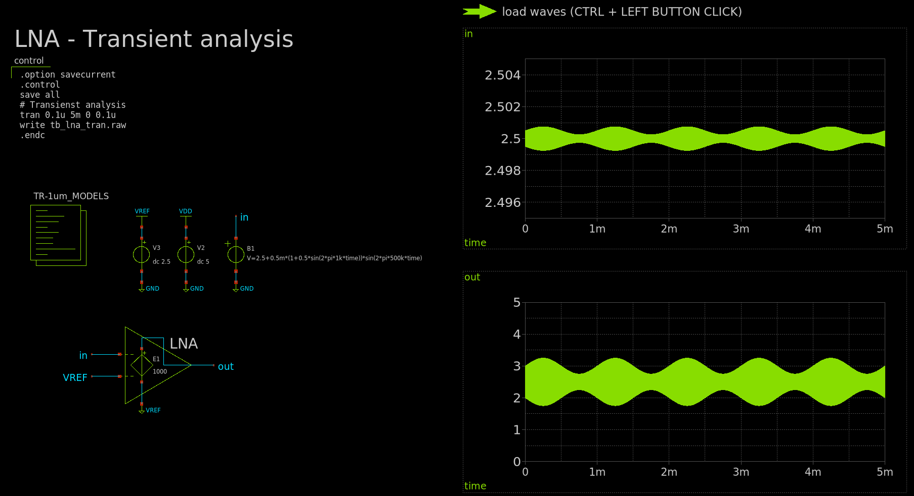

# 検波回路
## 絶対値回路
要求事項：AMの検波用なので、基準電圧より上は入力と同じ出力電圧、基準電圧より下は基準電圧と同じ電圧を出力する。

制約条件：
トランジスタで作る場合：ゲートを入力として使うと、スレッショルド電圧分必ずオフセットが出る。
ダイオードで作る場合：VFのある、シリコンダイオードは検波に適さない。

解決方法：トランジスタで作る。ゲート接地回路を使う。ゲートを電圧＝(基準電圧-スレッショルド電圧分の電圧)となるような電源に接続する。

### DC解析
[tb_abs_dc.sch](xschem/tb_abs_dc.sch)

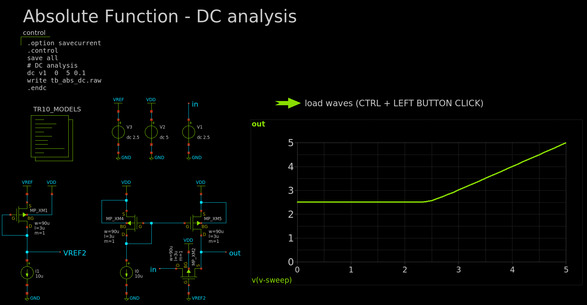

### トランジェント解析
[tb_abs_tran.sch](xschem/tb_abs_tran.sch)
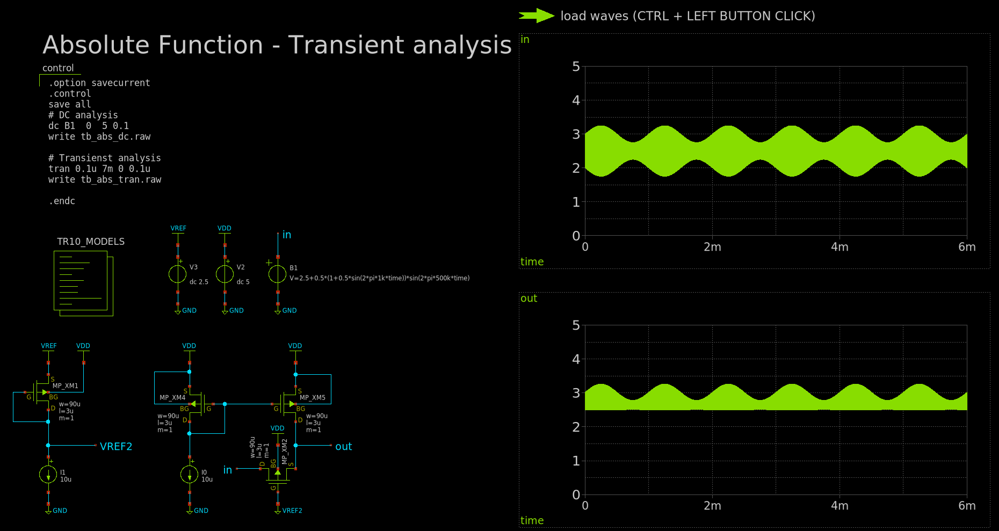

## LPF
要求事項：可聴周波数帯域(20Khz以下)は通過させ、AMキャリア周波数(500k～1MHz)は除外させる。

制約条件：
LPF決定用の抵抗・コンデンサを外付けする場合：外付けの分、貴重なピン数を使用してしまう。
LPF決定用の抵抗・コンデンサを内蔵する場合：低い周波数のLPFを作るには、高い値の抵抗・コンデンサが必要になる。

解決方法：
オペアンプでは電圧を基準とした設計になり、ピンが外付けになる設計にするしかない。
そこで、電流を基準とした設計に適した方式を使う。オペアンプではなく、OTAを使う。
OTAであれば、抵抗を使用しなくて済む。gmを少なめにすることで、少ない値のコンデンサでも必要な帯域のLPFを構成できる。

LPFを理想OTAを使用した場合の原理確認用シミュレーションを作りました。カットオフ周波数は可聴周波数の20Khzとし、コンデンサは東海理化で作成可能な単一コンデンサ最大容量8.856pFとしました。OTAは電圧→電流変換ゲインgmは1.113E-6であればよさそうです。
### AC解析
理想的なLPFを理想素子（電圧制御電流源）を使用して実装した場合を上(IDEAL)、実際のLPFをCMOSトランジスタを使用して実装した場合は下(REAL)に示します。
[tb_lpf_ac.sch](xschem/tb_lpf_ac.sch)
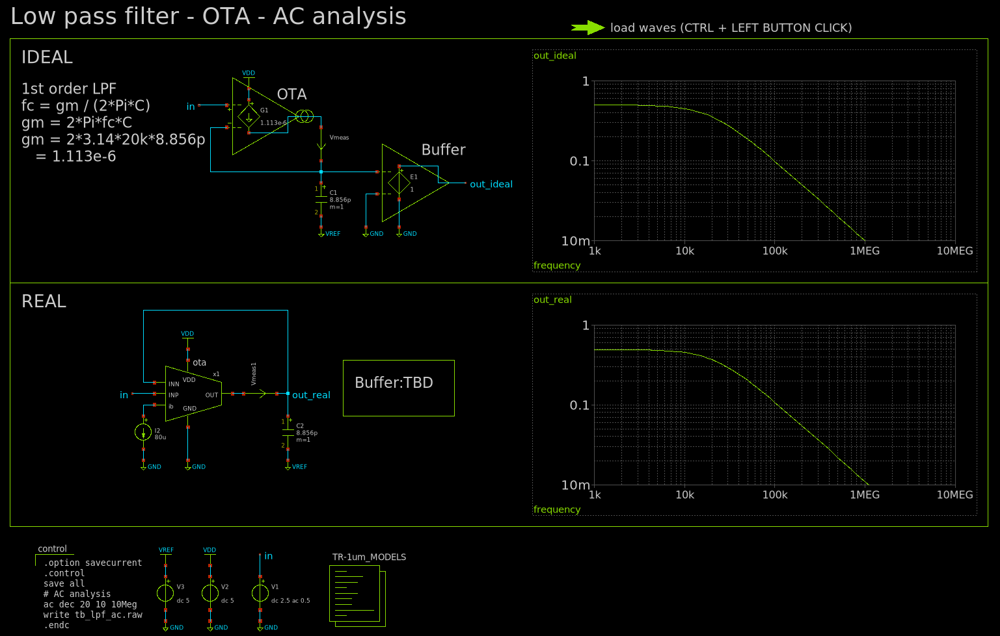

## CMOS
OTAのゲインが達成可能か調べるためにPMOSおよびNMOSのgmを調べました。
ゲート電圧1.5Vのとき必要なgm以上のゲインがあるのでゲインを下げることを考える必要があります。

### DC解析
[tb_cmos_dc.sch](xschem/tb_cmos_dc.sch)
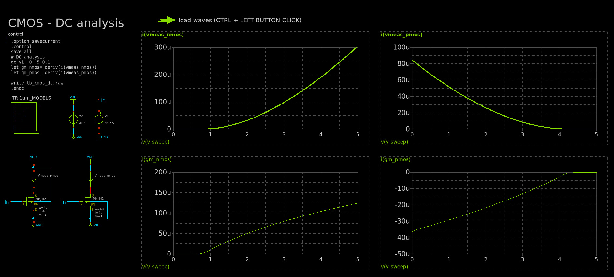

## OTA
OTA (Operational Transconductance Amplifier：オペレーショナルトランスコンダクタンスアンプ)
要はOPAMPの前半部分のみ、電流出力な差動増幅回路。OPAMPはOTA＋電流→電圧変換。
AMラジオチップではLPFに使用します。高い抵抗値の抵抗は大きな面積を使用してしまうので、抵抗の代わりにOTAを使用します。
通常OTAは増幅器として使用しますが、今回はLPFの抵抗の代わりに信号を減衰させるのに使用します。
OTAは仕組みが簡単でgmが調整しやすいカレントミラー型とします。カレントミラーの比率を変えて、ゲインを下げます。
OTAの回路図を以下に示します。
[ota.sch](xschem/ota.sch)
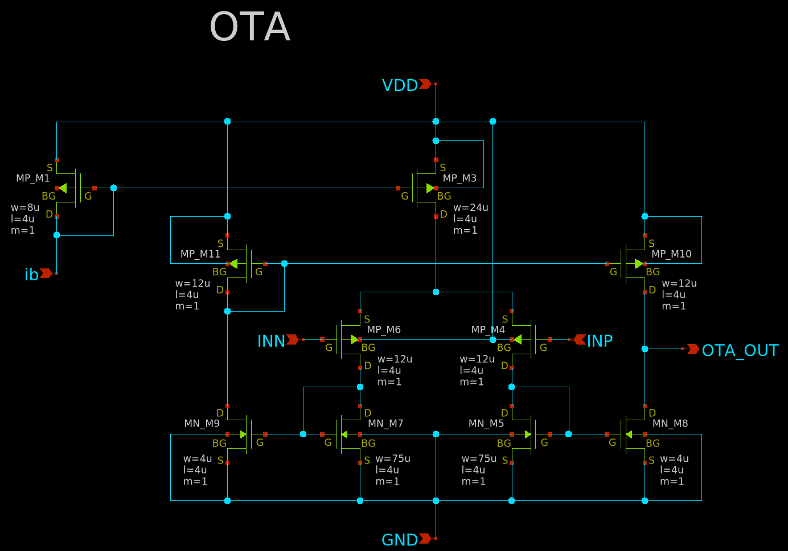

### DC解析
OTAで抵抗の代わりを作るときの難しさが、gmの非線形性です。また、使用可能な範囲も限られます。今回の回路構成は差動増幅段をPMOSで構成しているので入力電圧が電源電圧(5V)から電源電圧-1V(4V)の領域は抵抗として機能しないので、使用できません。
[tb_ota_dc.sch](xschem/tb_ota_dc.sch)
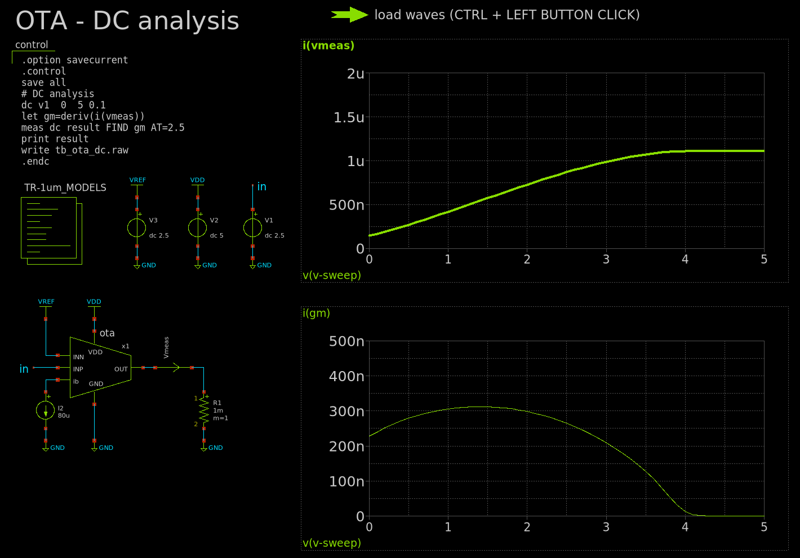

# 低周波増幅回路

[tb_pa_tran.sch](xschem/tb_pa_tran.sch)
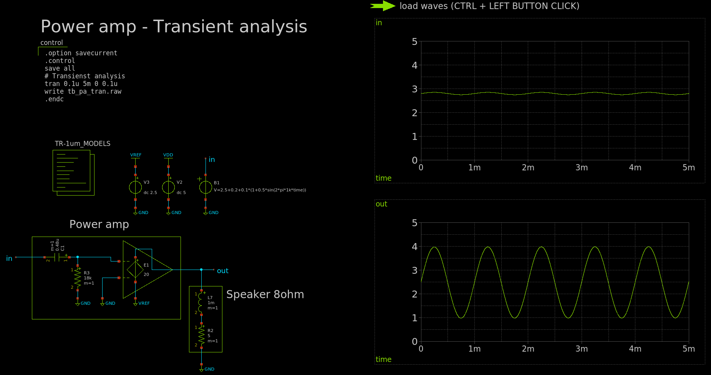

# AMチップ外

## 同調回路
今回、ラジオチップ側は、シンプルで楽な構成になっていますが、その分外付けの同調回路に、選局の難しさがあります。
定数などは、選局や実際のアンテナやバリコンなどにあわせて変える必要があるかと思います。
### AC解析
[tb_tuner_ac.sch](xschem/tb_tuner_ac.sch)
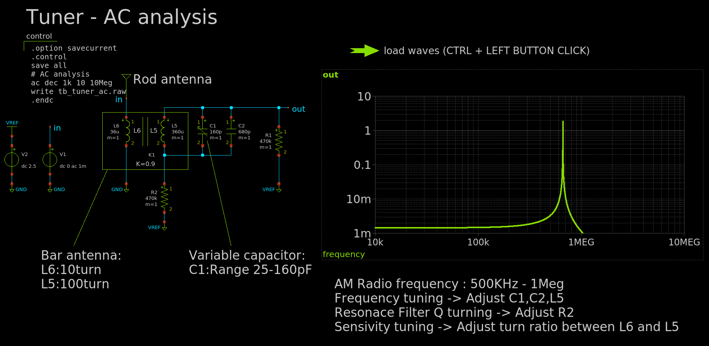

### トランジェント解析
[tb_tuner_tran.sch](xschem/tb_tuner_tran.sch)
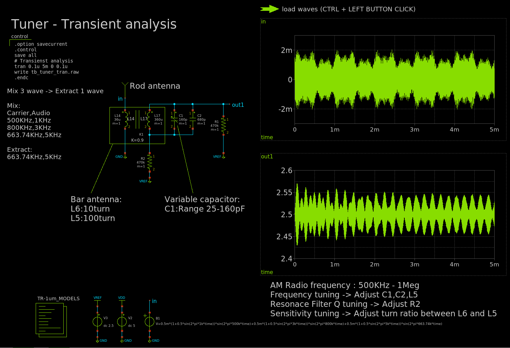

## 筐体

## アンテナ

## その他

