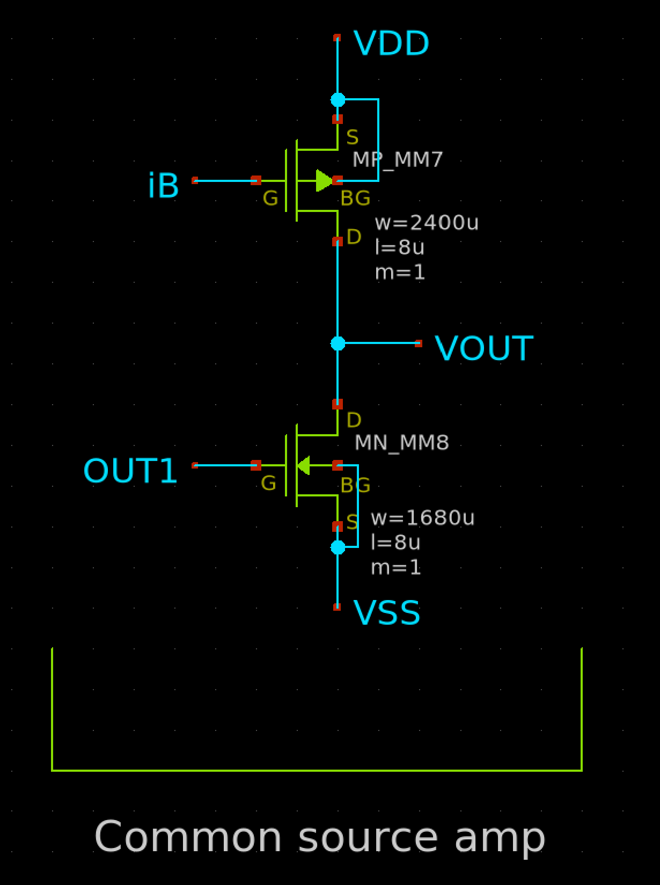
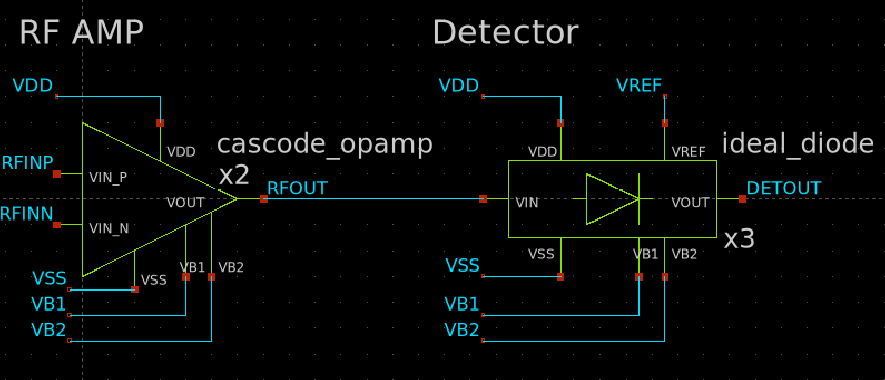
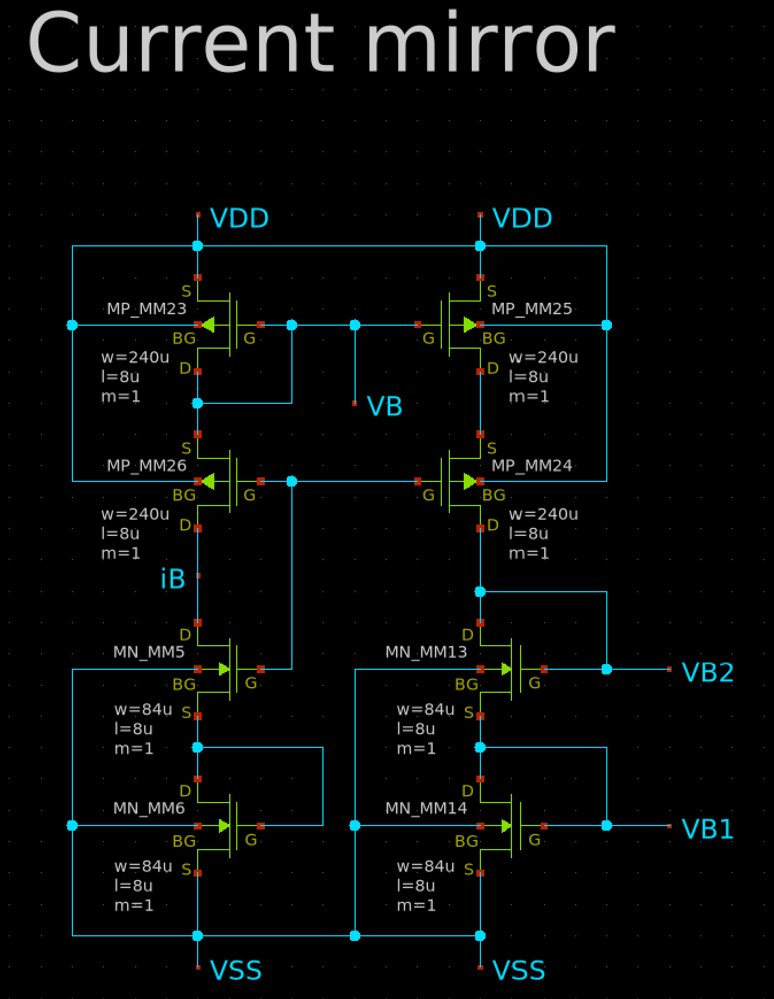
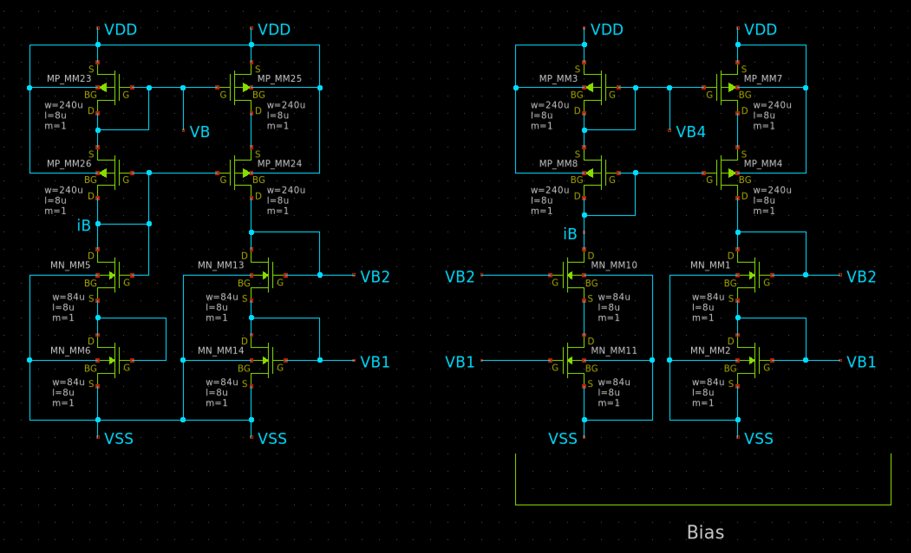
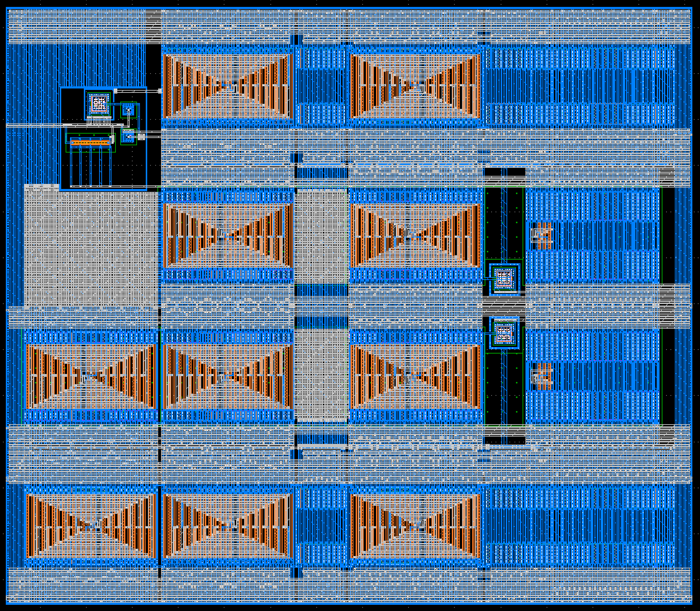
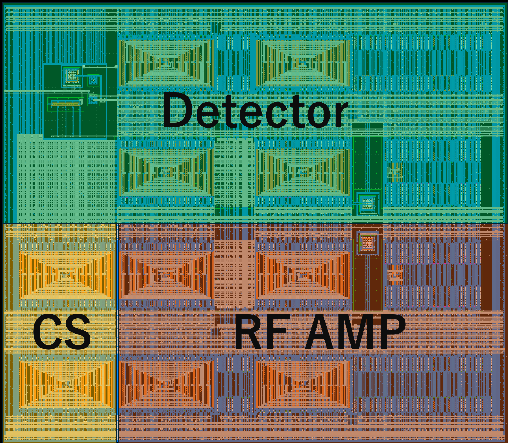

# AMラジオの究極レイアウト
[Yamada3チームが設計したAMラジオ](https://github.com/ishi-kai/ISHI-KAI_Multiple_Projects_OpenMPW_OpenSUSI-TR10-1/tree/main/member_project/AM_Radio/Yamada3)の回路図を生かして、究極のレイアウトを目指しました。

## 変更点
### Lの変更
元設計は、Lが1umですがこれですとソースやドレイン、ゲートの線を「直線的に引き出した」後にVIAを打つ場合、そのままですとM1やM2が近すぎるためDRCエラーが出てしまいます。  
そこで、引き出した線を直線上で扱えるように、Lを8倍の8umしました。当然、特性や性能を維持するために、W/Lを維持しておりますので、Wのサイズも8倍になっています。  
そのため、最大のFETは下記のようなかなりの巨大なFETになっています。  

### RF AMPとDetectorを直結
極力、使用ピンを減らしたかったので、RF AMPの出力はピンに出さずにDetectorを直結しました。  

### バイアス源を電流から電圧に変更
回路の対称性を出すためと扱い安を考慮して、バイアス源を電流から電圧に変更しました。  
これで、カレントミラー系のFET構成がほぼ同じになりました。  

## 完成レイアウト
以上をまとめて、下記のようになりました。完成まで、ほぼ一週間くらいかかりました。  

