# 概要

耳で聞けるJJY（標準電波）受信機のICを自作する設計データリポジトリ。目標はスピーカから毎時15分と45分に流れる「JJY JJY」のコールサインを耳で聞くこと。あわよくばタイムコードを復号して7セグメント表示機で表示できるようにする。

# 予備実験
## 実験1
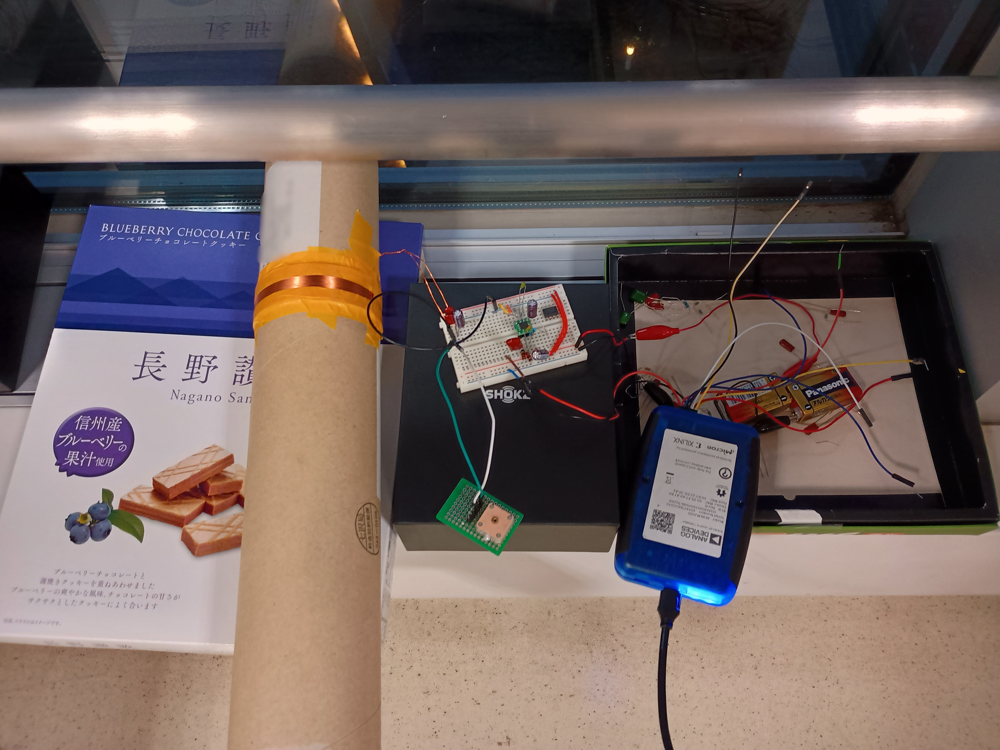
神奈川県横浜市緑区にあるビルの7階の窓際で実験をしています。アンテナには落ちてた紙管にエナメル線を密に巻いたものを使用しました。アンテナのインダクタンスは10kHzで約1.8mHです。回路はブレッドボード上に作成しています。アンプ出力をADALM2000のCh.1に接続して、スペクトラムを観測しています。下の金属と結合するようでノイズが大きいので全体を空き箱で浮かせています。

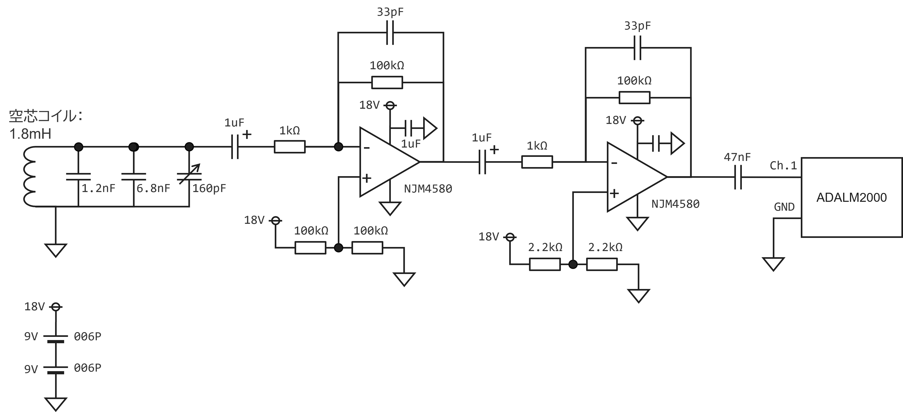
アンテナとなる空芯コイルが10kHzで約1.8mHなので、同調用のキャパシタとして1.2nFと6.8nFのフィルムキャパシタ、微調整用として160pFのバリコンを並列に接続しています。これにより40kHzに同調させています。アンプには手元にあるものでGB積が最も大きかった、NJM4580を用いて40dB(100倍)の反転増幅器を従属接続して、トータル80dBのゲインを確保しています。フィードバック抵抗と並列に位相保証の33pFセラミックキャパシタをつけています。。各段は1uFのキャパシタでAC結合することで、オフセット電圧で飽和することを防いでいます。

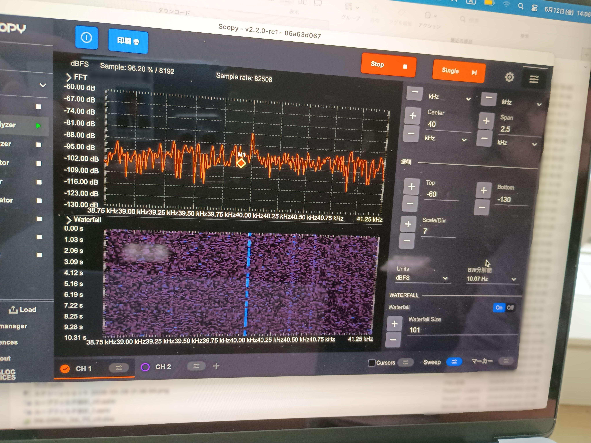
40kHzに強力な信号を確認することができています。0を表す0.8sの長パルス、1を表す0.5sの短パルスがウォーターフォール画面に確認できます。ただし、-80dBV程度と非常に小さい信号なので、ミキシング後に更に増幅を行いスピーカーを駆動する計画とします。

## 実験２

#　設計制約
##　使用するPDK
OpenSUSI for TokaiRika Shuttle PDK (OpenSUSI-TR10)

##　面積・ピン数
- 面積: 2000um x 1000um
- ピン数: 10ピン (VDD込み・VSSは共通)
- 電源電圧: 5V

#　設計構想
##　構想１
受信機全体のブロック図は下図のようになります。ベースとしてトラ技ジュニア2025年春号(No.61)に特集されている電波時計用40kHz受信機の構成を参考にしました。

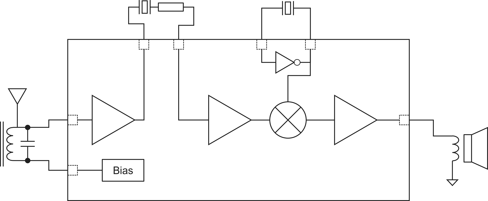

2段のプリアンプ、ミキサ、局部発振器、オーディオアンプ（バッファ）を集積回路として作成します。アンテナには同調回路を構成したバーアンテナを使用する予定です。プリアンプの1段目と2段目の間にはクリスタルフィルタを挿入して帯域外信号を除去します。このフィルタ回路には三洋電機のTime Code Reception ICs LA1650を参考にクリスタルフィルタにQダンピング用の抵抗を直列にした回路を使用しました。このために1段目出力と2段目出力はIC外部に出ています。

標準電波はAMで送信されています。包絡線検波でタイムコードを直接得ることもできますが、ほぼ直流となるため音声として聞くことはできません。そこで、トラ技ジュニアで紹介されていた、38kHzの水晶を用いた局部発振器によるダウンコンバージョンで2kHzのAM信号を得る回路としています。

## 最終構想

予備実験を受けて、全体の構成を変更し、下図のような構成にしました。ミキシングする場合、クリスタルフィルターが無くても取得できる見込みがたったため、クリスタルフィルターは廃することにしました。

またシングルエンドでの入力としていましたが、出力バッファを除いて全段差動信号を用いることにしました。アンプは1段のみとして、ミキサにもゲインを持たせるようにしました。

発振器にはシングル・差動変換のバッファを用意し、発振器が動作しなかったとしても、水晶を外して外部信号を入力しての動作もできるようにする機能を追加します。

ミキサにはギルバートセルを用います。負荷を電流源とすることで、ゲインを持たせる設計とします。

# 回路シミュレーション

## 入力アンプ
入力アンプは下図の回路としました。M7及びM8の差動対をM1及びM2の電流源負荷で増幅を行う1段アンプとしています。入力はIC外部に直列にキャパシタを挿入したAC結合とするために、M11、M14のインバータとM12、M13のインバータは入出力をショートすることで入力端子にバイアスを加えています。

AC結合のためのキャパシタにより低周波域では入力端子がオープンに見えてしまうため、オフセット電圧で出力が飽和する恐れがあります。そこで、出力の飽和を避けるために低周波域ではボルテージフォロアとして動作させるための抵抗を入出力端子の間に挿入します。これにより、低周波域では入力キャパシタのインピーダンスが大きくなるためボルテージフォロワとして動作し、アンプ全体はほぼゲインを持たず、一方でJJYの40kHz及び60kHz帯では入力のキャパシタによるインピーダンスが低下するため、反転増幅回路を形成することでアンプ全体はゲインを有します。これを実現するためには、フィードバック抵抗はメガオーム以上の高抵抗であることが求められます。メガオームオーダの高抵抗は抵抗素子で実現するのは困難なため、MOSFETで実現します。この抵抗の役割をするのが、M6及びM9とM5及びM10のPMOS FETによる疑似抵抗です。

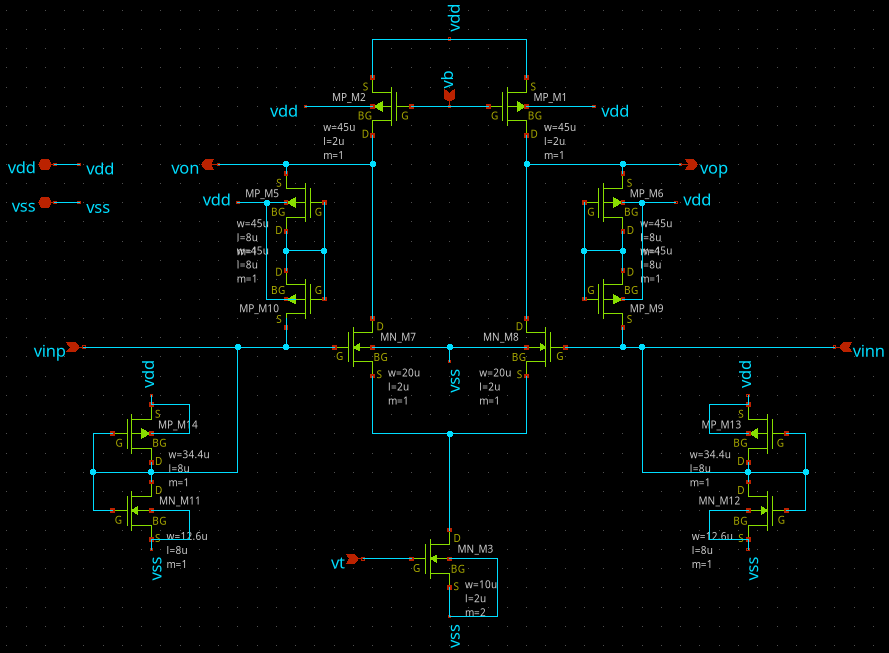

この回路の周波数特性は次のようになります。入力には10nFのキャパシタを接続して、入力端子には差動の信号を入力しています。ゲインを計算するために出力の差分を取っています。低周波域は入力のキャパシタによりゲインを持たず、高周波域は入出力のキャパシタによりゲインが低下します。10kHz〜100kHzの間で46dB以上のゲインを確保するように設計しています。

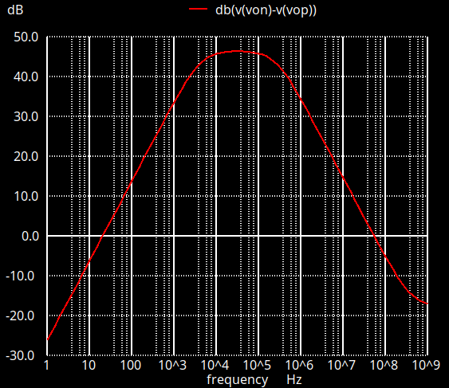

時間領域解析

入力波形
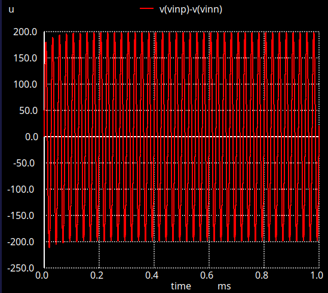

出力波形
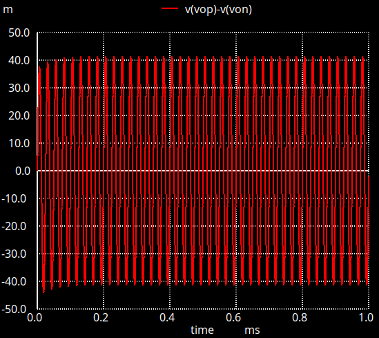

## ギルバートセルミキサ

ミキサにはギルバートセルミキサを用いました。ギルバートセルの回路図は下図になります。一般的なギルバートセルミキサと同じものです。負荷に電流源を用いることで、ゲインを持たせています。トランジスタサイズは差動アンプと同じものを用いていて、バイアス回路も差動アンプと共通になるように設計しています。差動アンプと動作点がほぼおなじになるので、追加のバイアス回路等不要で、アンプにそのまま接続することができます。アンプの出力をrfp端子とrfn端子に接続します。局部発振器をlopとlonに接続してミキシングします。ミキシング結果はifpとifn端子から出力されます。

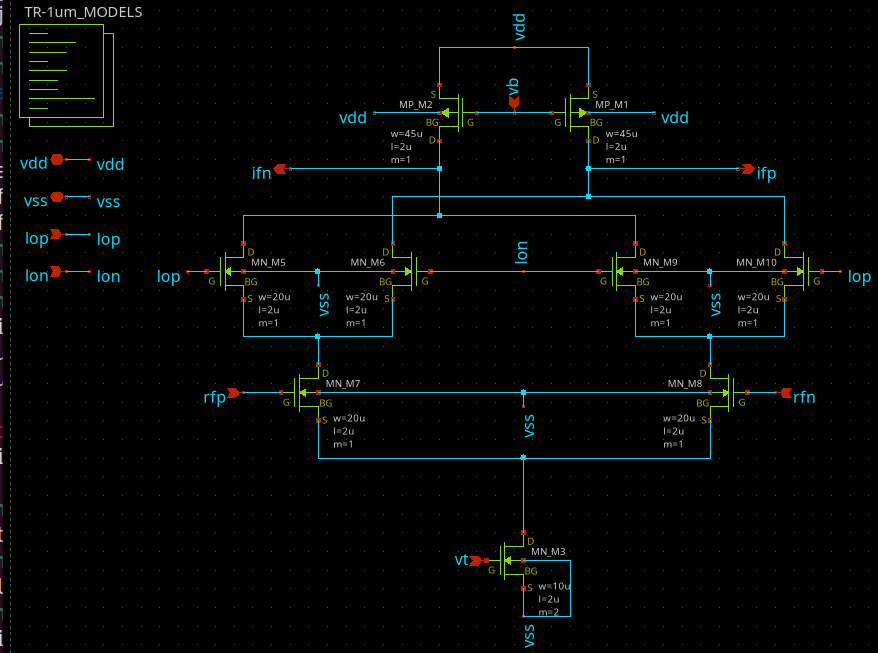

RF入力端子に差動電圧8mVの信号、LO端子には差動電圧400mVの信号を入力することで、IF端子からは差動電圧540mVとなって出力されます。

RF入力端子の信号はJJYを模擬してオンオフキーイングの信号を入力しています。LO端子は38kHzの信号を入力して、2kHzと78kHzの信号に変換されます。この内2kHの信号が音として聞くことができます。

RF入力信号
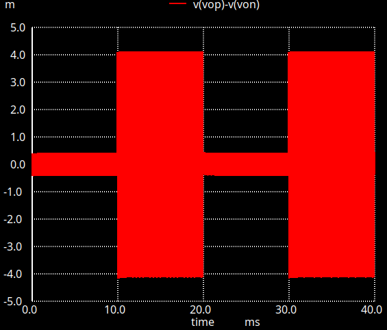

LO入力信号
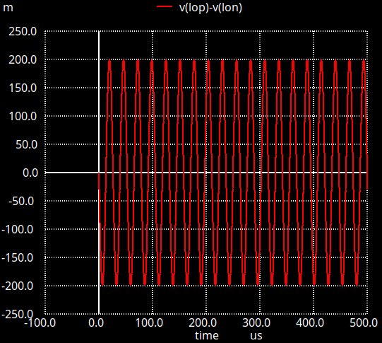

IF出力信号
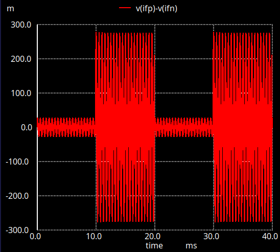

## 出力バッファ

## LO用水晶発振器

#　ブロック設計

#　レイアウト

