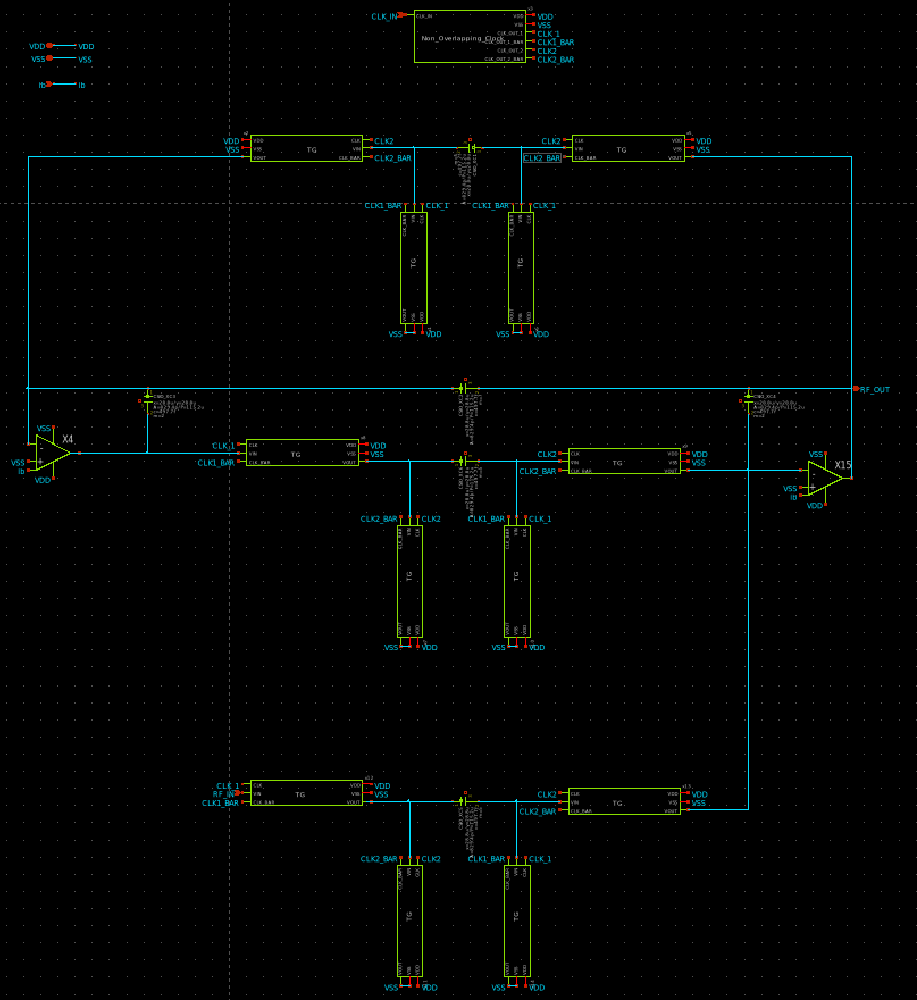
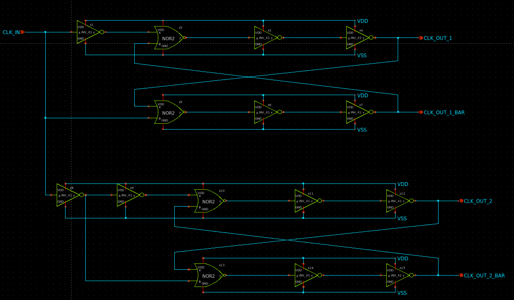
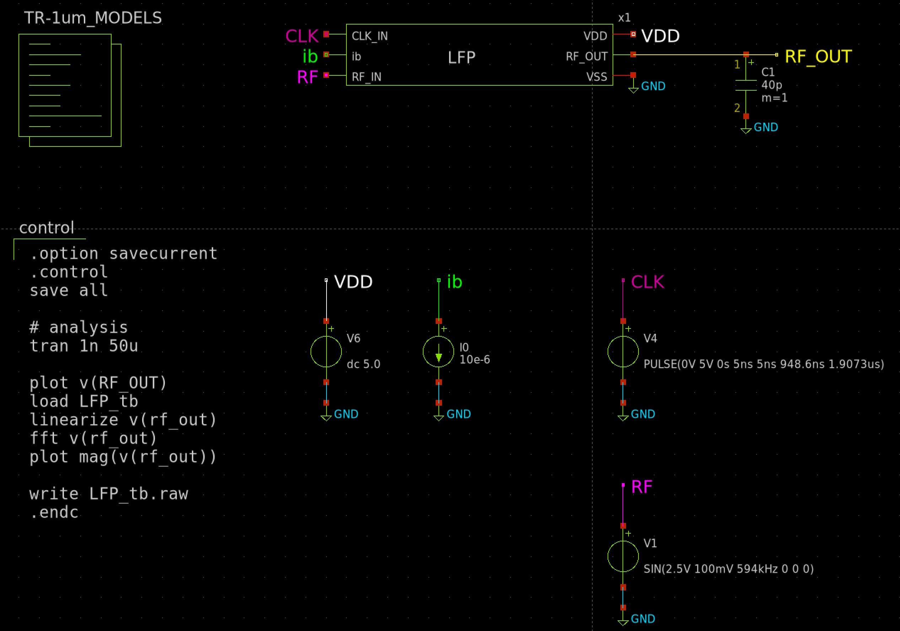
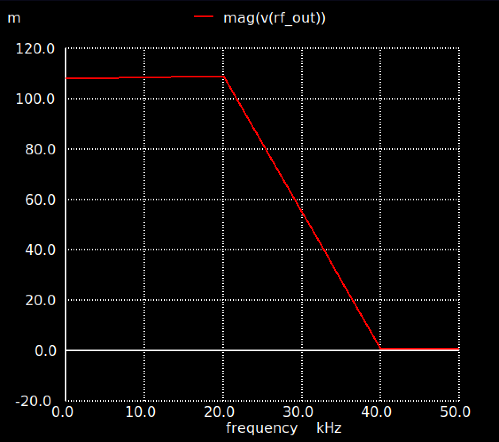
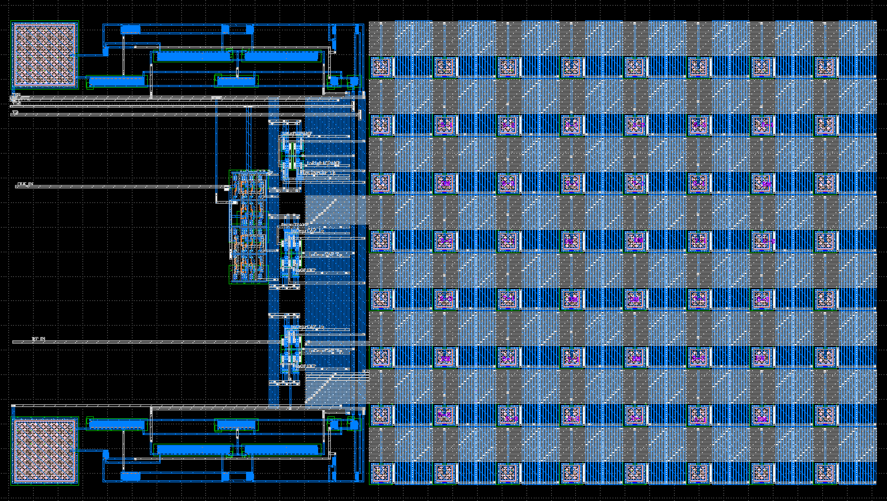

# AMラジオ用（に使えたらいいなの）Fleischer-Laker型 Switched Capacitor Biquad フィルタによるLPF(Low Pass Filter)
枠の穴ができたので、徹夜して一日で仕上げました。そのため、回路的な追い込みはそこそこでいろいろとピンに出して、別途調整する形にしています。  
目的としては、[Yamada3チームが設計したAMラジオ](https://github.com/ishi-kai/ISHI-KAI_Multiple_Projects_OpenMPW_OpenSUSI-TR10-1/tree/main/member_project/AM_Radio/Yamada3)で使えると良いなという目的で作りました。  
※キャパシタアレイ&コモンセントロイドをやりたかったという裏目的もあります。  

## Fleischer-Laker型 Switched Capacitor Biquad フィルタによるLPF(Low Pass Filter)
抵抗の代わりに『スイッチ＋小さなキャパシタ』を使い、電荷をパタパタと移動させることで、ICチップ上に正確で場所をとらない2次ローパスフィルタを実現する回路です。  
キモは、パタパタさせるクロックを生成するノンオーバーラップクロック（Non-Overlapping Clock）回路とキャパシタアレイです。  
（あとは、ただのOPAMPとトランスミッションゲートによるスイッチングです。）  

- 

### ノンオーバーラップクロック（Non-Overlapping Clock）生成回路
2つのクロック信号が『同時にONになる瞬間』を絶対に作らないように制御する回路です。  
この特性により、2種類のスイッチをパタパタさせるのです。  

- 

### キャパシタアレイ
キャパシタは、電流制限のために利用します。すなわち、電流制限≒抵抗としての役割となり、小さい面積でデカい抵抗の役割をさせることができます。  
これにより、音声帯の周波数でも搭載可能なLPFとなります。  

そして、このキャパシタの容量のズレがあると精度が悪くなるため、単位容量を決めてキャパシタアレイをコモンセントロイドで構築することになります。  
今回は下記のような感じで設定しています。  
※dはダミーです。また、これを覆うようにダミーキャパシタが配置されています。  

[ B1 ]  [ B2 ]  [ A1 ]  [ A2 ]  [ B3 ]  [ B1 ]  
[ d  ]  [ B3 ]  [ C1 ]  [ C1 ]  [ B1 ]  [ d  ]  
[ B2 ]  [ C1 ]  [ d  ]  [ d  ]  [ C1 ]  [ B2 ]  
[ B3 ]  [ C1 ]  [ d  ]  [ d  ]  [ C1 ]  [ B3 ]  
[ d  ]  [ B1 ]  [ C1 ]  [ d  ]  [ B2 ]  [ d  ]  
[ B2 ]  [ B3 ]  [ A2 ]  [ A1 ]  [ B1 ]  [ d  ]  

## シミュレーション
シミュレーションして、FFTした結果です。とてもきれいにフィルターがかかっているので、逆に怖い感じですね・・・  

- 
- 

## 完成レイアウト
以上をまとめて、下記のようになりました。完成まで、ほぼ徹夜で1日でした。  

