# AMラジオ用（に使えたらいいなの）パッシブ・ダブルバランスド・ミキサー
枠がかなり余り気味だったので、徹夜して一日で仕上げました。そのため、回路的な追い込みはそこそこでいろいろとピンに出して、別途調整する形にしています。  
目的としては、[Yamada3チームが設計したAMラジオ](https://github.com/ishi-kai/ISHI-KAI_Multiple_Projects_OpenMPW_OpenSUSI-TR10-1/tree/main/member_project/AM_Radio/Yamada3)で使えると良いなという目的で作りました。  
※ギルバートセル方式でないのは、[JJYチーム](https://github.com/ishi-kai/ISHI-KAI_Multiple_Projects_OpenMPW_OpenSUSI-TR10-1/tree/main/member_project/JJY_Receiver/Masahiro)がすでに実装済みだからです。  

## 構成
RF+やRF-、LO+やLO-を作るのは面倒なので、RFやLO直接入力するだけでよい構成にしています。また、出力のIFもIF+とIF-では取り扱いが大変なため差動IFアンプを入れています。（そもそも、IFの出力が弱すぎるのでアンプが無いと厳しいという面もあります。）  

- RF / LO アクティブ・バルーン
- パッシブ・ダブルバランスド・ミキサー
- 差動IFアンプ

### パッシブ・ダブルバランスド・ミキサー
最初はメインとなるパッシブ・ダブルバランスド・ミキサーについて。  
一般的な構成そのものです。出力は、IFの高周波と低周波をフィルターしていないため、変な出力っぽくなっています。  
問題は、出力が150mVくらいしかないため、もう少し引き上げたい感じですね。  

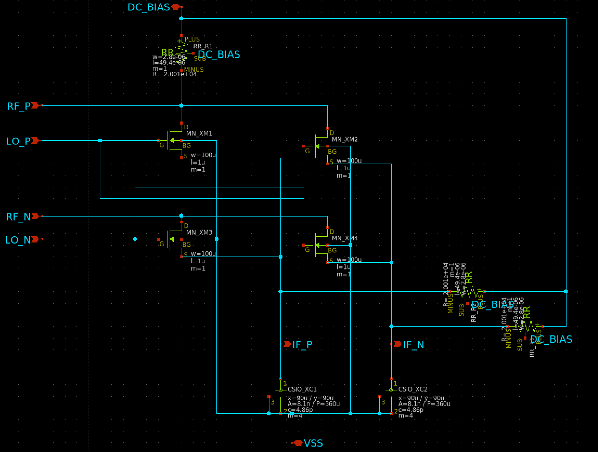
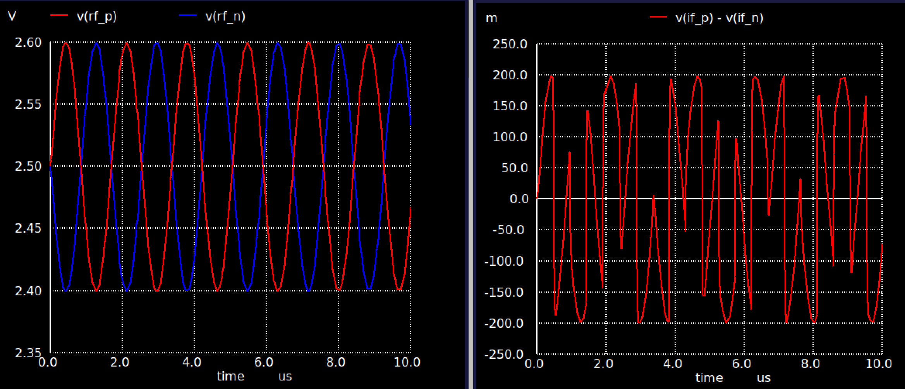
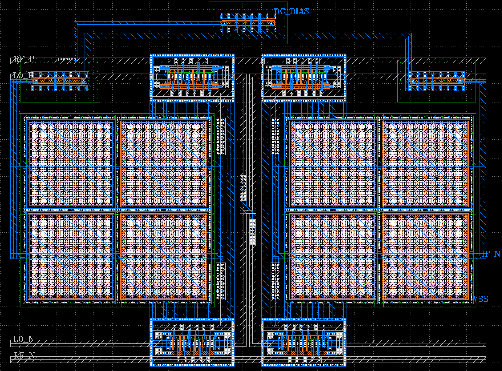

- [DBPMixer回路図](xschem/double_balanced_passive_switch_mixer.sch)
- [DBPMixerテストベンチ](xschem/double_balanced_passive_switch_mixer_tb.sch)
- [DBPMixerレイアウト](klayout/double_balanced_passive_switch_mixer.gds)

### 差動IFアンプ
IFの出力が150mVである点と出力のIFもIF+とIF-では取り扱いが大変なため差動IFアンプを導入することとしました。  
構成は、1段の差動オペアンプです。

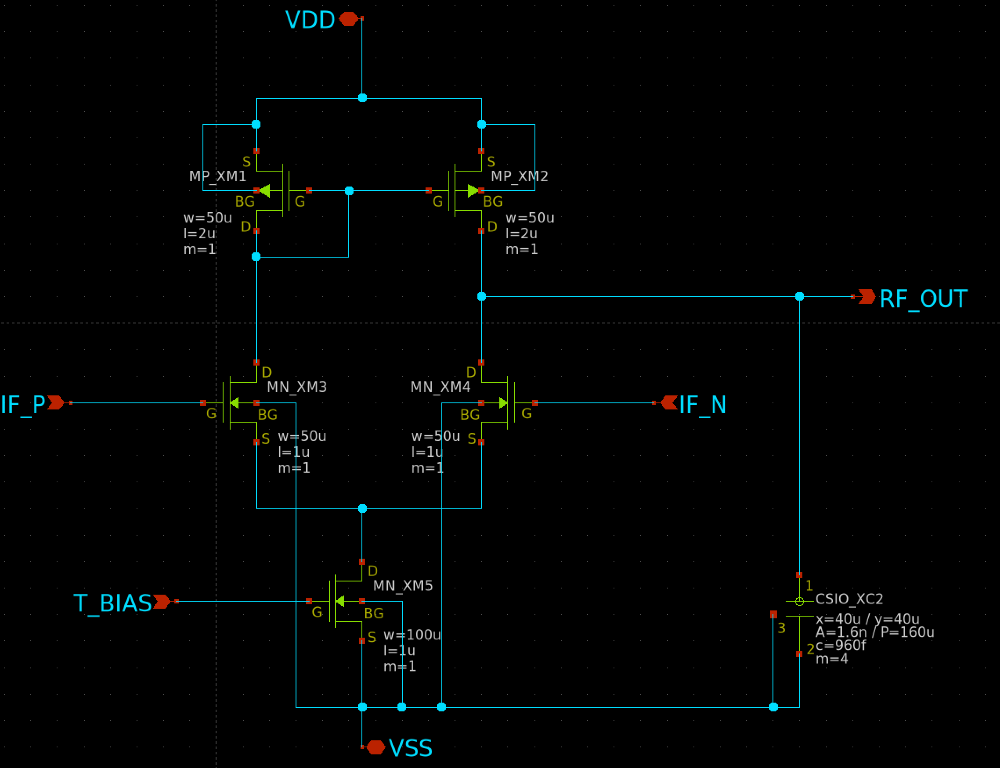
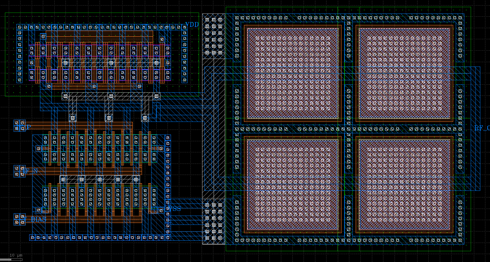

- [diff_amp回路図](xschem/diff_amp.sch)
- [diff_ampレイアウト](klayout/diff_amp.gds)

### パッシブ・ダブルバランスド・ミキサー＋差動IFアンプ
パッシブ・ダブルバランスド・ミキサー＋差動IFアンプを統合して、出力させてみた結果です。  
無事に1-4V間で動作しています。  

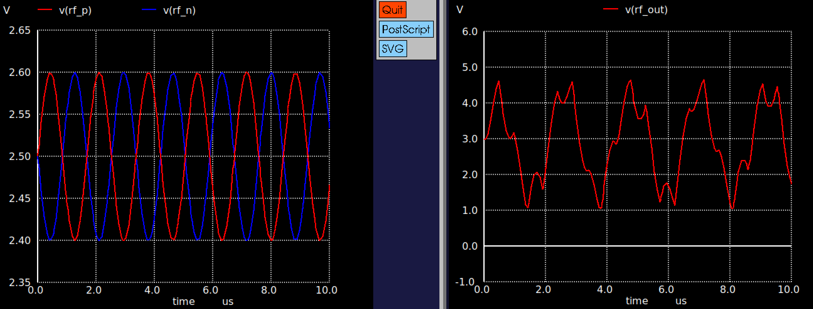

- [DBPMixer回路図](xschem/double_balanced_passive_switch_mixer_w_amp.sch)
- [DBPMixerテストベンチ](xschem/double_balanced_passive_switch_mixer_w_amp_tb.sch)

### RF / LO アクティブ・バルーン
RF+やRF-、LO+やLO-を作るのは面倒なので、RFやLO直接入力するだけでよいようにアクティブ・バルーン回路も導入しました。  

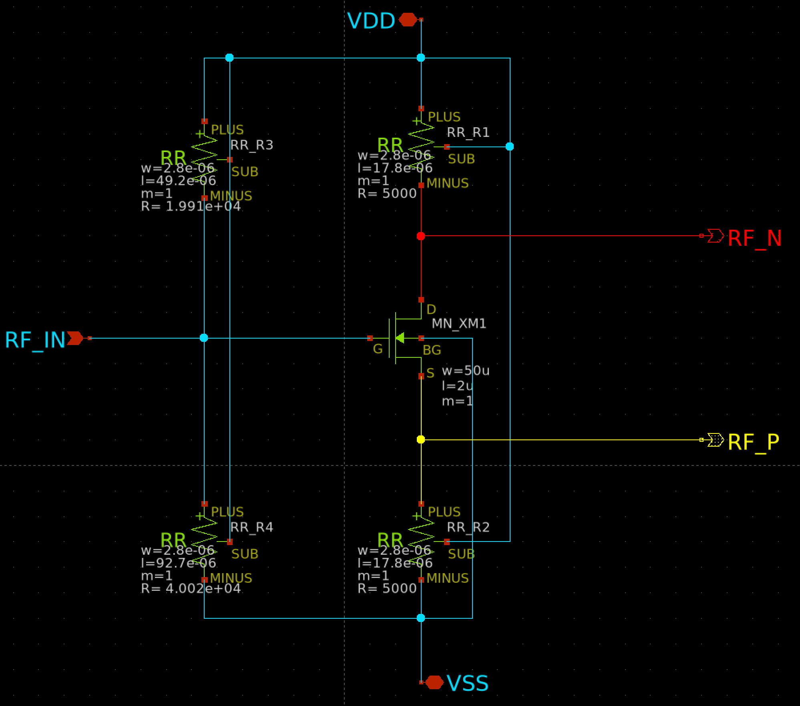
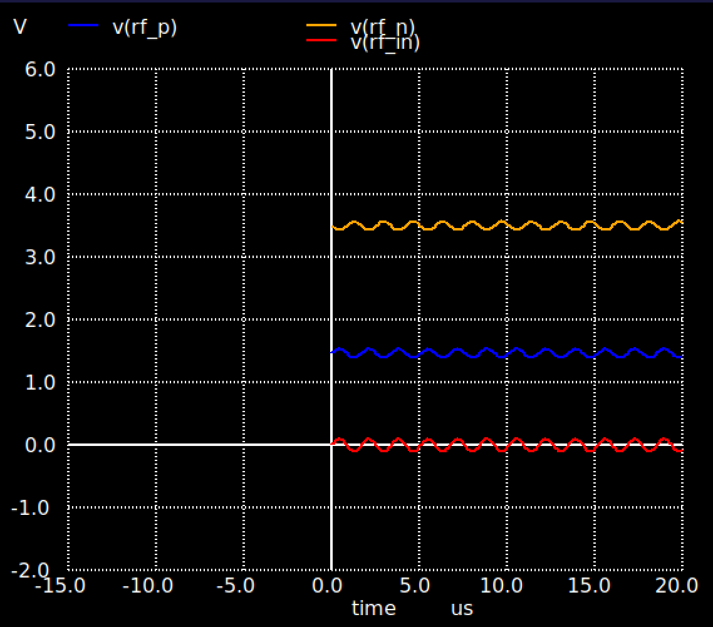
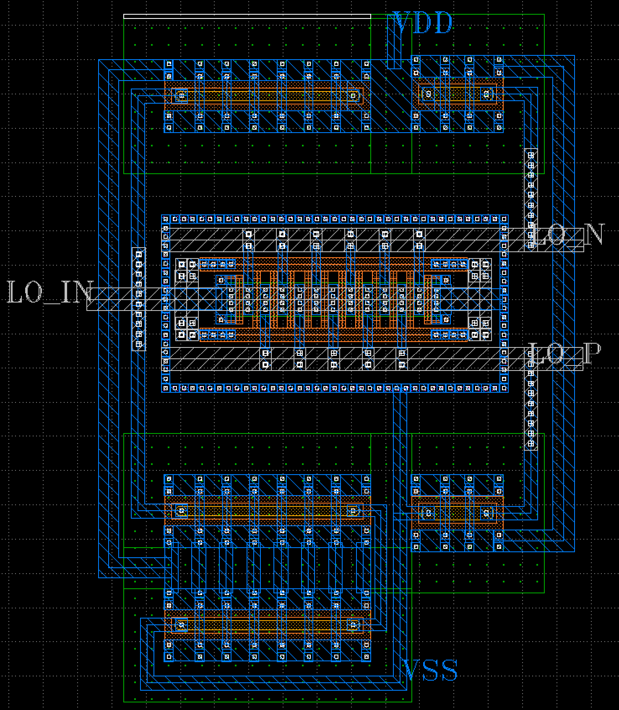

が、作ってからバイアスがずれていることに気が付いて補正しようとしたのですが、キャパシタのサイズ的に載りそうもなかったので、ピンを外付けにする作戦にしています。  
下記のグラフは、外付けで10nFのキャパシタを入れた時のグラフです。  

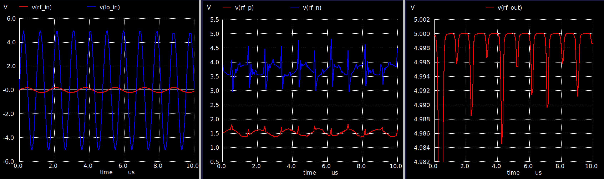
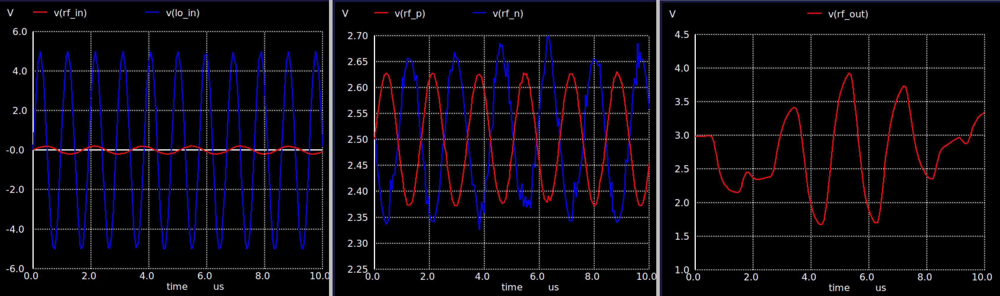

- [RFアクティブ・バルーン回路図](xschem/single_to_diff_RF.sch)
- [RFアクティブ・バルーンテストベンチ](xschem/single_to_diff_RF_tb.sch)
- [RFアクティブ・バルーンレイアウト](klayout/single_to_diff_RF.gds)
- [LOアクティブ・バルーン回路図](xschem/single_to_diff_LO.sch)
- [LOアクティブ・バルーンテストベンチ](xschem/single_to_diff_LO_tb.sch)
- [LOアクティブ・バルーンレイアウト](klayout/single_to_diff_LO.gds)

## 完成レイアウト
以上をまとめて、下記のようになりました。完成まで、ほぼ徹夜で1日でした。  

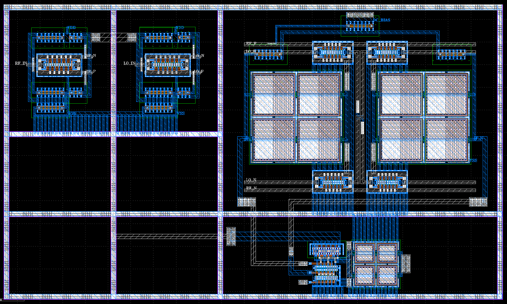
