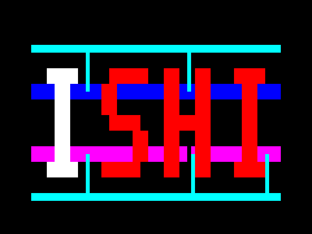
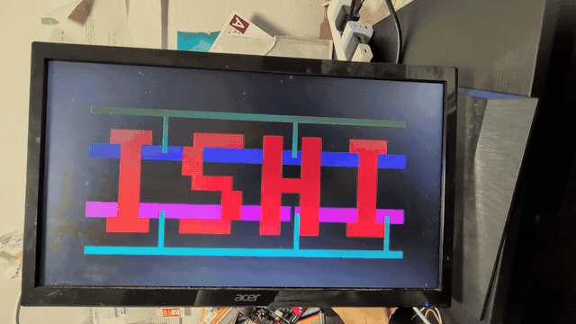

# Tang Primer 20K DockでのVGA動作試験

**現行の文字発光版を、Tang Primer 20K Dock＋抵抗DACで表示する手順です。** 外部3.15 MHz・RGB111・リセットなしのRTLを使用します。各文字16フレーム、発光なし64フレームです。

実行済みのOSS CAD Suiteでの合成・P&R・SRAM書き込みは[試験記録](FPGA_ANIMATION_20260925.md)を参照してください。現在の環境では次のコマンドを使用します。

```sh
python3 scripts/build_fpga.py vga_letter_animation
bash scripts/fpga_loader.sh -b tangprimer20k --detect
python3 scripts/program_fpga.py vga_letter_animation
```

書き込み前にビルド入力とビットストリームのハッシュ、確認済みのI/O・PLL設定を照合します。新しいPCでのGowin EDA設定は以下に記載しています。

## 1. 用意するもの

| 用意するもの | 内容 |
|---|---|
| FPGA | **Tang Primer 20K Dockセット**（手元の製品：[秋月117540](https://akizukidenshi.com/catalog/g/g117540/)） |
| PC・書き込み環境 | Gowin EDA／Gowin Programmer、データ通信対応USBケーブル |
| 表示器 | VGA入力のあるモニタ＋VGAケーブル |
| コネクタ | VGAメス、**3列15ピン**の端子台・変換基板 |
| 抵抗 | **300 Ωを3本**、各色1本。1%、1/4 W程度 |
| 配線 | 短い接続線、GND共通配線 |
| 測定器（あれば） | オシロスコープ。周波数確認だけならロジックアナライザも可 |

VGA Pmodは使いません。ボードの3.3 V GPIOで試験し、ASIC用5 V電源は接続しません。
旧手順で430 Ωを用意済みなら、**各色430 Ω 1本で約0.49 V**の暗めの予備試験もできます。RGB222用の2枝配線は外してください。

## 2. Dockだけで書き込みを確認する

1. VGA配線前に、PCをDockの **USB-JTAG側**へ接続する。
2. DIPスイッチ1でコアを有効にする。公式説明では下側が有効。基板の表示・向きも確認する。
3. Gowinで **GW2A-LV18PG256C8/I7** に対応するデバイスを選ぶ。Primer 20K用の選択肢・型番を照合し、Tang NanoやPrimer 25Kの設定を流用しない。
4. [Sipeed公式のDock LED手順](https://en.wiki.sipeed.com/hardware/en/tang/tang-primer-20k/examples/led.html)で、LEDサンプルを **SRAM Mode** へ書き込む。

LEDが動いてから次へ進みます。搭載発振器は27 MHz、FPGA端子は **H11** です。
製品・型番の根拠は[Sipeed製品資料](https://en.wiki.sipeed.com/hardware/en/tang/tang-primer-20k/primer-20k.html)。

## 3. VGAを配線する

USB・電源を外して配線します。Dockの **J5（2×6、RGB LCDと共用）** を使用し、J7などのRGB LCD接続は外します。
下表のJ5番号は**回路図のOdd/Even番号**です。一般的なPmodケーブルの番号と読み替えず、基板のピン1表示・FPGAピン名・GNDを照合してください。

| J5回路図番号 | FPGA端子 | 今回の信号 | 接続先 |
|---:|---|---|---|
| 5 | L9 | `r` | **300 Ω** → VGA 1（赤） |
| 6 | N8 | `g` | **300 Ω** → VGA 2（緑） |
| 7 | N9 | `b` | **300 Ω** → VGA 3（青） |
| 8 | N7 | `vsync` | VGA 14へ直結 |
| 12 | B11 | `hsync` | VGA 13へ直結 |
| 3, 4 | GND | 共通GND | VGA 5, 6, 7, 8, 10 |
| 9 | N6 | `pll_lock_mon` | 測定用。VGAへは接続しない |
| 10 | D11 | `clk_315_mon` | 測定用。VGAへは接続しない |
| 11 | A11 | 未使用 | 未接続 |
| 1, 2 | +3.3 V | 未使用 | 未接続 |

VGAの **4, 9, 11, 12, 15は未接続**。VGA 9へ電源を供給しません。
VGA端子は部品の刻印で確認してください。嵌合面とハンダ面では左右が反転します。

メス端子を**穴が見える側（ケーブルを挿す面）**から見て、金属シェルの幅が広い辺を上にした番号:

```text
  _________________________
  \   5   4   3   2   1   /
   \ 10   9   8   7   6  /
    \15  14  13  12  11 /
     -------------------
```

同じメス端子の**裏のハンダ付け側**から見ると左右反転する（広い辺は上のまま）:

```text
  _________________________
  \   1   2   3   4   5   /
   \  6   7   8   9  10  /
    \11  12  13  14  15 /
     -------------------
```

番号と信号の根拠: [VIA VB7009公式マニュアル §2.1.2、図7・表2](https://www.viatech.com.cn/uploads/files/20200706/1594023322631878.pdf#page=20)。端子台変換基板のネジ端子の並びはこの図と同じとは限らないため、基板の番号表示とコネクタ穴への導通で確認する。


```text
Dock J5.5  L9  (r) ── 300 Ω ── VGA 1  (R)
Dock J5.6  N8  (g) ── 300 Ω ── VGA 2  (G)
Dock J5.7  N9  (b) ── 300 Ω ── VGA 3  (B)
Dock J5.12 B11 (HS) ─────────── VGA 13 (HS)
Dock J5.8  N7  (VS) ─────────── VGA 14 (VS)
Dock J5.3/4    GND ──────────── VGA 5/6/7/8/10
```

RGBは各色1本なので、重み付き2ビットDACやパレットデコーダは不要です。
モニタ内の75 Ω終端と300 Ωで、理想振幅は `3.3 × 75 / (300 + 75) = 0.66 V`、High時の電流は約8.8 mAです。
CSTはRGBを **LVCMOS33・DRIVE=16**、HS/VSを **DRIVE=8** にしています。振幅はGPIOの出力抵抗などで下がるため、モニタ接続状態で測ります。外付け75 Ω終端は追加しません。

J5の対応はDock 3713/3714の回路図で共通。Bank3と標準設定のBank7は3.3 Vです。
原資料・版・SHA256は[以前のハード調査記録](../research/fpga_dock/README.md)。VGA端子と75 Ω終端の根拠は[Digilent VGA資料](https://digilent.com/reference/_media/nexys_vga/nexys_vga_rm.pdf)。

## 4. Gowinプロジェクトを作る

リポジトリのルートから作業します。Gowinプロジェクトの保存先は `build/fpga_tang_315/` など、提出物の外にします。

```sh
mkdir -p build/fpga_tang_315
```

新しいFPGA Designプロジェクトを作り、LED試験と同じデバイスを選びます。
以下の**3つだけを自作RTLとして**追加し、トップを `ishi_vga_tang_top` に指定します。

```text
fpga/tang_primer_20k/ishi_vga_tang_top.v
experiments/a_letter_scan_eco/ishi_vga_core.v
experiments/a_letter_scan_eco/ishi_logo.v
```

続いて次の制約ファイルを登録します。

```text
fpga/tang_primer_20k/ishi_vga_tang.cst
fpga/tang_primer_20k/ishi_vga_tang.sdc
```

`rtl/` や `experiments/descending_h79_v500/` は旧世代なので使いません。
`*_pnr.v`、TR-1umのセルモデル、テストベンチもFPGA合成へ入れません。
採用コアの端子は `clk, r, g, b, hsync, vsync`。**RESET端子はありません。**

### PLLを生成する

Gowinの **IP Core Generator → CLOCK → rPLL（版によってPLL表記）** を開き、モジュール名を **`gowin_pll_315`** にします。生成先は作業中のGowinプロジェクト内です。

```text
基板27 MHz → PLL CLKOUT=63 MHz → PLL内蔵SDIV ÷20
                                     ↓ CLKOUTD=3.15 MHz
                              提出版 ishi_vga_core
                                     ↓
                              RGB111 / HS / VS
```

| 設定 | 指定値 |
|---|---|
| 入力CLKIN | 27.000 MHz |
| CLKFB | Internal |
| CLKOUT | 63.000 MHz、使用端子として有効 |
| CLKOUTD | 有効、Source=CLKOUT、**Divide Factor=20**、3.150 MHz |
| LOCK | 有効 |
| CLKOUTP / CLKOUTD3 | 無効 |
| PLL Reset / Power Down / Divider Reset | 無効（入力端子を増やさない） |
| Dynamic設定 / Bypass | 無効 |

General ModeでCalculateが通れば、その生成値を使います。Advanced Modeで指定する場合の一組は、**入力分周3、帰還倍率7、VCO分周16、SDIV=20**。位相比較9 MHz、VCO=1008 MHz、CLKOUT=63 MHzになります。
生成Verilogの表現では `IDIV_SEL=2, FBDIV_SEL=6, ODIV_SEL=16, DYN_SDIV_SEL=20` です。入力・帰還のUI値と `*_SEL` の値には1の差があります。

**CalculateのActual FrequencyでCLKOUTD=3.150 MHzを確認してから生成**してください。63 MHzの `clkout` ではなく、分周後の **`clkoutd` をコアに接続**するラッパにしてあります。
生成した `.v` をプロジェクトへ追加し、同名モジュールの重複やインスタンス例 `*_tmp.v` の追加を避けます。端子は `clkin, clkout, clkoutd, lock` の4つです。

rPLLの分周・生成設定は[Gowin Clock UG286-2.0.2E §5.1](https://cdn.gowinsemi.com.cn/UG286E.pdf)、周波数範囲は[GW2A DS102-2.7.8E §3.4.7](https://cdn.gowinsemi.com.cn/DS102E.pdf)で確認しました。この設定値はその仕様から計算したもので、こちらでGowinのCalculateや実機LOCKを確認した結果ではありません。

コアにはPLLの分周クロックを直接入れ、LOCKはJ5.9で観測します。LOCKとクロックをANDしたり、ASICコアへFPGA専用のリセット・初期値を追加したりする必要はありません。起動直後の同期乱れが収まってから表示を判定します。

### 合成・P&R・タイミング確認

1. **Synthesize → Place & Route** を実行する。
2. I/OレポートでH11およびJ5各端子がCSTどおりに配置され、3.3 V設定になっているか確認する。
3. Timing Reportの **Clock Summary** で入力27 MHz、コアを駆動するCLKOUTDが **3.15 MHz / 317.460317 ns** になっているか確認する。
4. コアのレジスタ間setup/hold違反がないこと、クロックに専用配線が使われていることを確認する。
5. 生成した `.fs`（通常 `impl/pnr/` 内）、PLLの `.v` / `.ipc`、タイミングレポートを保存する。

SDCは入力27 MHzを定義しています。GowinのPLL生成クロック解析については[公式タイミング制約ガイド §4.1.2](https://cdn.gowinsemi.com.cn/SUG940E.pdf)を参照。自動生成されたCLKOUTDがレポートにない・100 MHzなどになっている場合はそのまま進めず、Timing Constraints Editorで**実際のPLLのCLKOUTDピン**を指定し、入力に対し `multiply_by=7, divide_by=60` の生成クロックを設定します。同じ端子への二重定義は避けます。

このSDCは内部回路のクロックを規定するものです。VGAのアナログ振幅やケーブル品質は実機で確認します。GowinのP&R合格とTR-1umのタイミング検証は別です。

## 5. SRAMへ書き込んで表示する

1. 配線を再確認してUSBを接続し、Gowin ProgrammerでScan Deviceする。
2. **SRAM Mode** を選び、今回生成した `.fs` を指定して書き込む。まずFlashへの永続書き込みは不要。
3. 測定器があればJ5.9のLOCKがHigh、J5.10が3.15 MHzかを見る。測定は高インピーダンス入力を使う。
4. HS/VSを次の表と照合する。VGAモニタの入力をVGAに切り替え、数秒待つ。
5. 表示画像を開き、実画面と比較する。

```sh
xdg-open submission/animation.gif
```

| 測定項目 | 期待値 |
|---|---:|
| コアクロック | 3.150 MHz、周期317.460 ns |
| HSYNC周波数 / 1行 | 31.500 kHz / 31.746 µs |
| HSYNC Low幅 | 3.810 µs（12クロック） |
| VSYNC周波数 / 1フレーム | 60.000 Hz / 16.667 ms |
| VSYNC Low幅 | 63.492 µs（2行） |
| RGB High電圧 | モニタ接続時、理想約0.66 V（300 Ωの場合） |

画像は**黒背景に赤文字、水色の横帯・枝、青、紫**。有色部分の範囲は640×480内の **X=64〜575、Y=92〜411**、512×320画素です。横は8画素時間単位で変わります。旧B案の白背景・512×432表示・青系の中間階調とは異なります。

RGB111のコードは `000=黒, 001=青, 011=水色, 100=赤, 101=紫`。発光中の文字は `111` です。振幅は各色がHighになる部分で測ります。モニタが640×480を認識していれば、必要に応じてAuto Adjustで位置・サンプリングを合わせます。

I → S → H → I → 発光なしの順序を確認します。各文字は約0.267秒、発光なしは約1.067秒です。



[実機動画](../submission/fpga_demo.mp4)



数分表示してちらつき・流れ・色化けがないことを確認し、SRAM再書き込みを数回繰り返して再び表示できるか確認します。電源を切るとSRAM設定は消えるため、電源再投入試験ではその都度書き込みます。

リセットなしの二値カウンタモデルでは、任意状態から正規周期へ最大49,928クロック、約15.85 msで入ります。これはモニタの同期獲得時間を含みません。FPGAの起動確認はASICのアナログ電源立上りの保証にはなりません。

## 6. 映らない場合

| 症状 | 最初に確認すること |
|---|---|
| FPGAが見つからない | USB-JTAG側、データケーブル、DIP1、LEDサンプル |
| `gowin_pll_315` が未定義 | PLL生成ファイルの追加、モジュール名、4端子の一致 |
| LOCKがLow / CLKが出ない | PLLの入力27 MHz・H11、Calculate結果、対象デバイス |
| HSが63 kHz・VSが120 Hz | コアに旧6.3 MHzを入力していないか |
| HSが630 kHz・VSが1200 Hz | PLLの63 MHz `clkout` を誤接続していないか |
| No Signal / Out of Range | HS/VSの取り違え、J5とVGAの番号、共通GND、実測周波数 |
| 同期するが真っ黒 | `experiments/a_letter_scan_eco` のRTLか、RGB3本の導通、抵抗と端子番号 |
| 暗い / 色がおかしい | 旧RGB222の2枝が残っていないか、300 Ω各1本、RGB順、75 Ωの追加有無 |
| 横にずれる / 輪郭がにじむ | モニタのAuto Adjust、短い配線とGND、安定した3.15 MHz |

## 7. 結果を残す

```text
日付 / 実施者:
Git commit:
Dockの版 / FPGA刻印:
Gowin EDA・Programmerの版:
PLL Actual Frequency / 使用.fsのSHA256:
CST変更の有無 / 抵抗の実測値:
モニタ機種 / ケーブル:
LOCK / CLK / HS周波数・Low幅 / VS周波数・Low幅:
RGB振幅（モニタ接続中）:
表示写真 / 再書き込み回数 / 連続表示時間 / 不具合:
```

この試験で確認するのは、**提出版RTLの画像・同期と、そのモニタとの相性**です。提出GDSやSPICEの再検証、TR-1um実機の5 V入出力・パッド・配線遅延の検証とは分けて記録します。
