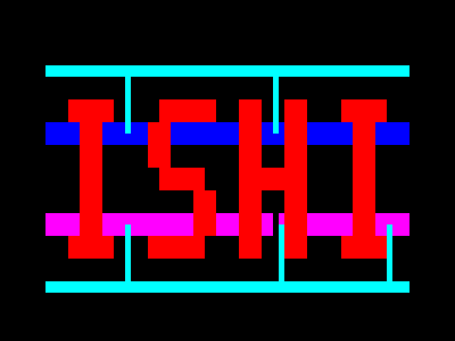
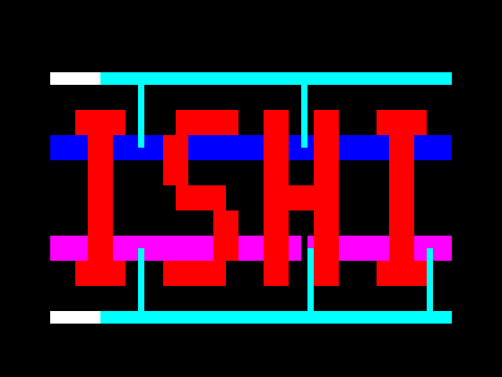
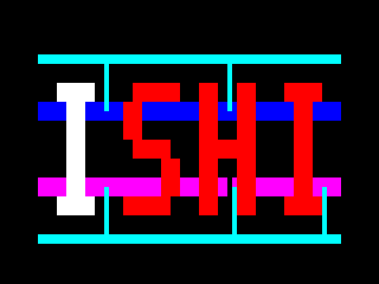

# アニメーションの試作比較

[比較ページ](index.html)をローカルブラウザで開くと、4案を同時再生できます。一時停止、速度変更、フレーム位置指定、元の静止画との比較ができます。

```sh
xdg-open docs/animation_samples/index.html
```

| 案 | 追加セル数 | 追加セル面積〔µm²〕 | 増加率 |
|---|---:|---:|---:|
| A · 配線の白点灯 | +13 | +34,642 | +11.5% |
| B · 配線を走る光 | +18 | +43,302 | +14.4% |
| C · 文字の順次点灯 | +15 | +38,812 | +12.9% |
| D · 色の切り替え | +16 | +40,737 | +13.5% |

基準は同じ固定APRtools/v59_4で新規合成した静止画版（209セル、301,192.8 µm²）。現在の提出版に後から加えたクロック分岐4セルは、双方の比較から外しています。これはセル面積の測定であり、配線後の外形寸法ではありません。

全案で6bitカウンタをフレーム末に更新し、1周64フレーム・約1.07秒。カウンタも含めて合成しました。外部CLKは3.15 MHz、追加ピン0、同期タイミングと図案の形を維持します。

RTLは64フレーム・3,360,000クロック/案を連続実行して、独立した既存の静止画参照と画面座標で求めた色変化に対してRGB/HS/VSを照合しました。ゲート回路は8種類の位相開始フレーム・420,000クロック/案を照合し、保存した表示データがRTLとバイト一致しました。ゲートモデルは単位遅延で、初期化は試験側だけにあります。

GIFと比較ページは、このシミュレーションの出力を画像化したものです。GIFの時間単位は10 msなので再生周期は約1.07秒、比較ページは60 Hzを基準に再生します。見た目を描き直した画像ではありません。

## GIFサンプル

### A · 配線の白点灯



### B · 配線を走る光



### C · 文字の順次点灯



### D · 色の切り替え


## 再現

設計ソース・設定は `experiments/animation_selected`。生成・合成・シミュレーションは `scripts/animation_samples.py`、画像化は `scripts/render_animation_samples.py`。試作は現行の `designs/grid_power` と `submission` を変更しません。

[面積の見込み・設定の範囲・再現コマンド](../../experiments/animation_selected/README.md)
