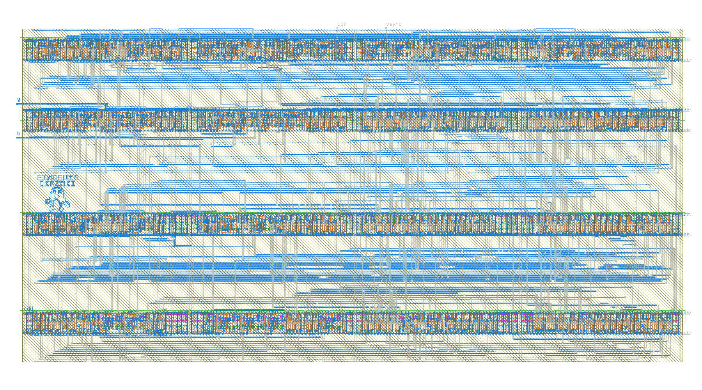
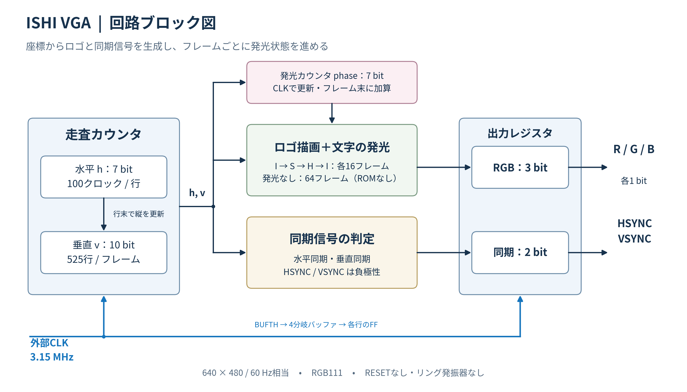

# ISHI VGA — TR-1um

ISHI会ロゴをVGAに出力し、**I → S → H → I → 発光なし**を繰り返す回路です。各文字は約0.267秒、発光なしは約1.067秒、1周は約2.13秒です。

**1792.8 × 897.2 µm、VDD込み7端子（共通VSSを除く）。** 外部CLK 3.15 MHz、640×480・60 Hz相当、RGB111。岡村氏の[APRtools](https://github.com/jun1okamura/TR-1um_APRtools)／v59_4を使い、論理合成・配置配線・検証を行いました。

[仕様・端子](SPEC.md) · [GDS](../../submission/ishi_vga.gds) · [抽出回路](../../submission/ishi_vga.extracted) · [再検証](REPRODUCE.md) · [版・由来](PROVENANCE.md)

これは**統合担当者へ渡す、パッド・フレーム未統合のコア**です。[提出レビュー](REVIEW.md)で再生成・DRC／LVS・全二値状態の動作を確認しました。配線RC・PVT・実I/O負荷は未検証で、特にクロック枝 `clk_row3` の配線容量の確認が残ります。

## 実機とシミュレーション

Tang Primer 20K＋抵抗DACでの実機動画。横向きに回転した[MP4](../../submission/fpga_demo.mp4)も収録しています。

ゲートシミュレーションで観測した表示。各文字16フレーム、発光なし64フレームです。

## 実装・検証

- 画像ROMを使わず、座標からロゴを描画。7 bitカウンタで発光状態を更新。
- M1/M2配線で半枠に収容。241論理セル、29 DFF。
- 描画DRC 0件、strict LVS一致、802信号端子の接続監査で欠落・短絡・断線0。
- セル遅延STA：setup余裕274.741 ns、hold余裕6.687 ns。
- RTL／ゲート：128フレーム・672万クロック一致。
- 抽出回路のngspice：1990素子、20試験・922クロックで状態24 bitと出力5 bitが一致。
- Tang Primer 20KへのSRAM書き込み・実機動画を収録。

[物理・論理検証記録](../../submission/verification/verification.json) · [抽出SPICEの条件と結果](SPICE.md) · [FPGA書き込み記録](../../submission/fpga/programming.json)

## レイアウト・構成

統合時のトップセルは **`ishi_vga_core`** です。左側中央に [名前とペンギン](SILICON_ART.md) をM1で配置しています。

名前・ペンギンを含む最終GDSの全レイヤー表示。

[ブロック図SVG](../../submission/ishi_vga_blocks.svg) · [実メタル上の端子位置](../../submission/ishi_vga_pins.png)
