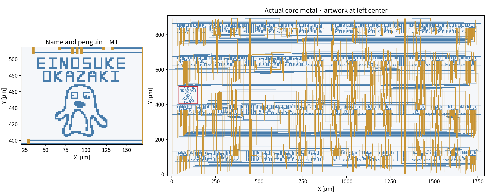

# 名前とペンギン

左側中央の空きスペースに、`EINOSUKE`／`OKAZAKI` の2行とペンギンをM1で配置しています。兄弟プロジェクト `balanced-ternary-logic` と同じ名前・フォント・元のペンギンを使いました。ソースは本リポジトリの `assets/silicon_art/` に固定してあり、再生成に兄弟リポジトリは不要です。



- 装飾全体：x=40〜148、y=404.1〜502 µm、108 × 97.9 µm。
- ペンギン：約64.8 × 64.8 µm。元図形を45%に縮小し、M1の1.8 µm画素に整形。瞳などの小成分を保持し、斜めの点接触を画素で補いました。
- 文字：2 µm画素。図形は描画レイヤーの実メタルで、テキスト注記ではありません。
- コア回路のM1／M2／V1から3 µm以上離隔。独立した `ishi_vga_art` セルを1個追加。既存セル名・端子・配線・全体外形は維持しています。

描画DRC 0、strict LVS一致、MDPは従来と同じCLKのFloating SG 1件です。元の全機能図形と端子を比較し、抽出回路も匿名番号を正規化して接続・素子パラメータの一致を確認しました。新規抽出回路のngspiceは20試験・922クロック合格です。金属配線RCの評価は含みません。

[図形生成記録](../../submission/verification/art_geometry.json) · [装飾後の検証](../../submission/verification/verification.json)

## 再生成

リポジトリ全体で実行します。装飾前入力は `release/ishi_vga_letter_scan_core/ishi_vga.gds` に固定しています。装飾の座標・倍率・文字列は `experiments/a_letter_silicon_art/config.py` にあります。

```sh
python3 scripts/check_toolchain.py
.venv/bin/python scripts/add_letter_silicon_art.py
.venv/bin/python scripts/run_apr.py --design-root experiments/a_letter_silicon_art apr/drc_pdk.py build/candidate.gds ishi_vga_core -r build/drawing.lyrdb --mdp > experiments/a_letter_silicon_art/build/drc.log 2>&1
.venv/bin/python scripts/run_apr.py --design-root experiments/a_letter_silicon_art apr/lvs_pdk.py build/candidate.gds ishi_vga_core --sch "$PWD/release/ishi_vga_letter_scan_core/ishi_vga_lvs.spice" -r build/core.lvsdb > experiments/a_letter_silicon_art/build/lvs.log 2>&1
.venv/bin/python scripts/run_apr.py --design-root experiments/a_letter_silicon_art apr/klayout_extract.py build/candidate.gds ishi_vga_core --no-combine -o build/core.extracted
.venv/bin/python scripts/verify_letter_silicon_art.py
.venv/bin/python scripts/letter_spice_check.py --design-root experiments/letter_art_spice
.venv/bin/python scripts/package_submission.py --out build/new_submission
python3 build/new_submission/tools/verify_bundle.py
python3 build/new_submission/tools/run_letter_tests.py saved-spice
```

DRCコマンドは既存のMDP警告1件により終了コード1を返します。無条件に無視せず、後続の装飾検証で描画違反0と警告が装飾前と完全一致することを確認します。SPICEの生波形には数百MiB以上の作業領域が必要です。パッケージ生成先は未作成のディレクトリを指定します。
