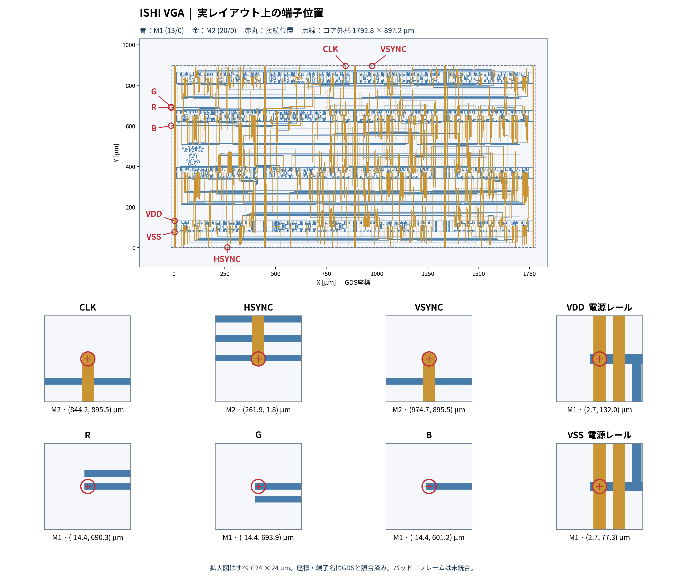

# ISHI VGA仕様

| 項目 | 値 |
|---|---|
| 動作 | I → S → H → I → 発光なし |
| 発光時間 | 各文字16フレーム、発光なし64フレーム。1周128フレーム、約2.13秒 |
| 電源・CLK | VDD=5 V、VSS=0 V、外部CLK 3.15 MHz |
| 映像 | 640×480・60 Hz相当、RGB111、HSYNC／VSYNC負極性 |
| RESET・リング発振器 | なし |
| 端子数 | 6信号＋VDD＋共通VSS。共通VSSを除く7端子 |
| コア寸法 | 1792.8×897.2 µm（1800×900 µm予算内） |
| GDSトップ／DBU | `ishi_vga_core`／0.001 µm |
| GDS bbox | 左下(-15.3, 0)、右上(1777.5, 897.2) µm |
| 論理セル・FF | 241セル、29 DFF |
| 配置インスタンス | 論理241＋TAP2 20＋FILL1 4＋FILL2 5＋FILL3 44=314 |
| スタンダードセル | 固定したAPRtoolsのv59_4 |

寸法は端子引き出しを含むコアbboxです。左端をX=0へ合わせる場合は、配置のXを+15.3 µmにしてください。

## 端子

以下はコア端子の位置で、パッド番号ではありません。単位µm、GDS座標をそのまま記載。M1=13/0、M2=20/0。端子名は小文字。

| 端子 | 方向・機能 | 層 | X | Y | 接続位置 |
|---|---|---|---:|---:|---|
| `clk` | 入力、立上りクロック | M2 | 844.2 | 895.5 | 上辺 |
| `vsync` | 出力、負極性垂直同期 | M2 | 974.7 | 895.5 | 上辺 |
| `hsync` | 出力、負極性水平同期 | M2 | 261.9 | 1.8 | 下辺 |
| `r` | 出力、赤1 bit | M1 | -14.4 | 690.3 | 左辺 |
| `g` | 出力、緑1 bit | M1 | -14.4 | 693.9 | 左辺 |
| `b` | 出力、青1 bit | M1 | -14.4 | 601.2 | 左辺 |
| `vdd` | 電源、5 V | M1 | 2.7 | 132.0 | 電源レール上 |
| `vss` | 共通接地、0 V | M1 | 2.7 | 77.3 | 電源レール上 |

VDD/VSSの座標はレール上の注記点で、信号と同じ外周引き出しではありません。統合側で各電源レールへ接続してください。

下段は各端子を中心とした24×24 µmの拡大図です。数値はGDS座標で、電源2点も含めた8端子を実メタル図形・GDSの注記と照合しています。

## 走査タイミング

| 区間 | 水平クロック数 | VGA画素時間換算 | 垂直行数 |
|---|---:|---:|---:|
| 表示 | 80 | 640 | 480 |
| フロントポーチ | 2 | 16 | 10 |
| 同期Low | 12 | 96 | 2 |
| バックポーチ | 6 | 48 | 33 |
| 合計 | 100 | 800 | 525 |

水平31.5 kHz、1行31.746 µs、垂直60 Hz、1フレーム16.667 ms。RGBとHS/VSは同じクロックでレジスタ出力します。帰線中RGBは黒です。

実装上の水平カウンタは7 bitで `71→70→…→0→127→…→100→71`。画面上の水平位置は `(71-h) mod 128`。行末の `h=100` で垂直カウンタを更新します。

垂直カウンタは10 bitで `500→501→…→1023→0→500`。画面上の行は `(v-500) mod 1024`。HSYNCは更新前の `106≤h<118`、VSYNCは `990≤v<992` でLow。出力は更新前のh/vに対応するため、RGB・同期を一緒に解釈してください。

表示図案の有色部分の外接範囲は画面の `[64,576)×[92,412)`、512×320画素。横の変化は8画素単位です。旧128×108・RGB222・6.3 MHz案とは異なります。

| RGBコード | 色 |
|---|---|
| 000 | 黒（背景・帰線） |
| 001 | 青 |
| 011 | 水色 |
| 100 | 赤 |
| 101 | 紫 |
| 111 | 発光中の文字 |

画像ROMは使いません。座標から文字・横帯・電源枝5本を判定し、基本の5色へ割り当て、選択中の文字の赤い部分だけをRGB=111にします。「電源枝」は表示するロゴの図案を指し、チップ内部の電源配線本数ではありません。

## 発光の制御

7 bitの `phase` は1フレームごとに0〜127を循環します。0〜15は左のI、16〜31はS、32〜47はH、48〜63は右のIが発光し、64〜127は元のロゴを表示します。更新は `h=100 && v=0` のフレーム末です。発光による変更もRGBの出力FFを通します。

## 起動と接続

VDDを安定させ、0〜5 VのCLKを入力します。ASICの5 V BUFTH入力は、3.3 V GPIOからの直結を前提にしません。RGB／HS／VSはデジタル出力であり、VGAの75 Ω終端はコアセルで直接駆動せず、I/O電圧に適合する外部バッファと抵抗DACを使います。

RESETはなく、電源投入直後の同期と発光位置は未定義です。h/vの二値遷移モデルは全131,072状態から正規周期へ入り、phaseの全128状態はそのまま有効な周期の一部です。二値モデルと、SPICEで試した電源立上り1条件は別の検証です。

## 検証範囲

- 描画DRC 0件、全8電気端子を含むstrict LVS一致。実メタルから802信号端子を検査し、欠落・短絡・断線0。
- RTL／ゲートは128フレーム連続、各672万クロックでRGB／HS／VS一致。全128のphase初期状態・遷移も照合。
- セル遅延STAはtyp 5 V/25℃、周期317.460317 ns。setup余裕274.741 ns、hold余裕6.687 ns、ピン容量違反なし。
- 最終GDSをno-combineで再抽出し、1990素子の回路でngspiceを実行。5 V/27℃、外部CLK 3.15 MHz、出力各1 pF。20試験・922クロック一致。[試験内容](SPICE.md)。
- 再生成したGDSのSHA256一致。FPGAのI/O・PLL・タイミングを確認し、SRAM書き込みと実機動画を収録。

STAと抽出SPICEには金属配線RC、PVT sweep、実パッド・基板負荷を含めません。ngspiceは選択した時間区間の解析で、2.13秒のアニメーション1周をアナログ解析したものではありません。

## フレーム統合

現GDSはフレーム未統合のコアです。マスク検査のCLK入力Floating SG警告1件は、フレームのI/O・ESD接続と併せて扱います。主催者の実テンプレートとパッド割当は別途合わせ、統合後に全体のDRC／MDP／LVSを確認します。

GDSには未参照ライブラリtopセルも含まれます。配置対象は **`ishi_vga_core` のみ**を選択してください。VDD/VSSは各行の電源レールへ接続し、bboxの負のX座標も考慮します。
