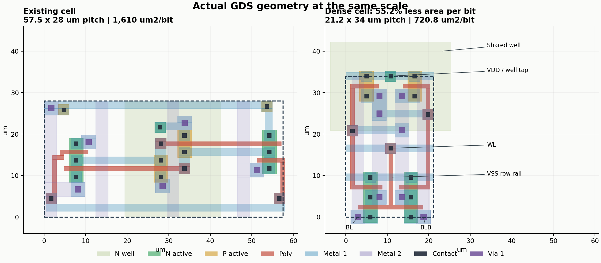
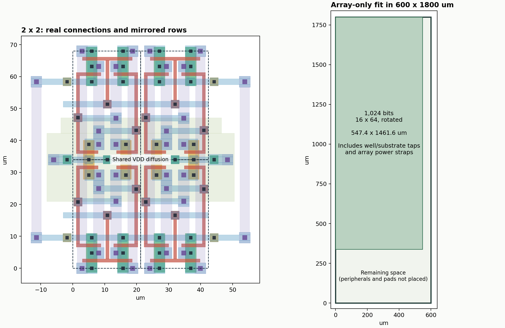

# TR-1um 高密度6T SRAM単セル

600×1800 µmに入るビット数を増やすため、既存の手描きセルから配置・配線を作り直した。
保存済みの成果物は [sram_dense.gds](sram_dense.gds)。元の [手配置GDS](../../learning/layout/sram.gds) と回路図は変更していない。

## 寸法と成果

| 比較項目 | 元のセル | 新しいセル |
|---|---:|---:|
| 列方向の配置ピッチ | 57.5 µm | 21.2 µm |
| 行方向の配置ピッチ | 28.0 µm | 34.0 µm |
| 周期配置の面積/bit | 1,610 µm² | 720.8 µm² |
| 相対ビット密度 | 1 | 2.234 |
| MOSのW/L | 全6個 3.4/1 µm | 全6個 3.4/1 µm |

周期配置の面積を55.23%削減した。これは配置ピッチの比較で、孤立したセルの外接矩形の比較ではない。
新セルの図形はウェルと共有拡散領域が配置境界を越え、外接矩形は29.0×44.0 µmになる。
隣接セルとの重なりと上下反転を前提に21.2×34.0 µmで配置する。



16行×64列＝1,024 bitの配置例もGDSに含めた。16列ごとのタップ・電源配線を含む全図形の外接矩形は
**1461.6×547.4 µm**。90°回転すると600×1800 µm内に収まり、アレイ部分が領域の約74.08%を使う。
行・列デコーダ、プリチャージ、列MUX、センスアンプ、シリアル制御、パッドはこの配置例に含まない。
チップ全体で1 Kbitを実現できるという判定ではない。



## 配置を小さくした方法

- PMOSを上、直列のアクセスNMOS・プルダウンNMOSを下にまとめ、NMOSをウェルの両側に離して置く構成を変更した。
- NMOS対はQ/QB側の拡散領域を共有する。上下の行は反転配置し、境界でVDD側またはBL/BLB側の拡散領域を共有する。
- PMOS間に各セルのウェルタップを置き、VDDへ実配線した。基板タップと垂直電源幹線は16列ごとの区画の両端に置く。
- BL/BLBと内部Q/QBの縦配線をM2、WL・電源レール・交差結合をM1、ゲート間接続をGCで配線した。
- コンタクト1.0 µm、V1 1.4 µm、MOSゲート長1.0 µmなど、インストール済みPDKの最小ルールを使用する。

高さ34 µmは、この配置でNMOS拡散端からウェルまでの10 µm、ウェルからPMOS拡散端までの7 µm、
MOSとコンタクト・V1の間隔に制約される。幅は4本のM2経路と列境界のコンタクト間隔に制約される。
21.6 µm幅の候補から配線位置を詰め、21.2 µmでDRCを通した。
全ての6Tトポロジーを総当たりした数学的な最小面積ではない。

## GDSの使い方

KLayoutで `klayout/dense_sram/sram_dense.gds` を開き、目的に応じて以下のセルを選ぶ。

| セル名 | 内容 |
|---|---|
| `sram_dense` | 反復配置用の6T単セル。基板タップ・外周電源幹線は上位で接続する |
| `sram_dense_1x1` | 単セル＋外周タップ・電源接続。Q/QBも外部ラベルとして観測可能 |
| `sram_dense_2x2` | 共有境界と配線を追うための最小アレイ |
| `sram_dense_4x4` / `sram_dense_8x8` | 内部セル・両方向の境界を含む検証用アレイ |
| `sram_dense_16x64` | 1 Kbitの面積・配線接続確認用アレイ |

基本単セル内の接続位置は次のとおり。座標単位はµm。
単セルの反復配置時に名前による短絡を導入しないよう、電気的なポートラベルは上位アレイで付けている。

| 信号 | 層 | 位置 |
|---|---|---|
| BL | M2 | x=2.9、列方向の連続配線 |
| BLB | M2 | x=18.7、列方向の連続配線 |
| WL | M1 | y=16.6、横方向の連続配線 |
| VSS | M1 | y=9.6、横方向の連続配線 |
| VDD | M1 | y=34.0、上下の反転行が共有 |
| Q | M2 | x=8.1、内部保持ノード |
| QB | M2 | x=13.5、内部保持ノード |

通常の列はx方向に21.2 µmずつ並べる。行rの変換は、偶数行なら `R0, y=r×34`、
奇数行なら `M0, y=(r+1)×34`。`M0`はX軸に関する鏡映（上下反転）。
BLとBLBを入れ替える左右反転ではない。
16列ごとに26.2 µmのタップ・電源区画を追加する。生成スクリプトが全ての接続を作る。

## 検証結果

2026-09-11、保存されたGDSを対象に以下を確認済み。
機械可読の結果・GDSハッシュは [verification.json](verification.json) に保存する。

| 構成 | MOS数 | PDK DRC | PDK LVS |
|---|---:|---|---|
| 1×1（外周接続込み） | 6 | 違反0 | 一致・警告なし |
| 2×2 | 24 | 違反0 | 一致・警告なし |
| 4×4 | 96 | 違反0 | 一致・警告なし |
| 8×8 | 384 | 違反0 | 一致・警告なし |
| 16×64 | 6,144 | 違反0 | 一致・警告なし |

インストール済みPDKの `drc/run.drc` と `lvs/run.lvs` をそのまま使用する。
この設計専用の接続補正、must-connect宣言、除外マスク、ポート無視、寸法許容差の追加は行っていない。
LVSは標準のdeepモードと厳密ポート比較で、独立に記述した6T回路と比較する。
交差結合の切断、BLとBLBの短絡をそれぞれ加えた故障コピーがLVSで不一致になることも確認した。

1×1から抽出した6T回路とW/L・AS/AD/PS/PDを、既存の
`learning/schematics/sram_tb_array_write_control.sch` の4個のセルに適用したSPICE検証もPASSした。
5 V・27℃、追加CBL=10 fF・CY=100 fFで、書き込み、センス読み出し、非選択セル保持、
行列選択、プリチャージ・センス初期化の既存判定を維持している。
抽出した配線RC、1 Kbit全体のアナログ動作、PVT・ミスマッチ、電源降下、ラッチアップ耐性は未評価。
タップ間隔16列は今回の配置上の選択で、これらの耐性を保証する値ではない。

## 再生成・再検証

リポジトリのルートから実行する。必要なものはPython 3、KLayoutのPythonモジュールと実行ファイル、
Xschem、ngspice、インストール済みTR-1um PDK。描画のみmatplotlibも使用する。

```sh
python3 klayout/dense_sram/build.py
python3 klayout/dense_sram/verify.py
python3 klayout/dense_sram/render.py
```

`build.py` はこのディレクトリのGDSと寸法JSONを再生成する。手作業でGDSを変更した後には不用意に実行しない。
`verify.py` は保存済みGDSを読み、回路基準・DRC/LVS結果・抽出回路・シミュレーションログを
`build/dense_sram/` に出力する。元の回路図やGDS、ユーザーのXschem設定は変更しない。
`--skip-spice`を指定するとDRC/LVSと故障検出だけを確認する。
再検証後の記録を更新する場合は `build/dense_sram/results.json` を `verification.json` にコピーする。
