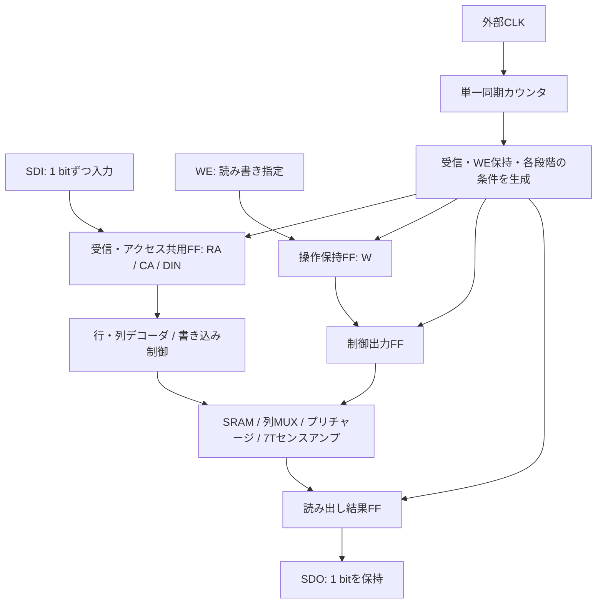

# シリアルSRAM制御仕様

2026-09-12改訂。受信段とアクセス保持段を共用し、RA/CA/DINの二重保持を廃止。外部CLKだけでシリアル受信から読み書き完了まで進める、電源込み7ピンの仕様。制御部はVerilog RTLで記述し、状態表とテストベンチの基準にする。

この文書は以前の設計案を全面的に置き換える。論理仕様に基づく制御RTLとデジタルTBを実装し、論理動作を検証済み。2×2用のスタセル回路図とSRAMを接続したSPICE統合検証も完了。デジタル検証は [rtl/README.md](../../sram512/rtl/README.md)、回路図と実モデルでの検証は末尾および [TESTBENCHES.md](TESTBENCHES.md) に記す。

## 1. 基本構成

- 1回の操作で、指定した1セルに1 bitを書き込む、または読み出す。
- アドレスと書き込みデータをSDIから1 bitずつ、CLK立上りごとに受信する。
- 単一の同期カウンタで、受信からE0〜E7までを順に進める。
- START、LOAD、BUSYの外部ピンは設けない。独立した内部STARTや開始待ち状態も設けない。
- 受信長と操作長は固定。読み出しでも書き込みと同じ数のクロックを送る。
- 読み出し結果は1 bitのFFに保持してSDOへ出す。出力シフトレジスタは不要。
- 電源投入後にRESETで受信位置を初期化する。正常な連続操作では毎回のRESETは不要。



図はデータと制御の流れ。CLKはカウンタだけでなく全FFへ共通に接続する。RESETも全制御FFへ接続する。

## 2. 外部ピン

| ピン | 方向 | 仕様 |
|---|---|---|
| VDD | 電源 | 5 Vを設計・検証の基準とする |
| VSS | 電源 | GND |
| CLK | 入力 | 全FFの共通クロック。立上りで受信・手順を進める |
| RESET | 入力 | HIGHで非同期初期化。CLKを送らなくても有効 |
| SDI | 入力 | 行アドレス、列アドレス、DINの順に直列入力 |
| WE | 入力 | 1=書き込み、0=読み出し。E0で内部Wへ保持 |
| SDO | 出力 | 最後に完了した読み出しの1 bitを保持。RESETで0 |

合計7ピン、うち信号5ピン。アドレスを拡張してもピン数は変わらない。WEと内部WRITE_ENは別信号であり、WEを直接プルダウン回路へ接続しない。SDOは常時駆動する論理出力とし、三態制御は設けない。パッド・ESD・外部負荷用の出力段は物理実装時に追加・評価する。

## 3. アドレス幅と送信形式

`ROW_BITS`、`COL_BITS`を、それぞれ1以上の実装時パラメータとする。配列は `2^ROW_BITS` 行、`2^COL_BITS` 列。送信中に幅を変更する機能は設けない。

```text
受信長 N = ROW_BITS + COL_BITS + 1
1操作のCLK立上り数 = N + 8
カウンタ幅 = ceil(log2(N + 8))
```

SDIの送信順は、行アドレスのMSBからLSB、列アドレスのMSBからLSB、最後にDIN。

```text
RA[ROW_BITS-1], ..., RA[0], CA[COL_BITS-1], ..., CA[0], DIN
```

読み出しでもDINの位置を省略せず、0を送る。回路はその値を取り込むが、読み出し操作には使用しない。WEはこの直列データに含めない。

| 配列 | ROW_BITS | COL_BITS | 受信長N | 1操作の立上り数 | カウンタ幅 | 読み出し幅 |
|---|---:|---:|---:|---:|---:|---:|
| 2×2 | 1 | 1 | 3 | 11 | 4 bit | 1 bit |
| 16×16 | 4 | 4 | 9 | 17 | 5 bit | 1 bit |
| 32×32 | 5 | 5 | 11 | 19 | 5 bit | 1 bit |

N bitのシフトレジスタは受信段階にだけ、以下の向きに更新する。

```verilog
shift_reg <= {shift_reg[N-2:0], SDI};
```

N回受信した後の内容は次の配置になる。

```text
shift_reg[N-1 : COL_BITS+1] = RA
shift_reg[COL_BITS : 1]     = CA
shift_reg[0]               = DIN
```

RA/CA/DINはシフトレジスタのQ出力を直接使い、別のアクセス保持FFを置かない。受信中はシフト途中の値がデコーダ・書き込み制御へ渡るが、WL_EN=WRITE_EN=0、SAE=1を保つ。最後の受信で全bitが揃い、E0〜E7ではシフトを止めてアドレスとデータを保持する。Wは別のFFでE0にWEを取り込む。前回の受信内容は次のN回のシフトで全て置き換わるため、操作ごとの消去は不要。

## 4. カウンタと状態遷移

`count`は「次のCLK立上りで実行する手順の番号」。以下の表は必ず立上り直前のcountで読む。立上りで、その番号の処理とカウンタ更新を同時に行う。

| 条件 | カウンタの動作 |
|---|---|
| RESET=1 | 非同期で0へ戻す。全保持値も初期化 |
| RESET=0、0 <= count < N+7 | CLK立上りでcount+1 |
| RESET=0、count=N+7 | E7を実行し、CLK立上りで0へ戻す |
| RESET=0、count>N+7 | 次のCLKで0へ戻し、制御出力を非アクセス値へ戻す |

未使用符号から戻る際は、受信・WE保持・読み出し結果取り込みを行わない。これは誤動作中のメモリ内容を保証する機能ではない。正常動作ではRESET後に未使用符号へ入らない。

```text
RESET → count=0

受信0 → 受信1 → ... → 受信N-1 → E0 → E1 → ... → E7
  ↑                                                        │
  └──────────────── 次の操作 ──────────────────────────────┘
```

`count == N` がE0の処理条件になる。別のSTARTパルス、START保持FF、受信専用カウンタ、アクセス専用カウンタは作らない。各条件を組み合わせ論理で作り、対応するFFの更新を選ぶ。

## 5. 受信からE7までの動作

| 立上り直前のcount | 手順 | その立上りでの更新・直後の動作 |
|---|---|---|
| 0〜N-1 | 受信 | SDIを1 bitシフト。SRAMへのアクセスは行わない |
| N | E0 | RA/CA/DINは受信段で保持を継続。外部WEをWへ保持。全BL/BLBと共通線Y/YBをプリチャージ。読み出しならSA入力を接続して初期化 |
| N+1 | E1 | プリチャージ解除。充電用PMOSがOFFになる時間を取る |
| N+2 | E2 | 書き込みならWRITE_ENを上げ、片側プルダウン開始 |
| N+3 | E3 | WL_ENを上げ、選択行へのアクセス開始 |
| N+4 | E4 | 読み出しならSAEを上げて判定。書き込みならそのまま継続 |
| N+5 | E5 | WL_ENを下げる。書き込みのプルダウンは維持 |
| N+6 | E6 | WRITE_ENを下げる。読み出しならSOUTを読み出し結果FFへ保持 |
| N+7 | E7 | 操作完了。非アクセス値を維持し、count=0へ戻す |

E0では `W <= WE` と同時に、今回のWEからSAの動作を決める。直前の操作のWを使ってE0のSAEを決めない。

最後の受信とE0は別のCLK立上りのままとする。最後の受信でアドレスとデータが確定し、E0でWEを保持してプリチャージを始める。RA/CA/DINの転送はなくなったが、E0〜E7の制御表・外部クロック数は変えない。

### 2×2での外部操作例

行1・列0へ1を書き込む場合、最初の3回でSDIに `1, 0, 1` を送る。WEはE0の前後で1に保つ。

| 外部から数えた立上り | 直前のcount | 動作 |
|---|---:|---|
| 1 | 0 | RA=1を受信 |
| 2 | 1 | CA=0を受信 |
| 3 | 2 | DIN=1を受信 |
| 4 | 3 | E0：WEを保持・プリチャージ |
| 5〜10 | 4〜9 | E1〜E6 |
| 11 | 10 | E7：操作完了・count=0 |
| 12 | 0 | 次の操作のRAを受信 |

同じセルを読む次の操作では、SDIに `1, 0, 0` を送り、E0でWE=0とする。E7後にSDO=1を確認する。読み出し結果は次のCLKでシフトアウトするものではなく、1 bitの電圧として既に出ている。

## 6. 制御出力の真理値表

表の値は、その手順のCLK立上り後、FF出力が落ち着いたときの値。カウンタ自体は既に次の手順番号になっている。更新後のcountを生デコードした値とは区別する。

`P`はPREBとYPREBの共通値で、0=プリチャージON。`W`はE0で保持した操作指定。E0の行だけは、同じ立上りで取り込む外部WEを使う。

| 手順 | P | WRITE_EN | WL_EN | SAE |
|---|---:|---:|---:|---:|
| RESET・受信・E7・未使用符号からの復帰 | 1 | 0 | 0 | 1 |
| E0 | 0 | 0 | 0 | WE |
| E1 | 1 | 0 | 0 | W |
| E2 | 1 | W | 0 | W |
| E3 | 1 | W | 1 | W |
| E4 | 1 | W | 1 | 1 |
| E5 | 1 | W | 0 | 1 |
| E6 | 1 | 0 | 0 | 1 |

PREB/YPREB、WRITE_EN、WL_EN、SAEはFFで保持する。カウンタの複数bitの遷移によるデコードグリッチを、アナログ回路へ直接渡さない。RTLでは立上り前のcountに対する処理で、カウンタと制御出力FFを同時に更新する。表からさらに1周期遅らせない。

書き込み前にもローカル線と共通線をプリチャージする。SAEは書き込み中ずっと1なので、センス内部のプリチャージは行わない。読み出しではE0〜E3でSAE=0にし、入力接続・初期化・信号追従を行い、E4で入力を切り離して再生判定する。SAE=1はSA内部を0に消去する意味ではない。

## 7. デコーダ・書き込み回路との接続

RA/CA/DINは受信中だけシフトし、E0〜E7で保持する。WはE0でだけ更新する。受信中は全WLがLOW、両プルダウンがOFF、SA入力が切り離された状態にする。最後の受信後にアドレスを落ち着かせ、E0で全ビット線・共通線をプリチャージする。必要な充電が完了してからE1でプリチャージを切る。

2×2では次の関係を維持する。

```text
WL0   = !RA & WL_EN
WL1   =  RA & WL_EN
COL0  = !CA
COL1  =  CA
PD_Y  = !DIN & WRITE_EN
PD_YB =  DIN & WRITE_EN
```

列はCA安定時に常に1列選択。COL_ENは設けない。アドレス遷移中の一時的な複数列接続は、WLと書き込み駆動がOFFの期間に収める。受信中は列選択も変わり、ビット線の電荷共有が起こり得るため、アクセス前のE0で全ビット線・共通線を再充電する。

アレイ拡大時はアドレス幅に合わせてデコーダを拡張する。nMOS列MUX、共通の片側プルダウン、共通の7Tセンスアンプで1セルずつアクセスする方針は同じ。デコーダや配線の負荷増加に応じて出力段とCLK周期を評価する。

## 8. 非同期RESETと保持値

RESETはHIGH有効、CLKより優先。アサート時はCLKなしで全デジタル保持値を0へ戻す。初期値を作るためだけのCLKは不要。

| 保持値 | RESET時の値 | 更新する手順 |
|---|---:|---|
| count | 0 | 各CLK立上り |
| shift_reg（RA / CA / DINを兼用） | 0 | 受信のみ |
| W | 0 | E0のみ |
| READ_DATA | 0 | 読み出しのE6のみ |
| PC_ON | 0 | 制御表に従う。PREB=YPREB=!PC_ON |
| TRACK | 0 | 制御表に従う。SAE=!TRACK |
| WRITE_EN / WL_EN | 0 | 制御表に従う |

スタセル化ではDFFRを基本にする。PREB/YPREBとSAEは、内部に反対の意味を保持してQBから出す。これによりQの初期値は全て0で統一でき、DFFRに1へのプリセット機能を要求しない。RTLでもPC_ONとTRACKを0にリセットして反転出力する形で表現する。実際のQB利用への割り当てはスタセル化時に確認する。

RESET直後はPREB=YPREB=SAE=1、WRITE_EN=WL_EN=0、SDO=0。列デコーダはCA=0に応じて列0を選ぶが、全WLはLOWで書き込み駆動はOFF。

RESETはSRAMセルを消去しない。電源投入後、まだ書き込んでいないセルの読み出し値は未定義。アクセス中のRESETは中断として扱い、その中断によるメモリ内容は保証しない。

外部はCLKをLOWで停止してRESETを解除し、リセット解除から最初のCLK立上りまで、実装が要求する回復時間を確保する。SDIの先頭bitもその最初の立上りに間に合わせる。この外部タイミング規則を前提に、解除同期用の追加クロックはプロトコルへ入れない。RESETの最小パルス幅・解除間隔は実セルで確認する。

## 9. 外部タイミングと出力の扱い

- SDIは受信CLK立上りの前後でセットアップ／ホールド時間を満たす。基本はCLK立下り側で切り替える。
- WEはE0の前後でセットアップ／ホールド時間を満たす。操作全体で一定にしてよい。E0後のWE変化はその操作へ反映しない。
- E0〜E7中はSDIを無視する。CLKは手順を進め続ける。
- READ_DATAは読み出しのE6でだけ更新し、SDOへ出す。RESET以外では、書き込み・受信・次回のプリチャージで変えない。
- 外部の結果観測時点は読み出しのE7後とする。E6からのFF・出力バッファ・負荷の遅延も満たすこと。
- E7後、および受信中はCLKをLOWで止めて待てる。その時点の受信途中の値と非アクセス出力を保持する。
- E0〜E7は同じCLK周期で進め、書き込みでもE4などの段階を省略・短縮しない。アクセス途中での任意長停止は仕様に含めない。
- クロックを連続供給すれば、E7の次の立上りから次の操作の受信が始まる。入力が不要な単なる空クロックという扱いにはしない。
- 余分なCLKや不足したCLKは送受信の位置ずれになる。自動検出・自動再同期は設けず、RESETで受信先頭へ戻す。

CLKは外部から供給し、内部発振器は作らない。全FFを共通CLKで駆動し、保持／更新はD入力側の論理・MUXで選ぶ。単純なANDによるCLKゲーティングとリップルカウンタは使わない。

検証の開始条件は5 V・27℃・CLK周期100 ns。既存アナログ回路の追加容量は2×2の各ローカル線10 fF、共通線100 fFを引き継ぐ。これらは抽出値ではない。

本仕様の制御で論理上WL_ENがHIGHなのはE3→E5の2周期、書き込み駆動はE2→E6の4周期。読み出しのSAE立上りから結果取り込みまではE4→E6の2周期。実際のWL・PD・ビット線・SOUTの遅延を含めて成立することを統合検証する。

100 nsは最短周期や製品保証値ではない。配列の拡大、配線抽出、電源・温度・素子ばらつきを反映したタイミング値は実装後に確定する。論理プロトコルを変えずにCLK周期を調整する。

## 10. Verilogでの記述と検証

制御部のRTLには、パラメータ化した受信・アクセス共用シフトレジスタ、単一カウンタ、WE保持FF、制御出力FF、読み出し結果FFを記述する。受信回路とアクセス回路の間に別のSTARTハンドシェイクは作らない。

FF更新は共通のCLK立上りと非同期RESET、ノンブロッキング代入で記述する。保持条件はクロックイネーブルとして表現し、必要なMUXはスタセル化で実現する。今回は自動論理合成を必須にせず、動作確認後にゲート構成を決めてXschem回路図へ対応付ける。繰り返し部分はスクリプト生成できる。RTLと実回路には共通の操作を与え、動作を照合する。

デジタルTBはSDI/WE/CLK/RESETから操作し、SRAM部分の動作モデルと期待メモリを使ってSDOを照合する。内部信号は状態と制御順序の検証にも使う。SRAMモデルは未書き込みセルを初めから0と仮定しない。

最低限、以下を自動判定する。

1. CLKなしの非同期RESETで全デジタル保持値と非アクセス出力が初期化され、解除後の最初の立上りが受信0になる。
2. 各アドレス幅でMSB先行の受信とRA/CA/DINへの分割が正しい。受信中の各シフトがRA/CA/DINへ反映されても、WL・書き込みはOFFで、セル内容とSDOは保持される。
3. 全手順のカウンタ・制御出力・保持／更新が表と一致する。E7から受信0へ追加クロックなしで戻る。
4. E0後にSDIとWEを変更しても実行中の操作に影響しない。WEはE0で今回の値を使い、読み書きを交互にしても正しい。
5. 全4セルに両方の値を書き、読み出し結果をSDOで確認する。他セルの内容は変わらない。
6. READ_DATAは読み出しのE6で更新し、受信・書き込み・次回プリチャージでは保持する。
7. 連続操作、操作間のCLK停止、受信途中の停止・再開、受信途中のRESETで受信位置が仕様どおりになる。
8. アクセス中のRESETで制御が解除される。中断したメモリ内容の一致は要求せず、必要なセルへ再書き込みして以後の動作を確認する。
9. 2×2に加え16×16・32×32相当のパラメータでも、フレーム長・アドレスの取り違え・カウンタの折り返しを確認する。

その後、実スタセルと既存2×2アナログ回路を接続したSPICE TBで、実WL/PDの順序、プリチャージ、センス判定、非選択セル保持、FFのセットアップ／ホールド、RESET動作を確認する。RTLのPASSはアナログ動作の保証を意味しない。

## 11. 既存回路の扱いと実装範囲

本仕様を実装する順序は、制御RTLとデジタルTBの作成・検証、スタセル回路への反映、既存2×2とのSPICE統合検証、レイアウトとDRC/LVS・抽出後検証とする。

以前の並列入力・START受付・同期RESETのシーケンサー、保持レジスタ、専用TBの回路図・シンボルは削除した。それらに依存する専用検証スクリプトと操作一覧も削除した。旧実装はGit履歴で参照できる。

| 残す回路・TB | 本仕様での利用 |
|---|---|
| `learning/schematics/row_decoder_1to2.sch` / `.sym` | 保持したRAとWL_ENを入力する |
| `learning/schematics/col_decoder_1to2.sch` / `.sym` | 保持したCAを入力し、安定時に常に1列を選択する |
| `sram512/schematics/write_control.sch` / `.sym` | 保持したDINとWRITE_ENから両プルダウンを制御する |
| SRAMセル・列MUX・プリチャージ・7Tセンスアンプ | 既存の2×2構成を接続し、新制御で再検証する |
| `learning/schematics/sram_tb_array_write_control.sch` | シーケンサーを追加する前の、既存2×2と周辺回路の検証基準 |

新仕様の制御RTLは `sram512/rtl/sram_serial_controller.v` に実装済み。シリアル受信、単一カウンタ、非同期RESET対応の保持・制御、SDOへの結果保持を含む。`tb/`の動作モデルとデジタルTBを `python3 scripts/verify_rtl.py` で検証する。

2×2、16×16、32×32、4×8、8×16の全5構成でデジタル検証がPASS。結果と検証範囲は [rtl/README.md](../../sram512/rtl/README.md) を参照。スタセル回路図とSPICE統合TBは2×2について作成・検証済み。制御回路のレイアウトと抽出後検証、拡大配列でのアナログ検証は未実施。


## 12. 2×2のスタセル実装とRTL照合

[sram_serial_controller.sch](../schematics/sram_serial_controller.sch) は、既存PDKスタセルを直接並べた1枚の回路図。独自の1 bit保持レジスタ用サブ回路・シンボルは作らず、MUX2のAへQを戻すフィードバック、Bへの新データ、DFFRのDへの接続を実配線で示した。制御ブロック全体を統合TBへ接続するための [sram_serial_controller.sym](../schematics/sram_serial_controller.sym) のみ作成した。

回路図は次の6区画で読む。

| 区画 | 内容 |
|---|---|
| A | 4 bit同期カウンタ。0〜9なら+1、10〜15なら0へ戻す |
| B | 現在countからRXとE0〜E7を判定。countと反転値の共通線からANDへ配線 |
| C | 状態判定とWE/Wを組み合わせ、プリチャージ・WL・書き込み・SAEをFFで保持 |
| D | SDI→DIN→CA→RA。受信中だけシフトし、E0〜E7では同じFFで保持。Qを直接出力する |
| E | E0でWE→Wを取り込み、それ以外は保持 |
| F | E6かつW=0でSOUTを取り込んでSDOへ出し、それ以外は保持 |

DFFRはカウンタ4個＋受信兼アクセス保持3個＋WE保持1個＋制御出力4個＋結果保持1個の計13個。MUX2は5個、全体では48個のスタセル。旧構成からRA/CA/DIN用のDFFR×3とMUX2×3を除去した。RST端子は全てRESETに接続する。PREBはPC_ONのQB、SAEはTRACKのQBから出し、リセット時にHIGHにする。PREBとYPREBは共通なので、回路図ではPREBの1ポートから両方へ配線した。

スタセルへの割り当ては手で決めており、論理合成ツールは使用していない。配置と配線を再現するコードは `scripts/build_serial_schematics.py`。これは明示的な座標・配線の生成で、P&Rではない。実行すると生成対象の手編集を上書きするため、再生成が必要な場合だけ使用する。通常の検証では実行しない。

[sram_tb_serial.sch](../schematics/sram_tb_serial.sch) は既存のセル・行列デコーダ・nMOS列MUX・書き込み制御・プリチャージ・7T SAへ上記制御回路を接続したもの。電圧源はVDD、CLK、RESET、SDI、WEのみ。内部WLやPD、SAEを理想電圧源で代替していない。各ローカル線に10 fF、共通線に100 fF、SA各出力とSDOに10 fFを追加した。パッドや外部配線負荷を再現したものではない。

実行は `python3 scripts/verify_serial_spice.py`。既存の回路図をネットリスト化し、ngspiceで解析後、同じ外部入力系列をRTLへ与えて比較する。刺激は `scripts/serial_spice_stimulus.py`、RTL比較用TBは `learning/tb/tb_serial_spice_reference.sv`。状態・受信兼アクセス保持値・WE保持値・制御出力・SDOの比較時点は各CLK/RESET立上り開始から35 ns後で、ゲート遅延を0と仮定した比較ではない。

5 V・27℃・CLK周期100 ns・立上り立下り1 nsで、19操作、3,408件のRTL比較、954件のアナログ区間判定がPASS（2026-09-12）。受信中の全WL・両PDのLOW、SA入力切り離し、書き換え対象を含む全既知セルの保持も区間判定した。全4セルの両値の書き込み・読み出し、非選択セル保持、実WL/PDの順序、プリチャージ完了、SA初期化、E6でのSDO保持を確認した。

受信途中にCLKを止め、RESETでカウンタ・受信兼アクセス保持値・W・HIGHだったSDOがCLKなしで初期化されることも確認。解除後は受信先頭から再開し、RESET前に書いたSRAMの値を読み戻した。起動時も含め `.ic` による状態強制は使っていない。

これは回路図の名目モデルでの検証で、最短周期、PVT、素子ミスマッチ、任意のアクセス途中でのRESET、パッド駆動、配線抽出後の挙動の保証ではない。16×16などの拡大配列のPASSはRTL段階のみである。

## 13. 保持段共有による面積削減

受信とアクセスを同時に行わないため、N bitの受信FFをそのままアクセス中の保持に使う。カウンタの状態判定と制御出力FF、行・列デコーダはこの変更で最適化・変更しない。最終容量は未確定で、16×64を実装目標に固定しない。

削減するのはDFFR×N＋MUX2×N。総FF数は`K+2N+6`から`K+N+6`へ減る。既存スタセルの共有配置面積では、1組が4,840＋2,722.5＝7,562.5 µm²。2×2では0.0226875 mm²、16×16では0.0680625 mm²、16×32では0.075625 mm²の素子面積を削る計算になる。配線込みの実配置面積ではない。

実ネットリストの全13保持bitとSDI/WE/SOUTを全列挙した65,536条件・851,968比較で、各FFの次状態が仕様式と一致した。拡張用ゲート生成も6構成で各2,048クロックと非同期RESETをRTLに照合した。大きな配列での負荷・配線・アナログ動作は、この論理一致とは別に検証する。
