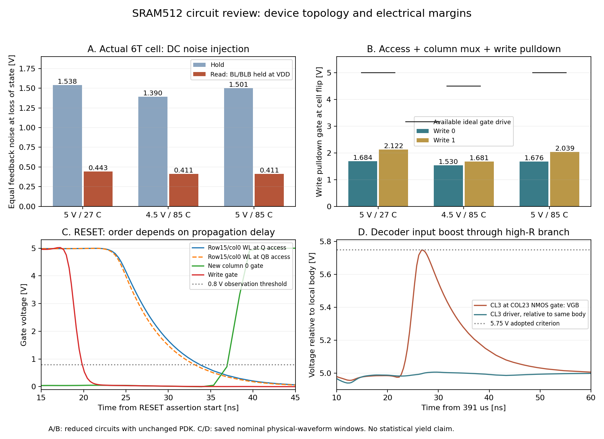

# SRAM512 回路構成・電流経路の追加レビュー

対象日：2026-09-13。対象GDS：`56810ad742a73036fb9db5207c75a2fcd63d344833c17da5f6270f1dc128bca1`。
PDK：変更していないTR-1um dev、commit `6afbd918951f2ea0dcd11c5a46986b4c20f9e6f9`。

**回路を構成するMOSの接続、帰還の極性、各動作の電流経路を追った範囲では、記憶・書込み・読出しが原理的に成立しない接続は見つからなかった。ただし、電圧余裕とRESETの切断順序に設計上の懸念があり、動作・歩留まりを含む製造承認は保留とする。**

この判断は既存のPASS件数から導いていない。[セル](../sram512/schematics/sram512_bitcell.sch)、[列回路](../sram512/schematics/sram512_column.sch)、[7Tセンスアンプ](../sram512/schematics/sense_amp_7t.sch)、[制御回路](../sram512/schematics/sram512_control.sch)、[全体回路](../sram512/schematics/sram512.sch)と、Xschemが生成したMOS接続を読んだ。さらに現GDSの厳密LVS抽出から得た実寸法・接合面積を使い、24条件の小回路DC解析を新規実行した。既存の詳細RC波形も、合否フラグを使わず、該当するMOS端子と制御切替の時刻を取り出した。

GDS・マスク・検証ツール・全体の試験範囲は[先の総合レビュー](sram512_review_2026-09-13.md)を参照。本書はその回路評価を補う。並行して変更されている検証ツールの修正完了を認定する資料ではない。



## 1. 優先して扱う回路・配線上の懸念

| 項目 | 回路から分かったこと | 判断 |
|---|---|---|
| C1：内部デコーダの電圧上昇 | COL23を作るAND2のCL3入力が、ドライバ側より大きく持ち上がる。最大VGB=5.74747 V | 採用上限5.75 Vまで約2.53 mV。製造判断を止める主要事項 |
| C2：RESETの切断順序 | アドレスとアクセス制御を同時にリセットするため、WL・列選択・書込みの切断順序が伝搬遅延に依存する | 対象外セルの破壊は今回の波形で見つからない。設計上の時間条件として保証が必要 |
| C3：6Tセルの行半選択 | 保持用NMOSとアクセスNMOSが同幅。1行の32セルは全てWLで開く | 名目モデルで静的安定点はある。読出し時の余裕と局所ばらつきを詰める必要がある |

### C1：CL3の高抵抗ゲート配線に電圧上昇が残る

`decoderfix_reset_write1`の391,026.6835 nsで、COL23用AND2のNMOS `XM4774`を直接調べた。

| 観測点 | 電圧／値 |
|---|---:|
| 当該MOSのゲート、外部GND基準 | 5.761291 V |
| 当該MOSのボディ、外部GND基準 | 0.013823 V |
| **同じMOSのVGB** | **5.747468 V** |
| CL3ドライバ出力、外部GND基準 | 5.009368 V |
| 当該ゲート分岐のデッキ上のR | 79.181 kΩ |
| 同分岐に置かれた対地配線C | 38.221 fF、MOS固有容量は別 |

ドライバは約5 Vなのに、接続先ゲートで約0.75 V上乗せされる。AND2内部の切替、MOS容量、高抵抗分岐による電荷の逃げにくさが原因候補であり、波形の形とも整合する。これは回路・配線に由来する推論で、素子容量ごとの寄与を分離した解析までは実施していない。

このノードは外部入力クランプの内側にある。CLK等にDP/DNが付いていても、そのクランプが遠い内部ゲートを常にVDD近傍に制限する構成ではない。LVSの一致はこの電圧上昇を防がない。

5.75 Vは固定PDK資料に基づく推奨動作電圧の採用基準であり、破壊電圧を意味しない。全電圧対の最悪区間の数値収束、使用電圧・温度・寄生条件を確認し、必要に応じてCL3等の配線抵抗低減や負荷近傍のバッファを検討する。抵抗・容量係数は未校正なので、79.181 kΩを製造後の確定抵抗としては扱わない。

### C2：RESETでアドレスを先に動かさない保証が構成上明確でない

通常動作ではフレームFFのアドレスをアクセス中ずっと保持し、WLを下げてから書込み駆動を解除する。しかしRESETは、同じRSTIから次を同時に進める。

- RA/CA/DINのFFを0にする。
- WL_EN/WRITE_ENのFFを0にする。
- フェーズ、動作モード、出力FFを0にする。

従って、アドレス511の書込み中にRESETすると、元の行・列が切断される途中で、アドレス0に向けてデコーダ入力も動く。最終的にWL_EN=0になることだけでは、途中の対象外セルへの接続や共通線の残留電荷の影響まで説明できない。

現GDS、5 V/27°C、5 ns入力遷移の保存波形では、次の順序だった。数値は外部RESET立上り開始からの時間で、**0.8 Vを観測の共通基準**にした。

| 観測 | 書込み0中のRESET | 書込み1中のRESET |
|---|---:|---:|
| 共通書込みMOSのゲートが0.8 V未満 | 19.816 ns | 19.845 ns |
| 行15・列0のQ側アクセスゲートが0.8 V未満 | 33.676 ns | 33.708 ns |
| 同QB側 | 32.998 ns | 33.060 ns |
| 行15の64個のアクセスゲートが全て0.8 V未満 | 36.441 ns | 36.501 ns |
| 新しいCOL0のMUXゲートが0.8 V以上 | 36.975 ns | 36.957 ns |

COL0に直接関係する行15・列0では、遅い側との間に約3.25〜3.30 nsある。行15全体の最後のゲートとの差は約0.46〜0.53 nsだが、これは別の列のゲートも含む参考値であり、COL0の誤書込み余裕そのものではない。0.8 VもMOSの厳密な遮断電圧ではない。対象外行のWLドライバの最大値は約0.051 Vだった。

従って、**今回の波形からRESETによる誤書込みが起きたとは言えない。一方、この切断順序は回路の論理だけで固定されておらず、遅延の相対関係に依存している。** 書込み駆動は先に切れているものの、共通線には電荷が残るため、最終段のPDだけのOFFで全ての影響がなくなるとは限らない。

さらに、既存の2条件では行15・列0を、割込み中の書込みデータと同じ値に初期化している。ここへの同値の誤書込みは内容比較では判別できない。これはアドレス0への切替経路を回路から追った結果、確認すべきと分かったパターンである。

対応として、RESET時はまずWL・書込み経路を閉じ、アドレス変更はその後にする構成を検討する。現在の構成を採るなら、使用するプロセス・電圧・温度・入力slewで切断順序を保証し、行15・列0を反対値にした場合や各RESET位相を調べる。RESET解除のrecovery/removal条件も外部仕様に必要になる。

### C3：同幅6Tセルは成立するが、読出し時は保持時より余裕が減る

セル内の全6 MOSはW/L=3.4/1 µm。保持用NMOSとアクセスNMOSの描画寸法比は1である。ただしNMOSとPMOSの同幅は同じ駆動力を意味せず、比1だけで読出し破壊を断定することもできない。

Q=0を保持しているとき、WLを上げると、充電されたBLからアクセスNMOSを通ってQへ電流が入る。Q側の保持NMOSはこれをVSSへ逃がすため、Qは厳密な0 Vから浮く。WLは1行の全32セルで共通なので、この擾乱は選択列以外の31セルにも及ぶ。非選択列のMUXがOFFでも、セルとその列のBLの接続はONである。

現GDSから取り出した6 MOSに、左右の帰還をそれぞれ状態が崩れる向きへずらす等しいDC雑音源を入れた。両状態について1 mV刻みで掃引し、保持状態を失う境界を調べた。方法は二つの逆極性DC雑音源を使うSNMの定義に対応する。[Grossarほか、JSSC 2006、Fig. 1とSection II-A（著者公開本文）](https://www.researchgate.net/publication/2983293_Read_Stability_and_Write-Ability_Analysis_of_SRAM_Cells_for_Nanometer_Technologies)

| 条件 | 保持時の境界 | 読出し条件の境界 | 雑音0のときの低い記憶ノード |
|---|---:|---:|---:|
| 5 V、27°C | 1.537〜1.538 V | 0.442〜0.443 V | 1.008 V |
| 4.5 V、85°C | 1.389〜1.390 V | 0.410〜0.411 V | 0.900 V |
| 5 V、85°C | 1.500〜1.501 V | 0.410〜0.411 V | 1.021 V |

両極性とも同じ1 mVの区間に入った。読出し条件はWL=VDD、BL/BLBの両方を理想VDD源に固定したもので、浮遊BLが放電する実アクセスより継続的に電流を流し込む条件である。表の約1 VはこのDC条件の値で、実マクロの通常保持電圧を表すものではない。

**名目モデルには二つの安定した記憶状態と正の読出しSNMがある。従って、同幅セルが回路として必ず崩れる、という結果ではない。** ただし約0.41 Vを512セルの最低保証や局所ばらつき込みの余裕とは扱えない。左右のミスマッチ、アクセス対保持NMOSの差、電源雑音、隣接パターンの評価が残る。

保持NMOSを強くすれば読出し安定性は改善方向になるが、反転させる書込み側の条件も変わる。セル比だけを経験則で変更せず、両方の余裕を同時に評価すべきである。

## 2. 基本動作が成立する接続上の根拠

### 保持と書込みの帰還・極性

セルは二つのCMOSインバータの出力を相手のゲートに戻す接続になっている。Q=0/QB=1では、Q側NMOSとQB側PMOSがON、反対の2 MOSがOFFになり、元の状態を維持する。Q=1/QB=0は左右反転で成立する。全抽出4,877 MOSグループについて、NMOSのボディはVSS、PMOSはVDDへつながっていた。

書込み0の低側経路は次の通り。

`Q → アクセスNMOS(W=3.4) → BL → 列MUX NMOS(W=5.1) → Y → 書込みNMOS(W=10.2) → VSS`

`PD_Y = WRITE_EN AND DINB`、`PD_YB = WRITE_EN AND DIN`で、書込み1ではQB側を下げる。安定したDIN/DINBに対し両方を同時に下げる論理にはなっていない。低い側が相手のインバータの切替点を越えると、セル内PMOSが高い側をVDDまで再生する。従って、高いデータをNMOS列MUXだけでVDDまで押し込むことを前提とした回路ではない。

セル単体でWLと反対側BLをVDDに固定し、下げる側のBLをVDDから掃引すると、5 V/27°Cでは2.422〜2.423 V、4.5 V/85°Cでは2.095〜2.096 V、5 V/85°Cでは2.438〜2.439 Vの区間で反転した。

次に、セル6 MOS、列MUX2 MOS、プリチャージ4 MOS、書込み2 MOSの**実寸法14 MOS**で、書込みドライバのゲートを0からVDDまで掃引した。プリチャージは全てOFF、反対側BLに理想HIGH源は置かない。共通線Y/YBに2.923/4.166 kΩ、ローカルBL各898 Ωを直列に入れた。値は現GDSのRC×3レポートから採った。

| 条件 | 書込み0で反転したドライバのゲート電圧 | 書込み1で反転したゲート電圧 | 使用できる理想駆動電圧 |
|---|---:|---:|---:|
| 5 V、27°C | 1.683〜1.684 V | 2.121〜2.122 V | 5 V |
| 4.5 V、85°C | 1.529〜1.530 V | 1.680〜1.681 V | 4.5 V |
| 5 V、85°C | 1.675〜1.676 V | 2.038〜2.039 V | 5 V |

最終Q/QBは期待する両電源レール近傍へ達した。YB側の大きな抵抗で書込み1の必要電圧が上がることも現れている。この解析により、**現在の3段直列の書込み経路が、名目モデルでセルのプルアップに必ず負ける構成ではない**ことを確認した。

これは静的解析で、WL到着遅延、書込み時間、全セルの漏れ、全アレイ負荷、電源網のIR降下、局所ばらつき込みの書込み保証ではない。表のドライバゲートの反転電圧を、BLの雑音余裕やWLの最低電圧と取り違えない。

### 7Tセンスアンプは低い入力をそのままSDOへ出す接続ではない

7Tの内訳は、Y/YBからSOUT/SOUTBへのPMOSパス2個、交差結合PMOS2個、交差結合NMOS2個、共通テールNMOS1個。

| 状態 | 電流経路と役割 |
|---|---|
| SAE=0、プリチャージON | 入力PMOSがON、テールNMOSがOFF。Y/YBの充電からSOUT/SOUTBを両方HIGHへ戻し、前回結果を消す |
| SAE=0、WL=1 | セルによるY/YBの差を入力PMOSが内部ノードへ伝える。テールは接地されない |
| SAE=1 | 入力PMOSがOFF、テールがON。差を交差結合インバータが再生し、一方を0、他方をVDDへ近づける |
| E6 | SOUTをDFFへ保存し、その後BUF_X4がSDOを駆動する |

PMOSパスは低電圧を強く伝えないため、トラッキング中の低いSOUT側が0 Vにならないこと自体は接続ミスではない。SAE=1でテールが接地される段階でLOWが再生される。書込み0→Q=0→Y低→SOUT低→SDO=0であり、読出しの極性も一致する。

ただし、同一SAEでPMOSパスを切り、NMOSテールを入れるため、有限な遷移中の電気的な非重複は保証していない。入力へのキックバック、前回状態の消去時間、差が小さいときのオフセット・再生時間は設計評価が必要。

現5 µs周期の保存波形で、実際のSAEゲートがVDDの10%に達した時点を取り出すと、16読出しのY/YB差の絶対値は約4.494〜4.992 V、SOUT/SOUTB差は約2.953〜3.334 Vあった。いずれも再生開始前から大きな差が付いている。現在の低速条件の成立を説明する根拠にはなるが、微小なBL差でも正しく判定できることや、最大動作周波数の根拠にはならない。

### 制御の通常動作には前後のクロックを使った余裕がある

実MOSのDFFRは、CLKの相補信号でマスタ・スレーブの入力と帰還を切り替え、内部の二つの記憶ノードをRESETでLOWにする構成。出力Qは正極性、QBは反転であり、制御回路での使い分けに取り違えは見つからなかった。

アクセス期間の安定値を、実制御回路から整理すると次の通り。

| 段階 | プリチャージ | WL | 書込み駆動 | 読出し時のSA |
|---|---|---|---|---|
| 10 bit受信 | OFF | OFF | OFF | 前回結果を保持 |
| E0 | ON | OFF | OFF | トラック・初期化 |
| E1 | OFF | OFF | OFF | トラック |
| E2 | OFF | OFF | ON（書込み時） | トラック |
| E3 | OFF | ON | ON（書込み時） | トラック |
| E4 | OFF | ON | ON（書込み時） | 切離し・再生 |
| E5 | OFF | OFF | ON（書込み時） | 結果を保持 |
| E6 | OFF | OFF | OFF | 結果を出力FFに保存 |
| E7 | OFF | OFF | OFF | 結果を保持 |

これにより、通常の安定したクロック列では、プリチャージと書込みの直通、書込み駆動の解除によるWL中のデータ喪失、SA結果が付く前の出力取り込みを避ける順序になっている。実時間の余裕は周期と素子・配線遅延に依存する。

列デコーダには独立したCOL_ENがなく、受信中にもCA/CA_Bの変化で列選択は動く。ただし受信中のWLと書込み駆動はOFFで、アドレスはE0の1クロック前に受信を終え、次のアクセスの前にプリチャージする構成である。通常受信中のデコードハザードがそのままセルの書換えになる接続ではない。RESETの途中は別途C2の検討が必要。

SDI・WEのsetup/hold、CLKの最小HIGH/LOW時間、RESET解除の条件は外部から守る必要がある。特にE0のWEはモードFFと初回TRACKの双方に使われるので、入力タイミング仕様がないまま任意の変更を許容できる回路ではない。

## 3. 製造に対する判定

総合レビューで再実行したDrawing DRC、厳密LVS、製造マスクDRC、PCell一致は、**コアの形状・接続に関する肯定材料**である。今回の回路読解と24件のDC解析も、名目モデルで基本方式が成立することを補強した。

製造したSRAMとしての動作承認には、C1の電圧余裕、C2のRESETの順序、C3の局所ばらつきを含む安定性が残る。加えて、校正された寄生・製造コーナー、共通フレーム統合後の電源・負荷・パッド保護、製造後の全アドレス試験が必要である。**「回路図に明白な短絡がない」「テストがPASS」「製造後も動く」は別々に判断する。**

## 4. 再現と保存した証拠

- [診断コード](sram512_circuit_review.py)：現GDSから6/14 MOSを選び、セル雑音12条件、セル単体の書込み6条件、列MUXを通す書込み6条件を解析。
- [数値・入力ハッシュ・波形窓ハッシュ](sram512_circuit_review_2026-09-13_results.json)。小回路デッキと波形は`build/sram512/review_20260913/circuit/`に出力する。
- [図](sram512_circuit_review_2026-09-13.png)。元の大容量過渡波形は複製・Git追加していない。

```sh
# 小回路DC解析を新規実行し、既存詳細RCの4波形から該当窓を読み直す
python3 reviews/sram512_circuit_review.py --saved-waveforms
```

小回路の初期状態はDCの安定枝を選ぶための`.nodeset`で指定する。実マクロの電源投入で特定データになることは主張しない。PDK・設計のMOS寸法・回路図・GDSは変更せず、診断用の理想電源と抵抗だけを小回路へ追加した。
