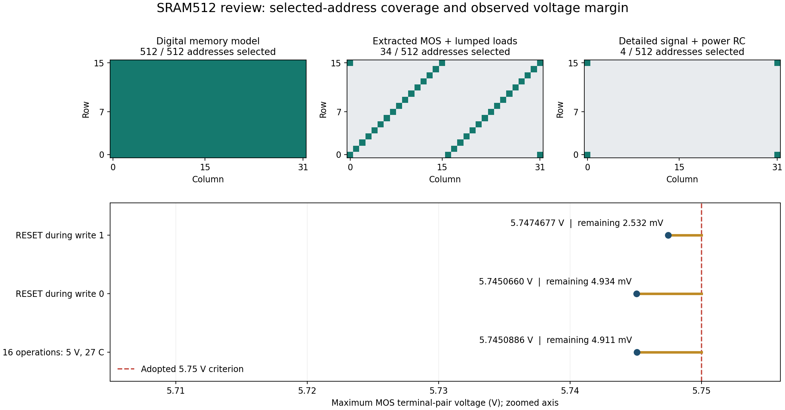

# SRAM512 設計・回路図・GDS・検証レビュー

2026-09-13。**コアの形状・接続は固定PDKの検査に適合し、再実行した論理・MOS試験も合格した。一方、検証ツールの確定した欠陥が3件あり、電気的余裕と実セルの検証範囲も不足しているため、動作保証を伴う製造承認は保留とする。** 試作候補としての成立と、製造後の動作・歩留まりの保証を分けた判断である。

対象の実回路について、今回新たに短絡・回路図とGDSの接続不一致・試験条件内の読書き失敗を確認したわけではない。以下の「確定した欠陥」は検証ツールで再現したもの。「未解決事項」は、現在の合格から製造可否を判断するうえで残る根拠の不足を示す。

詳細数値・入力ハッシュは[レビュー結果JSON](sram512_review_2026-09-13_results.json)、再現用コードは[レビュー確認スクリプト](sram512_review_checks.py)。回路図・GDS・PDK・従来の波形と判定結果は変更していない。

| ID | 優先度・分類 | 結果 |
|---|---|---|
| F1 | P1・検証ツールの欠陥 | 回路図変更後も古い26群のPASSを引き継ぎ、詳細ZIPを`CORE_VERIFIED`として生成できる |
| F2 | P1・製造判断の未解決事項 | 最大電圧5.7474677 V、採用基準まで2.5323 mV。最悪区間の数値収束・電源変動・製造ばらつきの余裕が未確認 |
| F3 | P2・実セル検証の不足 | 詳細RCで選択したのは4/512アドレス。512セル保持試験の初期状態は全て1で、残る508セルの0保持・書換えを確認していない |
| F4 | P2・波形判定の欠陥 | 最終確認時刻に届かない波形でもアナログ判定がPASSになる |
| F5 | P2・波形判定の欠陥 | 受信中のSDOに200 nsの誤ったパルスを挿入してもPASSになる |

P1は製造・検証済みとしての引渡しを判断する前に解決すべき事項、P2は検証の信頼性・適用範囲を改善すべき事項。



上段は**選択してアクセスしたアドレス**の比較。詳細RCでも全512セルの状態を観測しているが、全512セルを書き換えた試験ではない。下段の電圧軸は5.705〜5.756 Vに拡大している。

## 対象と確認方法

| 対象 | 識別子 |
|---|---|
| 開始時コミット | `49e23f6` |
| レビュー中に更新された説明・提出構成を含むコミット | `0854c30a681967d704255aab1104798f8ef698a0` |
| 開発GDS、top `sram512_macro` | `56810ad742a73036fb9db5207c75a2fcd63d344833c17da5f6270f1dc128bca1` |
| 提出GDS、top `sram512` | `7cf6744ff1a17bc7a6560639bbdaeea98041bc4eb0629763154e4c86e44be5a2` |
| TR-1um dev PDK | `6afbd918951f2ea0dcd11c5a46986b4c20f9e6f9` |

レビュー中の別作業による説明書の整理を保持した。回路・GDSのハッシュは一致しており、製造・電気的評価の対象は変わっていない。PDKはコミットだけでなく固定済みファイル集合のハッシュも照合し、無改変を確認した。

主に`schematics/`、`rtl/`、`tb/`、保存GDS・マスク・端子情報、26群の採用レポート、SPICEデッキと実波形、検証・抽出・梱包コードを確認した。過去候補の`pd102_*`、`signalfix_*`の結果を現在のGDSの合格へ付け替えていない。

今回の区別は次の通り。

- **新規実行**：保存GDSのDrawing DRC・厳密LVS・MDP・マスクDRC、PCell比較、提出版の通常GUI設定によるDRC/LVS、全アドレス論理試験、提出MOS TB。
- **保存波形の独立再集計**：現GDSの詳細RCによる連続16操作2条件、511番地の書込み中RESET2条件。SPICEデッキからMOSの実端子接続を読み、全バイナリサンプルの有限性・時間順序・終了時刻・全MOS端子対の最大値・ダイオード逆電圧を走査した。
- **記録・コードの監査**：9条件MOS感度試験、抽出MOSの行列カバレッジ、起動、1 ms保持、RC空間分割、電源金属・ビアの判定。これらの長時間過渡解析を全て再計算したわけではない。
- **負例による検証**：回路図の変更はコピー内、波形への異常挿入はメモリ上で行った。欠陥を含むZIPは`build/`の検証専用コピー内に置き、実際の`submission/`へは出力していない。

## F1：変更した回路図を古い証拠で検証済みにできる

**確定。** [validation_summary.py](../sram512/tools/validation_summary.py)の112行は物理試験についてGDSハッシュだけを照合し、論理・回路図MOS試験では`not physical`により出典一致を無条件に認める。142行では、その時点のソースハッシュを新しい`source_snapshot`として記録する。試験が実行された時点の回路図・テスト・検証コードと現在の内容の対応は確認していない。

[package.py](../sram512/tools/package.py)の123〜147行は、この新しく作った一覧を使って詳細ZIPを承認する。137行のハッシュ照合は、今読み込んだファイルと今作ったスナップショットの一致であり、過去の試験と現在の回路の一致を保証しない。

再現結果：

1. リポジトリの必要ファイルを`build/.../mutated_archive_source/`へコピー。
2. コピー内の`sram512_bitcell.sch`の先頭MOSのみ、`w=3.4u`から`w=6.8u`へ変更。GDS、テスト結果、波形は変更しない。
3. `package.py`を通常実行。
4. **26/26 PASS、終了コード0、`status=CORE_VERIFIED`のZIP生成。** ZIP内の回路図にも変更したMOS幅が入っている。

現状の平置き提出用[build_submission.py](../sram512/tools/build_submission.py)には、`repository_organization.json`に対する別のソース照合があり、同じ変更を終了コード1で拒否した。したがって、現在の平置き提出物がこの再現で誤って更新されたという指摘ではない。集約表示と`full-archive`経路の欠陥である。

**必要な対応**：各試験に、実行時の電気的ソース、刺激・判定コード、PDK・モデル、デッキ、GDS／抽出元の識別子を保存する。集約時はそれらと現在の入力を比較し、変わった試験を再実行が必要な状態へ戻す。検証済みスナップショットを集約処理だけで更新しない。失敗・不足時のCLI終了コードも非0にする。両方のZIP経路へ同じ根拠確認を適用する。

## F2：2.5 mVの余裕では製造後の動作範囲を承認できない

**報告値自体は正しく再現した。余裕の十分性は未確認。** 最も近いケースは`decoderfix_reset_write1`のAND2_X1、`XM4774`、列プリデコード`CL3`を受けるゲートとバルク間。保存波形の時刻391.0266835 µsで、絶対値5.7474677034 Vだった。

| 現GDSの保存波形 | 全サンプルの再集計 | 5.75 Vとの差 |
|---|---:|---:|
| 5 V・27°C、連続16操作 | 5.7450886062 V | 4.9114 mV |
| 4.5 V・85°C・信号RC×3、連続16操作 | 5.1726050668 V | 577.3949 mV |
| 511番地・書込み0中のRESET | 5.7450659515 V | 4.9340 mV |
| 511番地・書込み1中のRESET | **5.7474677034 V** | **2.5323 mV** |

4条件の6種類の端子対最大値は、採用レポートと全て一致した。再集計対象は4,877 MOSグループ、物理フィンガ数では4,953。今回の保存波形から5.75 V超過は検出していない。

しかし、現GDSの時間刻み5 ns／1 ns比較は、RESETを保持してクロックを動かさない0〜2 µsの起動試験である。そこで比較した最大値は約5.23 Vで、上記の391 µs付近の最悪区間を確認したものではない。RCの4／8分割比較も初回1操作が対象で、全16操作やこのRESETケースの収束確認にはならない。[startup_tests.py](../sram512/tools/startup_tests.py)、[signal_resolution.json](../sram512/reports/decoderfix_signal_resolution.json)、[startup_comparison.json](../sram512/reports/decoderfix_startup_comparison.json)参照。

詳細RCの2電源条件は5 Vと4.5 V。回路図MOS感度試験の5.5 V合格には詳細信号・電源RCがなく、全MOS電圧上限の検査もないため、これを実レイアウトの高電源側の余裕へ拡張できない。最大刻み20 nsという値だけで解析が不正確と断定もしない。適応刻みで入力遷移を解くため、必要なのは**最悪区間そのものの刻み・誤差許容値を変えた比較**である。

**必要な対応**：最悪ケースの電圧ピークについて数値収束を確認し、使用する電源範囲・入力遷移・RC係数の範囲で余裕を確保する。十分な余裕が得られなければCL3経路などを修正し、同じ判定基準で再検証する。2.5323 mVは端子間電圧の余裕であり、そのままVDDの許容変動幅を意味しない。

## F3：「全512セル保持」には508セルの両極性アクセスが含まれない

**検証範囲の不足。実セルの故障を検出したという意味ではない。** [analog.py](../sram512/tools/analog.py)の既定刺激が選ぶアドレスは0、31、480、511。[all_cell_retention.py](../sram512/tools/all_cell_retention.py)は、電源投入後の状態を観測して期待値にし、書込み対象だけその期待値を更新する。

現GDSの詳細RC4ケース全てで、保存波形の初期状態は**512セル全てQ=1側**だった。連続16操作の2ケースでは四隅に0/1を書いているが、それ以外の508セルは観測した起動時の1を保持したかの確認になる。0を保存した未選択セルの保持、全セルでの0→1／1→0の書換え、相補チェッカーボードでの半選択や隣接干渉の確認が残る。

| 検証層 | 選択アクセスの範囲 | 内容・限界 |
|---|---:|---|
| 論理モデル | 512/512 | 4パターン、March C-、アドレス歩進。メモリ本体は動作モデルでありMOSではない |
| 抽出MOS＋固定負荷 | 34/512 | 全16行・全32列を少なくとも一度選び、各アドレス両極性、136操作。全アドレスの組合せは未実施 |
| 詳細信号RC＋電源網 | 4/512 | 四隅で16操作。全512セルのQ/QBを各操作後に確認する |
| 高温1 ms停止保持 | 四隅4セル | 固定負荷の抽出MOSで既知の4セルを確認。全512セル・詳細RCでの1 ms試験ではない |

セルの保持・読出し安定性を示すSNM、書込み余裕、完成アレイでのセンスアンプ入力差とオフセット余裕、局所ミスマッチ・歩留まりの資料も採用26群にはない。全体Vthの±0.1 Vシフトは、セル内の左右やアクセスMOSだけが異なる局所ばらつきの代わりにはならない。

**必要な対応**：実MOS側で全セルへ既知パターンを書き、0・1・相補チェッカーボード・行列ストライプの読書き／保持を確認する。全セルの詳細RC実行が重い場合も、抽出MOSで全512アドレスを確認し、配線抵抗・負荷が厳しい位置と代表パターンを詳細RCで補う。セル／列のアナログ余裕と局所ばらつき感度を別に測定し、その範囲を明示する。

## F4：波形終端に届かない測定をPASSとして扱う

**確定。** [analog.py](../sram512/tools/analog.py)の106〜113行では、一点測定に`np.interp`を使う。要求時刻が波形範囲外でも端の値を返す。期間測定も、その期間の一部にサンプルがあれば`len(values)`の検査を通る。`verify_samples`の入口に必要な開始・終了時刻の検査がない。

正常にPASSする保存波形をメモリ上で288,981.3801 nsまでに制限したところ、最終確認は289,800 nsに必要なのに、**2,901判定全てPASS**になった。

これは元rawファイルのヘッダやサイズを破壊する試験ではない。ヘッダとバイナリの長さが不一致なら`load_raw`が拒否するが、短い時間範囲の正常なデータが判定に渡った場合を取りこぼす。通常のngspiceプロセス異常終了は別途検出される。

詳細RCの全セル保持チェッカーには終了時刻の検査があるため、この不足が全ての詳細RC試験をすり抜けるわけではない。今回監査した現GDSの4波形は、別の検査で**それぞれ要求終了時刻まで存在する**ことを確認した。

**必要な対応**：全判定に先立ち、時間軸の有限性・単調増加・開始／終了時刻を確認する。各一点・期間測定でも要求区間が存在することを確認し、範囲外の補間を拒否する。

## F5：仕様で保持すべきSDOをアクセス末尾だけで判定する

**確定。** [analog.py](../sram512/tools/analog.py)の156行がSDOを確認するのは各操作のE6+0.8周期〜E7+0.8周期。受信期間と、書込み操作の大部分に前回結果を保持するかの時間窓判定がない。外部仕様は受信・書込み中も保持するとしている。

正常波形の最初の受信期間2,500〜2,700 nsに、SDOを0 Vから5 Vへ誤って上げる200 nsパルス（53サンプル）をメモリ上で挿入した。**判定は2,901項目PASSのまま**だった。電圧自体が0〜VDDに収まるため、端子の過電圧検査では代用できない。

論理モデルのFFが保持していることは確認済みだが、アナログ波形の異常を同じように検出できるとは限らない。今回実回路のSDOにこのパルスが出たという結果ではない。

**必要な対応**：RESET期間と読出し結果の正規更新期間を明示し、それ以外の受信・書込み期間でSDOの前回値を時間窓判定する。外部で許容する整定時間を定義し、不要なパルスも検出する。

## 設計・回路図の確認結果

追補：[回路構成・電流経路の追加レビュー](sram512_circuit_review_2026-09-13.md)で、6Tセルの雑音余裕、実寸法の列MUX・書込み経路、7Tセンスアンプの接続、RESETの伝搬順序を詳しく評価した。24条件の小回路DC解析と実MOS端子の波形窓を追加し、C1〜C3の設計上の懸念と、基本動作が成立する根拠を示している。

| 項目 | 確認した内容 |
|---|---|
| 容量とアドレス | 16×32個、各6 MOS。`32*RA+CA`、RA 4 bit・CA 5 bit |
| 外部プロトコル | 10 bit受信＋E0〜E7、1操作18クロック。WEはE0のみ記憶し、読出しもDIN用クロックを含む |
| 制御 | 21 FF。受信中はWL・書込み駆動OFF。受信した同じFFでアクセス期間のアドレスを保持 |
| デコード | 全512アドレスの論理試験でWL・COL選択、PD_Y/PD_YBを照合。禁止される同時書込みプルダウンも検査 |
| セル・列MUX | セルW/L=3.4/1 µm、列MUX 64 MOS・W/L=5.1/1 µm |
| 共通書込み | プルダウン2個W/L=10.2/1 µm。WLを閉じてから書込み駆動を解除する順序 |
| センス・出力 | 7Tセンスアンプ、読出しE4で再生、E6でSDO記憶。SDO側BUF_X4と10 pF試験負荷 |
| 回路図とTB | 独立に生成したSPICEで、最上位47インスタンスと子22回路のMOS・ダイオード・子回路接続とパラメータが一致。TBのVSS→0接続は意図した差分 |
| 表示 | 全体図は上にSRAMアレイ、中に列MUX・共通線、下に共通書込み回路・SA。信号経路を実配線で追える。表示図は階層ブロックのため、セル内部は子回路で確認 |
| RESET | 制御・受信位置・SDOを初期化し、SRAM全体は消去しない。書込み中に中断した対象セルの内容は未定義という仕様と整合 |

回路図MOSの一部には接合面積・周囲長が0指定のものがあり、固定負荷TBと物理抽出MOSの容量条件は同一ではない。物理抽出デッキは抽出したAS/AD/PS/PDを使用する。従って、TBの1 µs周期の合格をGDSの1 µs動作保証にはしない。

詳細RC試験の周期5 µsは、1 bit当たり90 µs、約11.1 kbit/sの操作条件。限界周波数、setup/hold・RESET解除のrecovery/removal・許容入力slew・VDDの使用範囲を確定する特性評価は残っている。

## GDS・製造マスクの再検査結果

| 新規実行した検査 | 結果 |
|---|---|
| 開発GDSの公式Drawing DRC | **0件** |
| 現回路図との厳密LVS | **14回路全てMatch、エラー0** |
| 公式MDP変換後の全IP62マスクDRC | **0件** |
| 保存マスクと再生成マスク | **全27図形層XOR一致** |
| 元PCellとの比較 | **全8図形層XOR一致** |
| 物理アレイ | **16行×32列、512個の6Tセル、列順序・ピッチを確認** |
| Drawingおよび実製造層の外形 | **1776.7×600.0 µm、原点(0,0)、1800×600 µm以内** |
| 実端子 | **7端子、全て実M2上。座標と用途を照合** |
| 提出版の通常設定による検査 | **Drawing DRC 0、厳密LVS 13回路全てMatch、端子照合有効** |

PDKのDRC/LVSルールを緩めたり、外部端子を省略したり、waiver図形で検査を抑制した結果ではない。開発版から提出版への外側階層統合後も、図形・文字・端子座標の比較記録と提出版の新規LVS/DRCを確認した。

マスクの全出力層を含むBBoxはY=-6.6〜605.0 µmで、デバイス認識用の派生図形も含む。一方、実製造層のBBoxはY=0〜600.0 µm。**全層BBoxと製造層の外形は異なる**。提出するDrawing GDS自体は600.0 µmに収まっている。

採用フローはDrawingのLVSと変換後マスクのDRC。変換後マスクから回路を再抽出した厳密LVSの合格証拠、パッド・共通フレーム統合後のチップ全体のDRC/LVSは含まれていない。マスクの図形一致・DRCから、これらも実施済みと解釈しない。

## 電気モデル・信頼性・製造可能性

**製造ルール上のコア形状適合は確認できた。実プロセスでの電気的動作・寿命・歩留まりはこの証拠だけでは承認できない。** F2・F3のほか、以下を引渡し条件に明記する必要がある。

| 領域 | 現在の根拠 | 残る事項 |
|---|---|---|
| 配線寄生 | 実形状から独自RCモデルを作成。WL/C4Bは分岐・ループ・ゲート位置を保持 | 係数のプロセス校正、配線間結合容量、接点・基板等の近似の評価 |
| RC感度 | 信号R/C各3倍の条件あり | 電源抵抗は3倍にしていない。RC増加だけでオーバーシュート等を含む全最悪条件は覆えない |
| 物理MOS | 4,953フィンガを4,877グループとして計算 | 合成された並列MOSは単一位置と`m`で扱うため、全フィンガ間の個別配線電圧を解いているわけではない |
| PVT・局所ミスマッチ | 電源・温度・容量・全体Vthの9条件が保存済みPASS | 校正済みの製造コーナー・局所ばらつきではない。SNM・書込み・SAオフセットの余裕評価が必要 |
| モデル適用条件 | 公式MOSモデルの抽出条件はVgs/Vdsの絶対値0〜5 V、27〜150°C | -20°Cや5.5 Vの感度試験、および5 Vを超すピークは記載された抽出条件外。シミュレータが計算できることとモデル精度の裏付けは異なる |
| 電源金属 | 連続16操作2条件、平均絶対値・RMSを形状モデルで評価。保存結果の最大RMS比は約14.05%／13.25% | 配線寿命の認定ではない。外部電源配線・ボンド線・パッドの寄生と許容電流を含めた確認 |
| 電源ビア | 0.78 mAの定常基準に対するRMS、7.8 mA瞬時基準を適用。通常条件の最大瞬時値は約5.004 mA | 仮定した電源抵抗網の電流分担に依存。信号配線・拡散コンタクト全ての電流検査を済ませたという意味ではない |
| DP/DNクランプ | 入力4本に各1対。今回の4波形では最大逆電圧約5.00058 V | 既存MOS電圧チェッカーはダイオードを除外している。通常電圧の合格はESD耐量・過電流破壊の保証ではない |
| 起動・RESET | 1 µs起動の刻み比較、固定負荷で20 µs起動・1 ms保持、511番地で書込み中断 | 511番地は書込み0/CLK LOWと書込み1/CLK HIGHの2組。独立な2×2全4組、解除位相の掃引、ブラウンアウト等は未確認 |
| 共通フレーム | 主催側がパッド配線・パッドESDを担当する前提 | 最終配線・電源・外部負荷・保護回路との接続とチップ全体の検証 |
| 製造後の試験 | シリアル経由で全アドレスへアクセス可能 | 実機の書込み／読出し・March・保持試験、電源／温度条件と判定基準を準備する必要 |

公開PDKはDrawing＋MDP方式を説明している。[OpenSUSI公式README](https://github.com/OpenSUSI/TR-1um/blob/main/README.md)。具体的な数値と制限は固定したローカルPDKの原本を確認した。

- [OS00 リファレンスマニュアル rev1.1](https://github.com/OpenSUSI/TR-1um/blob/6afbd918951f2ea0dcd11c5a46986b4c20f9e6f9/openIP62/IP62/Technology/doc/OS00_%E3%83%AA%E3%83%95%E3%82%A1%E3%83%AC%E3%83%B3%E3%82%B9%E3%83%9E%E3%83%8B%E3%83%A5%E3%82%A2%E3%83%AB_rev1.1.pdf)：p.5にマッチング・寄生抽出なし、p.8の表I-2-3にMOS推奨動作電圧、p.10にダイオード逆電圧、p.17に金属・TC電流、p.37にMOSモデル抽出条件。
- [OS02 回路シミュレーションガイドライン rev1](https://github.com/OpenSUSI/TR-1um/blob/6afbd918951f2ea0dcd11c5a46986b4c20f9e6f9/openIP62/IP62/Technology/doc/OS02_%E5%9B%9E%E8%B7%AFsim%E3%82%AC%E3%82%A4%E3%83%89%E3%83%A9%E3%82%A4%E3%83%B3_rev1.pdf)：p.15にコーナーモデル非公開。

5.75 Vは資料に記載された**推奨動作電圧**に基づく採用基準であり、超過すると即破壊する実測閾値という意味ではない。逆に、その値をわずかに下回るだけで全条件の動作を保証することもできない。

## 再実行したテストと保存結果の対応

| 実行／再集計 | 結果 |
|---|---|
| 論理試験 | **9,270操作、4,644読出し、4,626書込み、334,063判定PASS**。全512アドレス、March C-、18段階RESET |
| 提出MOS TB | **16操作PASS**。通常のngspice実行結果にPython時間窓判定を追加し、**2,901判定PASS** |
| 通常の詳細RC保存波形 | **116,038点、9,851変数、0〜1,451 µs**。全MOS最大値一致、有限性・時刻範囲確認 |
| 低電圧高温RC×3保存波形 | **116,403点、9,851変数、0〜1,451 µs**。同上 |
| RESET書込み0保存波形 | **35,051点、9,851変数、0〜454.75 µs**。同上 |
| RESET書込み1保存波形 | **34,821点、9,851変数、0〜452.25 µs**。同上 |
| 証拠の現物照合 | 保存一覧内の電気的ソースハッシュ、26群のレポートハッシュが実ファイルと一致。連続16操作2条件のrawハッシュは既存電源金属監査の記録とも一致 |

上記の一致により、**現スナップショットに対する既存の数値が架空・別GDSの結果である兆候は見つからなかった**。F1は将来・変更後の判定を誤らせる再現済み欠陥であり、この照合とは両立する。

## 対応順と再現手順

1. F1を修正し、変更された入力で過去のPASSを使えないようにする。F4・F5の負例を検出できる判定を追加する。
2. F2の最悪電圧区間の収束確認と、使用する電源・入力・寄生条件での余裕確保を行う。
3. F3の実MOSでの全アドレス・既知パターン試験、セル／センスのアナログ余裕評価を追加する。
4. 実際の共通フレームへ接続し、最終チップでの形状・接続・電源・負荷・保護と製造後の試験条件を確定する。

レビューの再現はリポジトリルートで行う。

```sh
# 元の設計ファイルを変更せず、保存GDS・論理・提出MOS TBを新規検証
python3 reviews/sram512_review_checks.py --fresh

# コピー内の回路図変更と、メモリ上の波形異常でF1/F4/F5を再現
python3 reviews/sram512_review_checks.py

# 保存済み詳細波形4条件を全サンプル再集計（過渡計算のやり直しではない）
python3 reviews/sram512_review_checks.py --waveforms
```

出力は`build/sram512/review_20260913/probes/`。波形再集計は元の約22 GiBの4波形が存在する環境を前提とする。Gitにはレポート・小さな確認結果・図・確認スクリプトだけを保存する。
