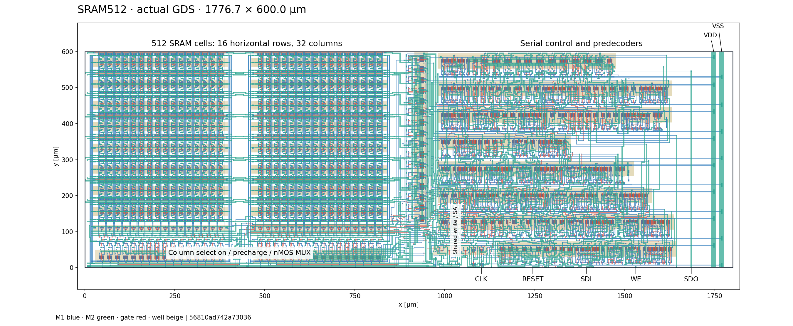
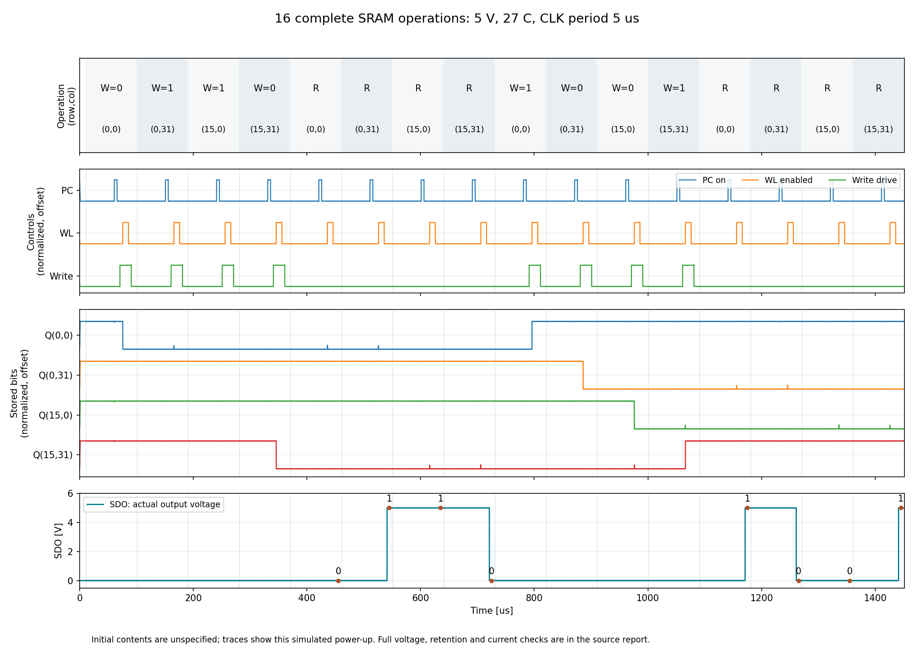
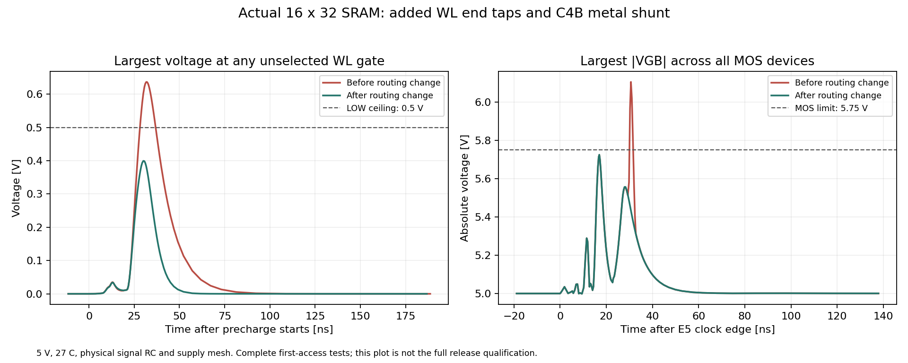
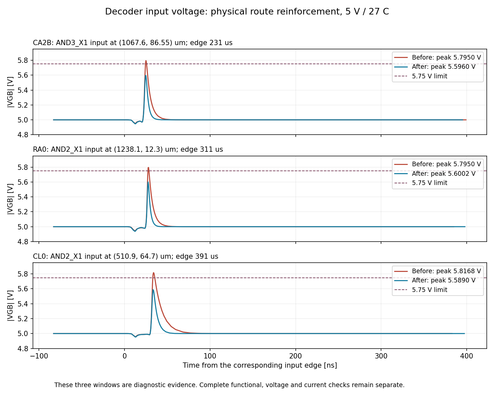

# 16行 × 32列・512 bit SRAM

**2026-09-13：保存した512 bitコアの必須検証26件がすべて合格。Drawing DRC・全製造マスクDRCは0件、厳密LVSは全14回路一致。詳細信号RCと電源網を含む連続読み書き、非同期RESET、電源配線の電流検査も完了した。**

保存した候補は [`layout/sram512.gds`](layout/sram512.gds)、最上位は `sram512_macro`。
外形は **横1776.7 × 縦600.0 µm**、左下が原点 `(0, 0)`。実際の製造マスクも枠内に収まる。
物理配置は16行×32列で、転置していない。
GDS SHA-256：`56810ad742a73036fb9db5207c75a2fcd63d344833c17da5f6270f1dc128bca1`。

提出版は[../submission/sram512.gds](../submission/sram512.gds)です。
外側の座標用階層を一段統合し、全体回路図`sram512.sch`とトップ名を揃えています。
図形と端子座標は元と同じで、通常のGUI設定でもDRC 0・厳密LVS全13回路一致を確認しました。
開発側の以下の記録は、元の階層とハッシュを保持しています。



## 回路と操作

- ユーザーの `klayout/sram_pcell/` のsix_single版。セルは22 × 29.6 µmピッチ、全MOSはW=3.4/L=1 µm。
- 512 bit、nMOS列MUX、片側プルダウン書込み、共有7Tセンスアンプ。常に1 bit単位でアクセスする。
- 列MUXはW=5.1/L=1 µm、共有書込みPDの2個はW=10.2/L=1 µm。過去の低電圧・高温試験で必要と判明した寸法。
- 各WLはAND3_X1で駆動。行4 bit・列5 bitの静的プリデコード。
- 受信とアクセスで同じ10 bitのフレームFFを使う。全体21 FFで、アドレスの二重保持やゲート付きCLKは使わない。
- 外部7端子：VDD / VSS / CLK / RESET / SDI / WE / SDO。SDOにBUF_X4を実装。
- `RA3…RA0 CA4…CA0 DIN`を10クロックで送り、続く8クロックE0〜E7でアクセス。1操作18クロック。
- RESETはHIGHで非同期。SRAM内容は初期化しない。書込み中のRESETでは、対象セルを再度書き込む。

詳しくは[操作仕様](SPEC.md)。本体は `schematics/sram512.sch`、専用TBは `schematics/sram512_tb.sch`、
7端子の階層入口は `schematics/sram512_macro.sch`。回路図と論理は今回の配線修正で変更していない。
拡大表示用：[全体回路図](diagrams/sram512.svg)、[制御回路](diagrams/sram512_controller.svg)、
[フレームFF](diagrams/sram512_frame.svg)、[カウンタ](diagrams/sram512_phase.svg)。

## 面積と今回の工夫

| 指標 | 値 |
|---|---:|
| 1 bitの繰返しピッチ | 22 × 29.6 µm = 651.2 µm² |
| 512 bitのピッチ面積の合計 | 0.3334 mm² |
| 周辺回路・配線を含むコア外形の面積 | 1.0660 mm² |
| コア全体の面積を512 bitで割った値 | 約2,082.1 µm²/bit |

セル単体のピッチ面積と、周辺回路・タップ・配線を含むコア面積を区別して示す。
元の最小6T PCellを保持し、32列で書込み回路とセンスアンプを共有した。
シリアル受信とアクセスで同じFFを使い、アドレスの二重保持を省いている。
論理回路はPDKスタセルを明示的に接続し、回路図の接続とRTL仕様を別々に照合する。
外部CLKだけで進む18段階の操作なので、発振器や内部のアナログ遅延回路を必要としない。

## 現候補の検証

| 検証 | 結果・範囲 |
|---|---|
| 回路図/ERC | 専用回路とTBが合格。別ディレクトリへ展開した依存回路でも確認済み |
| 論理検証 | 334,063項目合格、9,270操作。全512アドレス、March C-、全18段階のRESET |
| 回路図のMOS基準・感度試験 | 9条件・26,109項目合格。電源、温度、容量、全体Vthの感度 |
| 保存GDSのDrawing DRC / 厳密LVS | **0件 / 全14回路一致**。現在の編集可能な回路図へ再照合 |
| 製造マスクDRC | **全項目0件**。元のMDP変換と全IP62チェック。保存マスク全27図形層も再生成品とXOR一致 |
| 配列・外形・端子 | 512個の6Tセル、16行×32列、7端子、600×1800 µm内。元のbitcellと全8層XOR一致 |
| 詳細RCでの初回アクセス | **38,138項目合格**。全MOS端子、全電源ビア、全WLの各アクセスゲートと全512セルの保持 |
| RC空間分割の比較 | 4分割・8分割とも合格。主要MOS電圧ピークの差は最大約1.3 µV |
| 電源投入 | 最大刻み5 ns・1 nsとも**33,753項目合格**。最大MOS電圧の差は約3.6 mV。RESETを電源に追従させ、全512セルが相補状態へ収束 |
| 抽出後の全行列カバレッジ | **38,901項目合格**。全16行・全32列、34アドレスで両データ、136操作 |
| 電源網を含む連続16操作 | **120,547項目合格**。5 V・27°C、全512セルの保持、全MOS端子・電源ビア・全WLゲートを確認 |
| 電源網＋信号RC×3 | **120,547項目合格**。4.5 V・85°C、四隅の16操作、全512セルの保持、全MOS端子・電源ビアを確認 |
| 電源金属の電流 | **2条件・各13,406項目合格**。全16操作の平均絶対値・RMSを検査。最大RMSの基準比は通常14.05%、低電圧・高温13.25% |
| 高温保持・非同期RESET | **5,429項目合格**。85°C、20 µs電源立上り、1 msクロック停止、10通りの割込み、28操作 |
| 511番地での書込み中RESET | **2条件・各56,201項目合格**。書込み0/1とCLKのLOW/HIGHを分け、信号・電源の詳細RCで全511非選択セルの保持を確認 |

上のRESET試験2条件における全MOSの最大端子間電圧は5.7475 V。
採用した5.75 V上限には合格するが、余裕は約2.5 mVと小さい。
明記したモデル・電源・入力遷移における測定結果であり、電源変動や局所ばらつきに対する
余裕を保証する値ではない。連続16操作も別に完走・判定し、通常条件の最大値は5.7451 V、
4.5 V・85°C・RC×3では5.1726 Vだった。電源金属の電流検査は明記した定常基準への
平均絶対値・RMSの比較であり、配線寿命や未規定の瞬時許容値を認定するものではない。

機械判定は `reports/validation_summary.json`。必要な操作数、詳細信号モデルの有無、
レポートと保存GDSのハッシュも照合する。初回アクセスの合格を連続16操作に代用しない。
旧GDSの合格結果は履歴として保持し、現候補の合格根拠へ付け替えていない。
途中の負の観測は `reports/signalfix_decoder_voltage_diagnostic.json` に記録し、
同じGDSのリリースを阻止する。`live_probe.py` は実行中ファイルの完全な行だけを読み、
完了済み操作だけを調べる。rawのヘッダやシミュレーション結果を書き換えない。
現候補の抽出後試験名は `decoderfix_*`。前候補の `signalfix_*` とは区別する。



上から操作とアドレス、PC・WL・書込み駆動、四隅のセルのQ、外部SDOを並べた。
最後の丸印8個が読出しの判定点で、数字は期待値。セル内部の値とSDOを別々に確認できる。
この図は完走・合格した実波形から `operation_waveforms.py` で生成する。

```bash
python3 sram512/tools/operation_waveforms.py build/sram512/analog/decoderfix_power_paths_ramp
```

## 今回の信号配線修正

変更前の `dee111…` はDRC/LVSが合格でも、詳細RCで非選択WLが約0.64 V、
MOSの|VGB|が約6.10 Vとなった。各上限0.5 V・5.75 Vを超えており、修正が必要だった。

16セルの長いポリWLを片端から駆動していたため、共有アレイの反対端にもGC・コンタクト・
M1・ビアで金属WLへの接続を各行1個追加した。2バンクで32接続。
C4Bを受けるOR2までの長いポリ経路には、幅1.8 µmのM1を並列追加した。
WL0に近いCH1の既存接続は2.1 µm移動して間隔を確保した。bitcell自体は変更していない。
生成手順は `strengthen_signal_routes.py`、物理変更の記録は `reports/signal_route_strengthening.json`。

その修正後の初回アクセスでは、非選択WLの最大値は約0.40 V、全MOSの|VGB|最大値は約5.724 V。
電圧・保持・電源ビアの元の判定に合格した。全512セルを接続したまま確認している。



次に前候補 `f32c213…` の連続試験で、CA2B・RA0・CL0を受ける3個のNMOSに
約5.795〜5.817 Vの|VGB|が見つかった。WLや保持の機能が合格でも、5.75 Vの電圧基準には不合格だった。
現候補ではCL0の下側ポリバス2本へ幅1.8 µmのM1を並列追加し、
CA2BとRA0の長いフィールド上のポリ配線を、周囲との間隔を保って主に1.8 µm幅へ広げた。
MOSのチャネル部分やSRAMのbitcell形状は変更していない。
この追加修正のDrawing DRC・厳密LVS・全マスクDRCは合格している。
記録は `reports/decoder_route_strengthening.json`、再生成は
`reinforce_decoder_routes.py` → `widen_decoder_poly.py`。

同じ3か所・同じ切替区間を比較すると、修正後の|VGB|ピークは
CA2Bで5.5960 V、RA0で5.6002 V、CL0で5.5890 Vとなり、各5.75 V以内へ下がった。
これは3区間の比較結果であり、連続16操作の完走判定とは分けて記録している。



詳細な経緯と不合格の保存先は[検討記録](EXPERIMENTS.md)。

## モデルとPDK

使用PDKは無改変のTR-1um dev、コミット `6afbd918951f2ea0dcd11c5a46986b4c20f9e6f9`。
`run.drc`、`run.lvs`、`run_mdp.drc`、`run_IP62.drc`をそのまま使い、
waiver領域、端子照合の省略、ブラックボックス化は行っていない。

設計側へ取り込んだスタセルでは、欠けていた端子ラベルや取出し配線を整備した。
入力のDP/DNの配置、AND3の端のウェル接点なども実レイアウトとして調整し、元のルールで検査した。
スタセルやPCellの変更点は設計側にあり、PDKやDRC/LVSルールの変更ではない。
MDPのデバイス認識図形もファイル内に残し、全層を公式DRCへ渡す。

抽出回路は4,953物理MOSと8ダイオード。WLとC4Bは実GC/CO/M1/V1/M2の分岐・ループを
保持し、各ゲート位置へ接続したRC網。縮約前後の端子間DC抵抗と総配線容量を検査する。
BL・共通線は4区間のRC、その他のゲート枝は実形状に沿った抵抗経路の近似を使う。
電源は実際の幅・分岐・各ビアを持つ抵抗網で、全MOS端子電圧と個別ビア電流を検査する。
これらの係数は明記した感度試験用の仮定であり、校正済みファウンドリPEXや統計的な製造ばらつきの保証ではない。
初期値の強制、モデル変更、gmin追加で動作を成立させる操作は行っていない。

## フレームとの接続

[端子座標](layout/ports.json)は最上位GDS上の実M2位置。主催者がパッドへ配線し、
共通フレームのESDを利用する。コア内の小型DP/DN対は浮遊ゲート検査への対策で、
パッドESDの代替ではない。外部負荷の基準は10 pF。[接続メモ](SUBMISSION.md)を参照。

## 再検証と保存

```bash
python3 sram512/tools/verify_digital.py
python3 sram512/tools/analog.py --matrix --name-prefix pd102 --jobs 1
python3 sram512/tools/verify_saved_layout.py
python3 sram512/tools/pcell_preservation.py
python3 sram512/tools/verification_jobs.py start
python3 sram512/tools/verification_jobs.py status
python3 sram512/tools/validation_summary.py
```

端のアドレスでのRESET試験は、同じ再検証済みレイアウトを指定して実行する。

```bash
python3 sram512/tools/reset_address_test.py build/sram512/layout/rechecked16x32 --name decoderfix_reset_write0 --write-data 0
python3 sram512/tools/reset_address_test.py build/sram512/layout/rechecked16x32 --name decoderfix_reset_write1 --write-data 1
```

電源投入とRC分割の比較を再現する場合は、次のコマンドを使う。
信号網の分割数だけを変え、電圧・温度・時間刻み・判定基準は同じにする。

```bash
for divisions in 4 8; do
  python3 sram512/tools/postlayout.py build/sram512/layout/rechecked16x32 \
    --name "decoderfix_mesh${divisions}_prefix" --rc-scale 1 \
    --signal-mesh --signal-sections "$divisions" --access-limit 1 \
    --physical-gate-paths --power-sheet 0.1 --power-mesh-grid 0.25 \
    --voltage-envelope --startup-ramp-ns 1000 --period 5000 \
    --max-step-ns 20 --solver sparse --stream
done
python3 sram512/tools/signal_resolution.py \
  sram512/reports/decoderfix_mesh4_prefix.json \
  sram512/reports/decoderfix_mesh8_prefix.json \
  sram512/reports/decoderfix_signal_resolution.json
for step in 5 1; do
  python3 sram512/tools/startup_tests.py build/sram512/layout/rechecked16x32 \
    --name "decoderfix_startup_${step}n" --max-step-ns "$step" \
    --signal-mesh --solver sparse --stream
done
python3 sram512/tools/startup_summary.py --prefix decoderfix --skip-solver-comparison
```

連続16操作の2条件が完走して合格した後、保存波形から電源金属の電流を調べる。
これは追加の過渡計算ではなく、同じ電源抵抗網の各枝の電流を復元する検査。

```bash
python3 sram512/tools/power_wire_audit.py build/sram512/layout/rechecked16x32 \
  build/sram512/analog/decoderfix_power_paths_ramp
python3 sram512/tools/power_wire_audit.py build/sram512/layout/rechecked16x32 \
  build/sram512/analog/decoderfix_pg_rc3_lowhot
python3 sram512/tools/validation_summary.py
```

`verification_jobs.py`は個別プロセスを起動し、PID・コマンド・GDSハッシュを記録する。
デスクトップの終了には依存しない。VM再起動後は未完了フォルダを保存して再計算する。
既に合格した別GDSの結果を上書きして再利用することは拒否する。

詳細RCの初回アクセスは `postlayout.py` の `--signal-mesh --access-limit 1`、
電源投入は `startup_tests.py` の `--signal-mesh` を使う。完全な引数は各レポートと
`build/sram512/jobs/`、連続試験の定義は `verification_jobs.py` に記録される。
別環境では保存GDSの再検証後、`--folder build/sram512/layout/rechecked16x32`を指定する。
詳細RCの行列計算はSparseを使用し、PDKモデルや既定の誤差許容値は変更しない。
各試験は1スレッドで、`--stream`により全計算点をrawファイルへ直接保存する。
大きな再生成可能な波形は `build/` に置き、Git・提出ZIPには含めない。

GUIは `python3 sram512/tools/open.py`。提出ファイルの収集は `python3 sram512/tools/package.py`。
回路図の依存ファイル、GDS、仕様書、検証結果、使用ツールのバージョンとSHA-256を
`build/sram512/submission/sram512_core_56810ad742a7.zip` へまとめる。
梱包は現GDSの必須検証がすべて合格した場合だけ行える。途中のレビュー用は明示的に
`--draft` を付けて区別する。パッド配線・共通フレームとの統合後は、統合側でチップ全体を検証する。
