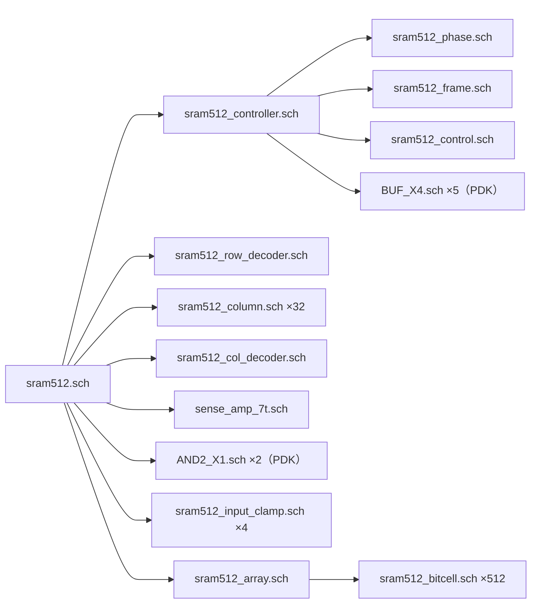

# SRAM512仕様

## 基本仕様

| 項目 | 値 |
|---|---|
| 容量・構成 | 512 bit、16行×32列、6T SRAM |
| アクセス | 1 bit単位、アドレス `32 × 行アドレス + 列アドレス`（0〜511） |
| アドレス長 | 行アドレス4 bit（0〜15）、列アドレス5 bit（0〜31） |
| 電源・論理レベル | VDD=5 V、VSS=0 V。HIGH=VDD、LOW=VSS |
| 外形 | 横1776.7×縦600.0 µm |
| 提出GDSトップ | `sram512` |
| PDK | TR-1um dev、`6afbd918951f2ea0dcd11c5a46986b4c20f9e6f9` |

## 端子

全端子は第2金属配線層（M2、GDS 20/0）。座標はµm、原点はコア左下。

| 端子 | 方向 | 機能 | X | Y |
|---|---|---|---:|---:|
| VDD | 電源 | 5 V | 1747.7 | 597.3 |
| VSS | 電源 | 0 V | 1769.7 | 597.3 |
| CLK | 入力 | 立上りで1段階進む | 1101.7 | 1.7 |
| RESET | 入力 | HIGHでクロックを待たずに制御回路を初期化 | 1244.7 | 1.7 |
| SDI | 入力 | アドレス・書込みデータ | 1393.2 | 1.7 |
| WE | 入力 | 11番目のCLK立上りで取り込み。1=書込み、0=読出し | 1530.7 | 1.7 |
| SDO | 出力 | 読出し結果1 bit、出力バッファ付き | 1684.7 | 1.7 |

[](sram512_pins.png)

赤丸が接続位置。電源2本は上辺、信号5本は下辺。

## シーケンス

1操作は18クロック。最初の10クロックで、SDIから次の順に1 bitずつ入力する。
行・列アドレスはそれぞれ上位bitから送る。

```text
行アドレス4 bit → 列アドレス5 bit → 書込みデータ1 bit
```

続く8クロックで読み書きを行う。各行はCLK立上り後の動作。

| CLK番号 | 動作 |
|---|---|
| 1〜10 | アドレスと書込みデータを受信。セルへのアクセスは停止 |
| 11 | WEを記憶し、ビット線を電源電圧まで充電。読出し時はセンスアンプを初期化 |
| 12 | ビット線の充電を停止 |
| 13 | 書込み時：データに応じて一対のビット線の片方をLOWに駆動 |
| 14 | 選択行のワード線を有効にし、セルをビット線へ接続 |
| 15 | 読出し時：センスアンプでビット線の電圧差を増幅し、0/1を判定 |
| 16 | ワード線を無効にし、セルをビット線から切り離す |
| 17 | 書込み時：ビット線の駆動を停止。読出し時：結果を出力用レジスタへ保存 |
| 18 | 操作終了。次のCLK立上りから次の操作の受信を開始 |

- 電源投入時はCLK=LOW、RESET=HIGH。電源安定後にRESETを解除し、受信を開始する。
- SDIは1〜10番目、WEは11番目のCLK立上り前後で安定させる。読出し時も10番目の入力は省略できない（値は任意）。
- SDOは読出し操作の17番目のCLK立上り後に更新。外部では18番目の後に読む。受信・書込み中は前回値を保持する。
- RESETは制御・受信位置・SDOを0にする。SRAM内容は初期化しない。電源投入直後の内容は未定義。
- 書込み途中にRESETした場合、そのアドレスへ再書込みする。

## 確認条件・接続

四隅は0・31・480・511番地。以下はいずれも合格。

| 試験 | 条件・範囲 | 確認した項目・合格条件 |
|---|---|---|
| 同梱テストベンチ | 5 V・27°C、CLK周期1 µs。四隅に0/1を書いて読み戻す16操作 | 各操作終了時に、対象セルの保持値が書込み値と一致。読出し後のSDOも一致し、書込み後のSDOは前回値のまま |
| 論理回路 | 全512アドレス、9,270操作。パターン試験・March C−、全18段階でRESET | 論理ゲートで組んだ回路とVerilogの仕様が各段階で一致。指定行・列だけを選択し、全アドレスの読出し値が期待値と一致。RESETで受信位置・SDOが0、全ワード線・書込み駆動が無効になる |
| 電圧・温度・素子特性 | MOS回路で9条件。電圧・温度5組、負荷増加2組、しきい値変更2組。各16操作 | 下記の読書き判定を全条件で満たす。負荷や素子特性を変えても、予定時刻までに充電・書込み・読出しが完了し、保持値が崩れない |
| GDSから抽出したMOS回路 | 5 V・27°C、固定負荷、CLK周期1 µs。全16行・全32列を含む34アドレス、136操作 | 全行・列の選択先が正しく、各対象セルで0/1の書込み・読出しが成功。既に書いた他の対象セルも保持 |
| 配線の抵抗・容量を含む読書き | 5 V・27°Cと、4.5 V・85°C・信号配線の抵抗/容量各3倍。四隅で各16操作 | 遅延を含めて下記の読書き判定を満たす。さらに各操作後、全512セルの内部値を期待値と比較。書込み先以外は変化しない（未選択508セルは起動時の1を保持） |
| 電源投入 | 配線モデル込み。5 Vまで1 µsで上昇、RESETをHIGHに保持 | 電源安定後、受信位置・アドレス・SDOが0、全ワード線・書込み駆動が無効。全512セルの内部2ノードが相補の0/1へ収束する（初期値は指定しない） |
| 緩やかな電源投入 | 5 V・85°C、固定負荷。電源立上り20 µs | 電源安定後の制御信号・SDOが初期状態になり、RESET解除後に受信・書込み・読出しが成功 |
| 高温での保持 | 5 V・85°C、固定負荷。四隅に0/1を書き、CLKを1 ms停止 | 停止期間全体で四隅の内部値とSDOを保持。ワード線・書込み駆動・ビット線の充電が停止し、再開後の読出し値も一致 |
| 受信・読書き中のRESET | 5 V・85°C、固定負荷。受信・充電・書込み・読出し途中の10通り | RESET後に全ワード線・書込み駆動が無効、受信位置・SDOが0。他の既知3セルを保持し、その後の再書込み・読出しも成功 |
| 最終アドレスでのRESET | 配線モデル込み、5 V・27°C。511番地へ0を書込み中にCLK LOW、1を書込み中にCLK HIGHでRESET | RESET後に全ワード線・書込み駆動が無効、アドレス・受信位置・SDOが0。他511セルがRESET保持中も変化しない。中断した書込み先の値は判定対象外 |
| MOS端子間電圧 | 配線モデル込みの電源投入・読書き・RESET | 全MOSの6通りの端子間電圧を確認し、絶対値が5.75 V以下。最大5.7475 V |
| 電源配線・ビアの電流 | 配線モデル込みの通常条件・低電圧高温条件、それぞれ16操作 | 金属配線の平均絶対電流・実効電流を線幅に応じて判定：M1は0.5 mA/2 µm、M2は3.7 mA/3 µm以下。各ビアは実効電流0.78 mA以下、瞬時最大7.8 mA以下 |
| 計算の刻み | 電源投入の最大時間刻み5/1 ns、初回アクセスの配線分割数4/8 | 時間刻みを細かくしても、起動・電圧・ビア電流の基準を満たす。配線分割数を変えた2条件も動作・電圧・電流の基準を満たし、MOS端子間電圧のピーク差は1 mV未満 |
| レイアウト | 提出回路図とGDS | Drawing DRC 0・LVS一致・製造マスクDRC 0 |

追加のMOS読書き試験では、次を波形から判定した。

- 受信したアドレスをアクセス中に保持し、選択中のワード線だけがHIGHになる。列選択も指定列だけが有効。
- 充電終了時に全ビット線と共通読書き線が0.9×VDD以上に到達する。
- 書込み時はデータに対応する片方だけをLOWへ駆動し、読出し中・操作終了後は書込み駆動が無効になる。
- 書込み後のセル内部値と反転値、読出し時のセンスアンプ出力、保存後のSDOが期待する0/1と一致する。
- 読出しや他セルへの書込みで、既知のセル内容が反転しない。SDOは読出し結果の保存・RESET直後を除き、受信・書込み・CLK停止中も前回値を保持する。

0/1の判定はLOW≦0.1×VDD、HIGH≧0.9×VDD（5 V時は0.5 V以下／4.5 V以上）。
アクセス中のセル保持確認に限り、LOW≦0.3×VDD、HIGH≧0.7×VDDを用いた。

配線モデル込みの連続読書きはCLK周期5 µs（90 µs/操作）、HIGH/LOW各50%、
入力の立上り・立下り5 ns、出力負荷10 pF。SDIは対応するCLK立上り開始の1.25 µs前から切り替え、
WEは受信開始前に設定して操作中保持した。

電圧・温度の5組は5 V/27°C、4.5 V/−20・85°C、5.5 V/−20・85°C。
固定負荷の基準はビット線70 fF/本、ワード線400 fF/本、共通読書き線180 fF/本。
負荷増加の2条件は、それぞれ210/1200/540 fF（5 V・27°C）と1000/2000/1000 fF（4.5 V・85°C）。
この2条件の入力遷移は20 ns。しきい値を変える2条件は5 V・85°Cで、
全NMOS・PMOSのしきい値電圧を一律+0.1 V、または一律−0.1 Vずらした。

配線の抵抗・容量はレイアウト形状と仮定した係数から見積もった値。
製造プロセスに合わせて校正した寄生抽出、最高動作周波数、素子間のばらつきは未評価。

- VDDは5 Vに調整した安定化電源へ、VSSは電源・測定器の共通GNDへ接続する。
- CLK・RESET・SDI・WEは0〜5 Vで駆動し、未接続にしない。
- SDOは5 V信号に対応する測定入力へ接続する。配線・測定入力を合わせた負荷10 pFで検証している。
- パッドへの配線と静電気保護（ESD）は共通フレーム側で行う。フレームのESD電源もコアのVDD/VSSと対応させる。

コア入力4本にも、電源・接地へ接続する保護ダイオードを各1組実装済み。
フレーム側保護との重複があり、コア側ダイオードの要否・統合後の静電気耐性は未確認。

## 回路図の階層



下表は図の各ブロック内部で使うPDKスタンダードセル。個数は親回路1個あたり。
参照先は`TR-1um_5_stdcell/`内の同名`.sch`。

| 親回路 | スタンダードセルと個数 |
|---|---|
| `sram512_row_decoder.sch` | INV_X1 ×4、AND2_X1 ×8、AND3_X1 ×16 |
| `sram512_col_decoder.sch` | AND2_X1 ×36、AND3_X1 ×8 |
| `sram512_phase.sch` | DFFR ×5、XOR2 ×4、AND2_X1 ×16、AND3_X1 ×1、AND4_X1 ×10、OR2 ×2 |
| `sram512_frame.sch` | DFFR ×10、MUX2 ×10 |
| `sram512_control.sch` | DFFR ×6、MUX2 ×2、INV_X1 ×1、AND2_X1 ×4、OR2 ×2、OR3 ×1、OR4 ×1 |
