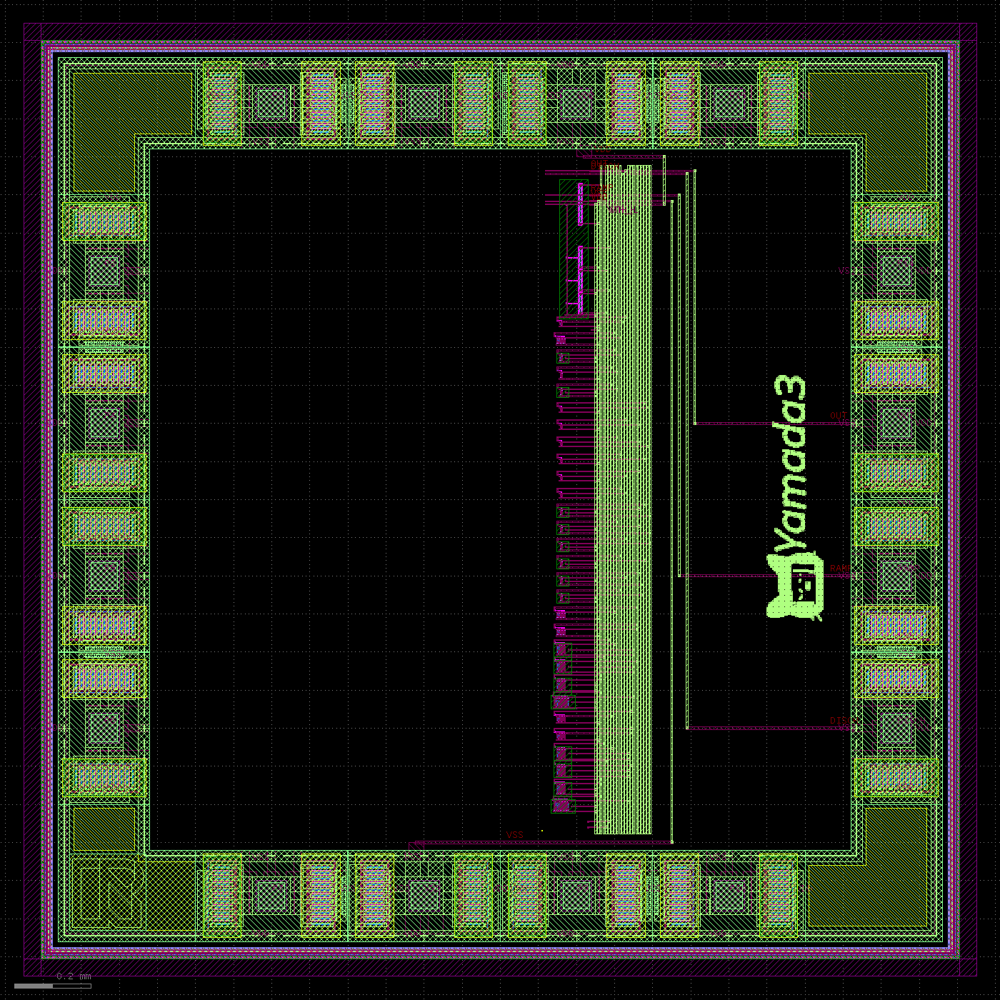

# Tiny555

Yamada3のOpenSUSI TR-1um用Tiny555です。電源は5 Vです。

## ファイル名と回路名

| 対象 | GDS | GDSトップセル | Xschem | LVS参照SPICE |
|---|---|---|---|---|
| Tiny555コアのみ | `klayout/Tiny555.gds` | `Tiny555` | `xschem/Tiny555.sch` / `Tiny555.sym` | `klayout/simulation/Tiny555.spice`（`.subckt Tiny555`） |
| フレーム・ESD・配線・Yamada3ロゴ込み | `klayout/tr_1um_Tiny555.gds` | `tr_1um_Tiny555` | 物理フレーム合成 | `klayout/simulation/tr_1um_Tiny555.spice`（`.subckt tr_1um_Tiny555`） |

トランジェント解析用回路図は`xschem/tb_Tiny555_tran.sch`で、
`xschem/Tiny555.sym`を参照します。

## フォルダ構成

- `klayout/`：コアGDS、フレーム込みGDS、SPICE、main/dev検証結果
- `xschem/`：Tiny555回路図、シンボル、テストベンチ、下位回路
- `image/`：Yamada3ロゴの`image.gds`とフレーム込みレイアウト画像

## レイアウト

提出・フレーム合成に使用するファイル：
[tr_1um_Tiny555.gds](klayout/tr_1um_Tiny555.gds)

Tiny555だけを再利用するときのファイル：
[Tiny555.gds](klayout/Tiny555.gds)

- Tiny555コアとYamada3ロゴはフレームの右半分に配置
- 左半分は貞方先生用として空けています
- `tr_1um_Tiny555.gds`ではESDパッドからコアまで配線済みです

## ピン

| 機能 | フレーム接続 |
|---|---|
| VDD | 上辺の専用VDDパッド、5 V |
| VSS | 下辺の専用VSSパッド、GND |
| DISCH | 右辺P11 |
| RAMP | 右辺P12 |
| OUT | 右辺P13、矩形波出力 |

外付け自励発振回路：

`VDD -- RA -- DISCH -- RB -- RAMP -- C -- VSS`

## DRC・LVS

KLayout 0.30.7、flat、strict port modeで、下記4組を個別に再検証しています。

| PDK | `Tiny555.gds` | `tr_1um_Tiny555.gds` |
|---|---|---|
| main | DRC 0 / LVS Match | DRC 0 / LVS Match |
| dev | DRC 0 / LVS Match | DRC 0 / LVS Match |

名前の自動監査でも次を確認済みです。

- GDSファイル名、トップセル名、SPICE `.subckt`名が一致
- `tb_Tiny555_tran.sch`が`Tiny555.sym`を参照
- `tr_1um_Tiny555.gds`内のコアセル名は`Tiny555`
- M1上の`VDD`、`VSS`、`DISCH`、`RAMP`、`OUT`ラベルが5本すべて一致

検証DB、ログ、抽出SPICEは`klayout/verification/`にあります。

