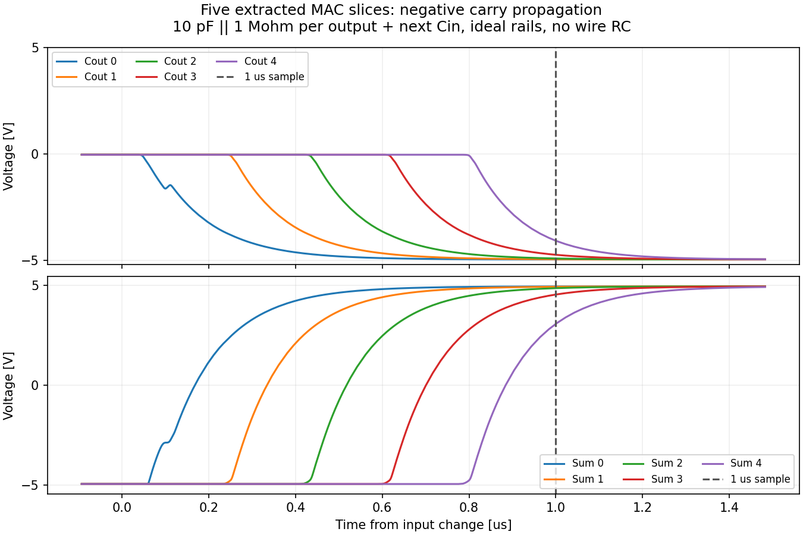

# 最終MACレビュー（2026-09-25）

**コアの論理・接続・寸法に新たな不具合は見つからなかった。最終製造合格は、実フレーム/ESD統合と採用済みの電圧例外の確認が残る。**

対象はコミット `894b4a1` の提出版MACと子セル全9種（INV、NANY、HA、FA、MUL専用NAND/NOR/INV、MUL、MAC）。今回のレビューは主エージェントによる。前回のサブエージェントレビューとは別の再検証で、回路図/GDS本体は変更していない。

- 編集用GDS SHA-256：`a9ff0fec14150144d8bbeee7ecfe4f348d0035a6e7206696a63669becdeb60bb`
- 提出用GDS SHA-256：`66299d3dcbe0bb877e9014607ac4cb35b85d079cc12ffe0d6c3752778236b937`
- PDK：TR-1um dev `9ef2ac38e1717b3ba2a4b0b374e48c53017e952c`。使用中のDRC/LVS/モデルはdevソースと一致。

## 指摘と製造条件

1. **実フレームへの統合が未完了。** 共通VSS/基板を−5 Vにする合意は確認済みだが、パッド接続、10 V電源差に適合するESD構成、相乗り回路との接続を含む実TOPは未検証。単体マスクDRCのFloating SG 14件は残る。入力をVDDへ接続した診断fixtureでは0件だが、実フレームの代替合格にはならない。
2. **±5 Vは採用済みの電圧例外。** 公開OS00資料では5 V MOSのBVDSは8 V、推奨端子電圧は5.75 V。回路には定常10 VのVDSが掛かり、既存の−40 ℃・1 nsエッジ試験でVDS最大11.011 V、VGD最大11.237 Vを確認。資料と現在のソース/モデルを再照合した。モデルの論理PASSは実物の耐圧・寿命の判定ではなく、この条件をPDK/フレーム担当者へ伝える必要がある。
3. **配線RC・電源の電流分担・IR/EM、プロセスばらつきは未評価。** 44 µm主M1・14 µm主M2・24カット接続、全体最大DC約10.363 mAの既存集計との整合は確認。追加した並列給電により電流は再分配されるため、個々の細い枝・ビアまで合格したという意味ではない。非公開コーナー/統計的ミスマッチ、実パッド/パッケージ、実基板の寄生も未評価。
4. **5段連結は単体の1 µs規定を適用できない。** 下記の新規診断で最大整定約1.181 µs。負carry伝搬時、1 µs時点の最上位SUMは約3.062 V（期待+5 V、誤差1.938 V）で±0.5 V基準を外れた。符号の復号不一致ではなく整定精度の不足。連結系の読取り待ちは別に設定する。
5. **抵抗の図中説明が5セルで旧値。** 実部品パラメータと抽出値は全てW=2.8 µm、L=30 µmで一致するが、`inverter.sch`はL=20、`mul_inv.sch`/`mul_nand.sch`/`mul_nor.sch`はL=15、`nany.sch`はL=16 µm/約4.13 kΩと記載。提出用コピーも同じ注記。電気的な寸法不一致はなく、図中説明の修正事項として残る。正本寸法はSPECおよび部品パラメータを参照。

## 再実行・照合した検証

- rootの全9セルと提出GDSの計10対象で、Drawing DRC 0件・strict LVS一致を新規実行。
- 現dev PCell再生成と保存GDSの図形・文字を比較し、差分0。子セルの埋込み図形は各単体GDSと一致。提出GDSも全レイヤー・ラベル一致。
- DBU=0.001 µm、0.05 µm格子、倍率1。外形1774.7×779.35 µm、全座標が1800×1000 µm内。
- 11端子の金属位置とTXMラベル、LVSの名前対応を確認。推定接続だけでなく、各トップ端子の名前の対応を照合。
- 59 PMOSのbulkと全46 RRのSUBはVDD、59 NMOSのbulkはVSS。全MOS L=1 µm、全RR W=2.8/L=30 µm。外部X/A/B/Cinはそれぞれ6/4/4/8個のMOSゲートにのみ接続。
- 新しく生成した回路図ネットリストをprimitiveの真理値表で解釈し、独立した算術期待値に全81通り一致。
- 以下は**最終版の抽出回路で今回新しく実行した過渡解析**。27 ℃、理想±5 V/0 V、1 nsエッジ、各出力10 pF || 1 MΩ、1 µs保持。全遷移は16分割したEuler経路で、全有向遷移をそれぞれ一度含む。各分割に開始状態の準備区間がある。

| 新規抽出試験 | 最大4出力誤差 | 最大整定時間 | 判定 |
|---|---:|---:|---|
| 81入力＋復帰 | 61.286 mV | 414.27 ns | PASS |
| 全6,480有向遷移 | 64.262 mV | 503.67 ns | PASS |
| 単一入力648有向遷移 | 64.085 mV | 485.87 ns | PASS |

全6,480/648遷移の波形は別の期待値計算で再集計し、入力、網羅性、一度ずつの通過、有限値、終了時刻、出力精度を独立確認した。回路図版の保存波形も全6,480/648遷移を再評価して合格。
整定は期待電圧±0.5 V内に入り、その区間の終わりまで留まることを基準にした。時間は保存波形からの推定で、最大刻み20 nsより細かい精度を保証しない。
旧抽出版の保存波形にはinclude先が更新されてハッシュが一致しないものがあり、今回の再承認には使わず上記の新規解析で置き換えた。これは保存先の可変参照の問題で、過去のGit基準版との回路同等性証跡とは区別する。

既存の条件試験20件は、回路図・モデルが現版と同じことをハッシュで再確認した（今回の新規解析ではない）。0 V入力の±0.5 Vずれ、10/25/50 Ωの電源直列抵抗、100 ns電源立上げの3状態、入力10/100 nsエッジ、±2.5 Vで−40/27/125 ℃などの報告を確認。50 Ω給電では最大出力誤差が約0.451 Vまで増える。低電圧探索の±2.1 VではORの誤差約0.698 Vで基準外、±2.15 Vの27 ℃代表試験では合格しており、電圧を任意に下げて使えるわけではない。詳細は `reports/final_review/prior_conditions.json`。全入力精度・温度・電源の組合せやfoundryプロセスコーナーを網羅した評価ではない。

## 5段連結の追加診断

5個の現抽出MACをCout→Cinで接続。各出力に10 pF || 1 MΩを付け、Coutには次段Cinのゲート負荷も接続した。共通の理想電源・共通B、最下位Cin=0 V。
正負carry伝搬、ADD/SUB/MUL/ゼロ積、乱数入力の19種類を23区間（22遷移）で試し、5 µs保持で全て合格。最大4種×5段の出力誤差は58.514 mV、最大整定は1.181 µs。
5段の全入力/全遷移を網羅した試験ではなく、実チップ間配線・パッド寄生を含まない。5 µsは今回の試験条件であり、全PVTで保証した待ち時間ではない。



## 根拠・再現

詳細は `reports/final_review/`、新規デッキと大容量波形は `simulation/final_review/`。図中の古いRR注記は回路図編集を伴うため、このレビューでは指摘として保存した。

```sh
python3 scripts/review_mac_final.py physical
python3 scripts/review_mac_final.py simulate
python3 scripts/review_mac_final.py fresh_recheck
python3 scripts/review_mac_delivery.py
python3 scripts/review_mac_chain.py
python3 scripts/review_mac_chain_plot.py
python3 scripts/summarize_mac_final_review.py
```

PDK一次資料：`openIP62/IP62/Technology/doc/OS00_リファレンスマニュアル_rev1.1.pdf`（印刷p.7–8の定格、p.17の配線電流）、`OS04_ESD保護素子ガイドライン_rev1.pdf`、`OS06_素子接続ガイドライン_rev1.pdf`。実フレームの最終DRC/LVS・ESDと電圧条件の確認を終えてから、製造投入を判断する。
