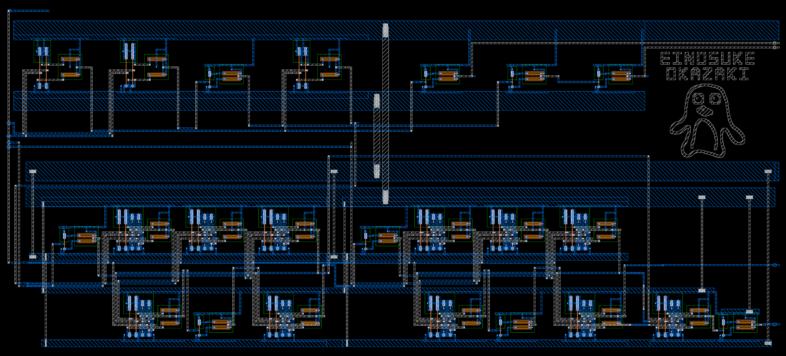

# 平衡3値論理回路 — OpenSUSI TR-1um

1 tritの乗算加算・AND・OR回路です。

| 項目 | 仕様 |
|---|---|
| 演算 | X + A×B + Cin = Sum + 3×Cout |
| 追加出力 | AND=min(A,B)、OR=max(A,B) |
| 論理値 | −1 / 0 / +1 ⇔ −5 / 0 / +5 V |
| 電源 | VDD=+5 V、VMID=0 V、VSS=−5 V |
| 端子数 | 11（共通VSSを除くと10） |
| 割当領域 | 1800 × 1000 µm |
| PDK | [TR-1um](https://github.com/OpenSUSI/TR-1um) dev / `9ef2ac3` |

[提出物](submission/README.md) · [仕様・真理値表](submission/SPEC.md) · [回路図](mac.sch) · [テストベンチ](mac_tb.sch)

