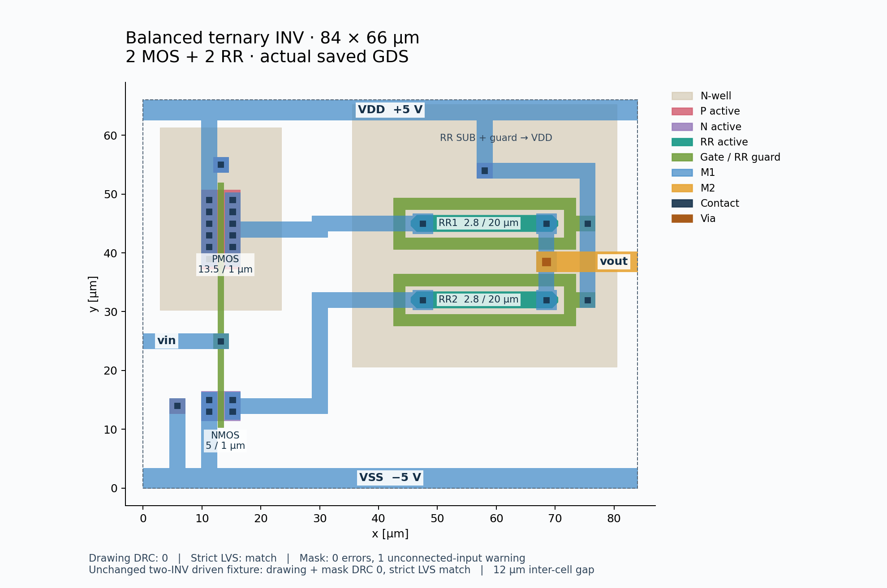

# 再利用用INV primitive

更新：現在はRR長30 µm、外形96×66 µm、DBU 0.001 µm・配置格子0.05 µmです。
以下の旧図・旧座標・旧検証値は更新前の記録です。現行座標は `inverter.ports.json`、再検証は [MAC_IMPROVEMENTS.md](../MAC_IMPROVEMENTS.md) を参照してください。

`inverter.sch`と一致する2 MOS＋2 RRのレイアウトです。正規成果物は
[inverter.gds](../inverter.gds)、top cellは`inverter`です。
外形は **84 × 66 µm = 5,544 µm²**、原点は左下`(0,0)`、DBUと配置グリッドは0.001 µmです。
上位HA/FAに配置するマクロとして素子階層と端子を保持しています。



## 回路とPCell

| 素子 | PCell | W / L [µm] | 基準位置 [µm] | 接続 |
|---|---|---|---|---|
| XM1 | TR-1um `fet_p` | 13.5 / 1 | (13.2,44) | S/B=VDD、G=vin、D→R1 |
| XM2 | TR-1um `fet_n` | 5 / 1 | (13.2,14) | S/B=VSS、G=vin、D→R2 |
| R1 | TR-1um `res_diff` | 2.8 / 20 | (58,45) | XM1.D→vout、SUB=VDD |
| R2 | 同上、同じmasterの別instance | 2.8 / 20 | (58,32) | XM2.D→vout、SUB=VDD |

MOSは単一finger、m=1です。寸法と接続は変更していません。外部パッド・試験負荷・保護素子は追加していません。
今回のprimitiveインターフェース整理に伴い、旧`V+`を`VDD`、旧`V-`を`VSS`へ統一しました。
`VDD=+5 V`、`VSS=−5 V`です。INVにVMID端子はありません。

生成コードはインストール済みPDK `/home/ishi-kai/pdk/TR-1um` のPCellを呼び出します。
PDKコードを複製・変更せず、親cellにwellと配線を追加しています。
PMOS用wellとRR用wellは12 µm離し、PMOS wellのtap、共用RR wellのtap、NMOS bulkのtapをそれぞれ接続しました。
RRのGC囲みも両方ともRR wellと同じVDDへ実配線しています。GCコンタクトはリング外の延長部に置きます。
RR tapのwell enclosureはmask deckに合わせ10 µmを確保しています。

GDS内には7種のPCell variantと11個のchild instanceがあります。
DBUは0.001 µmです。13.5 µm幅のPMOSも丸めずに表現できるため、全素子をlive PCellに戻しています。
[PCell監査](inverter.pcell_audit.json)では公式PCellからの全レイヤXOR 0、
親配線によるMOS channel変更0、GUI読込後のパラメータ復元を確認します。

2026-09-24のdev版対応では、RRリングのGCコンタクトをx=73.5から75.5 µmへ移し、
幅2.6 µmのGC延長でリングにつなぎました。devの`GC.R3`が禁止するRR認識領域内のCOを解消します。
電源配線も接続位置に合わせて移動し、素子寸法・接続・外形は維持しています。

## 配置・端子契約

座標はR0配置のµm値です。機械可読な詳細は[inverter.ports.json](inverter.ports.json)にあります。
端子名の文字は公式LVSの専用label layerに置いています。

| 端子 | 配線layer | label layer | 接続位置 | 利用可能なaccess box (x0,y0,x1,y1) |
|---|---|---|---|---|
| vin | M1 13/0 | 48/0 | (2,25) | (0,23.7,4,26.3) |
| vout | M2 20/0 | 49/0 | (82,38.5) | (80,36.8,84,40.2) |
| VDD | M1 13/0 | 48/0 | (42,64.3) | (0,62.6,84,66) |
| VSS | M1 13/0 | 48/0 | (42,1.7) | (0,0,84,3.4) |

- 上下の電源レールは幅3.4 µmです。M1延長、または必要なmetal enclosureを持つ公式`via_1`で接続できます。
- `vin`のM1は幅2.6 µmです。M2から接続する場合、親cellに`via_1`の3.4 µm M1 landingを追加してください。接続位置(2,25)付近の拡張はdriver fixtureで確認済みです。
- `vout`はM2で右端へアクセスします。RR囲みのVDD配線はM1で、その上をM2が交差します。
- **セルbbox間に12 µm以上**空けます。R0/MX/MY/R180の4セル配置で公式drawing/maskの幾何規則を検証しました。12 µmを絶対最小値として探索したものではありません。
- zero-gap abutment、well共有、拡散共有は許可しません。全instanceのbulk電源は同じVSSにします。
- 反転・回転時は端子座標とaccess boxにも同じ変換を適用します。MX/R180では上下の電源位置が入れ替わります。R90/R270は今回の配置検証対象外です。
- 12 µm gapはセル配置の契約です。親配線追加後は親階層でDRC/LVSを再実行します。gap全域が無条件に配線可能という意味ではありません。

## 検証結果

検証したGDS SHA-256:
`42bc2c653b2c5287d169be09d208bde4e7e9eecf50f5a3238f10762b18e4a5eb`

| 検証 | 結果 | 証跡 |
|---|---|---|
| 単体drawing DRC、公式`run.drc` | 0件 | [単体検証](../reports/inverter_layout.json) |
| 単体strict-port LVS、公式`run.lvs` | Match、2 MOS＋2 RRとW/L一致 | 同上 |
| MDP→公式IP62 mask DRC | ERR 0件、WAR06 1件 | 同上 |
| 12 µm gap・R0/MY/MX/R180の4セル | Drawing GC.ANT 4件のみ、mask ERR 0件、WAR06 4件 | [配置検証](../reports/inverter_placement.json) |
| 変更していないINVを2段接続したdriver fixture | drawing/maskとも0件、strict LVS Match | [driver検証](../reports/inverter_driver.json) |
| 保存PCell図形・パラメータ復元 | DBU変換後の全variant XOR 0、channel変更0 | [PCell監査](inverter.pcell_audit.json) |
| 抽出回路によるngspice | DC/過渡検査PASS | [抽出回路結果](../simulation/inverter_layout/extracted_sim/result.json) |

単体maskの`WAR06: Floating SG Detected`は、外部入力`vin`がMOS gateだけに接続され、単体の中にはactiveへの放電経路がないことを検出しています。
公式ルール・報告項目は変更せず、waiver領域も使わず、この警告を残しています。
したがって単体のmask報告を「全項目0件PASS」とは扱いません。
上位接続の証拠として、2個の同一INVを12 µm gapで配置し、電源と1段目vout→2段目vinを配線し、fixture側だけで1段目vinをVDDに固定した検査では、公式mask報告も0件になりました。
HA/FAでは実際のdriver接続を含めて同じ確認が必要です。

抽出したMOS/RR回路でのDC出力は入力−5/0/+5 Vに対し、+5 V / +67.3552 µV / −5 Vです。
PDKモデル内蔵の寄生成分は含みますが、配線のRC抽出を実施した結果ではありません。

## 再生成と確認

作業ディレクトリをプロジェクトrootとして実行します。`TR1UM_PDK`環境変数でPDK位置を指定できます。
GDSの標準出力先はプロジェクト直下の`inverter.gds`、端子情報等は`layout/`です。

GUIではプロジェクト直下の`inverter.gds`を開き、標準の`TR-1um DRC(Drawing)`と
`TR-1um LVS`を実行できます。LVSの比較回路は標準探索先の`simulation/inverter.spice`に置きます。
回路図を変更したら、次のコマンドでLVS用ネットリストを更新してください。
通常のSPICEシミュレーション用ネットリストとはMOSの書式が異なります。

```sh
python3 scripts/verify_inverter_layout.py --prepare-gui-reference
```

公式GUIマクロをパス指定の上書きなしで実行し、Drawing DRC 0件・LVS一致を確認済みです
（[GUI確認結果](../reports/inverter_gui.json)）。DRCが0件の場合、違反マーカーは表示されません。
旧`layout/inverter.gds`を開いていた場合は、プロジェクト直下のファイルを開き直してください。

```sh
python3 layout/build_inverter.py
python3 layout/audit_inverter.py
python3 scripts/verify_inverter_layout.py
python3 scripts/check_inverter_placement.py
python3 scripts/check_inverter_driver.py
python3 layout/render_inverter.py
```

未配線の4セル配置では、親セルに入力端子を設けていないためdev版DrawingにもGC.ANTが4件出ます。寸法違反は0件です。
単体と未配線の配置検証は、上記警告・未接続入力の検出を保持するため厳格な全件0判定では終了コード1になります。
報告には警告をそのまま保存しています。driver検証は全件0で終了コード0です。
GDSのタイムスタンプにより再保存時のバイトhashは変わり得ます。PCell監査とDRC/LVSは再生成したファイルで再実行してください。

rootの[inverter.gds](../inverter.gds)は完成版です。旧下書きは
[backups/inverter.original.fa1d42c942e9ab4a.gds](backups/inverter.original.fa1d42c942e9ab4a.gds)に保存しました。
元ファイルのSHA-256は`fa1d42c942e9ab4a9fff7b8bccf5fac2eacf4c0068095ff86644179e21ec97ee`です。
途中図はPMOS/NMOS/RR各1 instance、DBU 0.1 µmで、今回の再利用マクロとは別成果物です。
