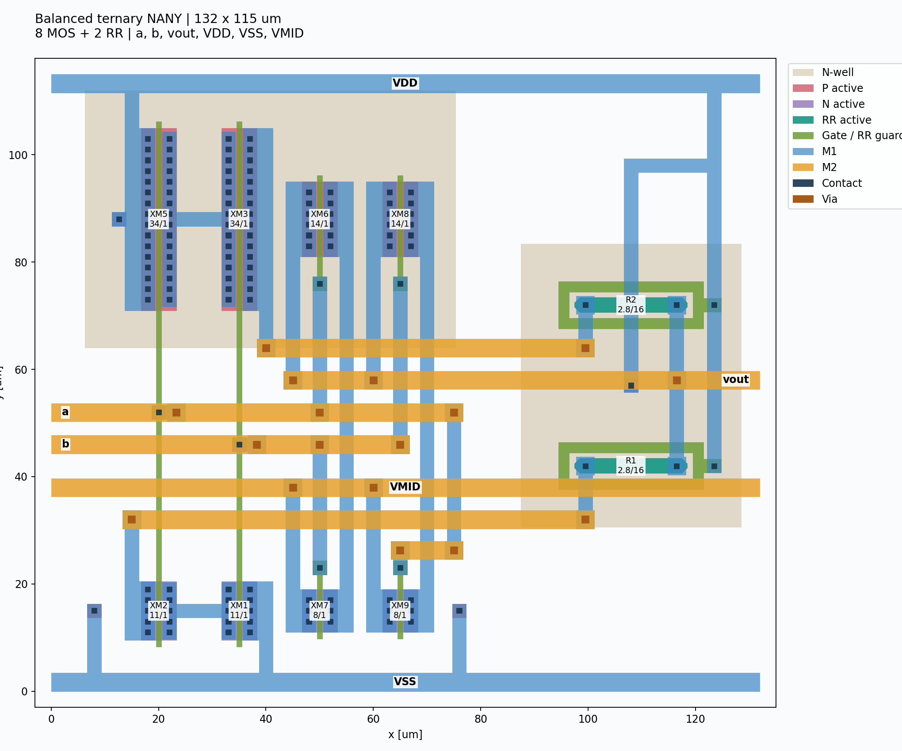

# NANY primitive layout

更新：現在はRR長30 µm、外形148×115 µm、DBU 0.001 µm・配置格子0.05 µmです。
以下の旧図・旧座標・旧検証値は更新前の記録です。現行座標は `nany.ports.json`、再検証は [MAC_IMPROVEMENTS.md](../MAC_IMPROVEMENTS.md) を参照してください。

正本はプロジェクト直下の[nany.gds](../nany.gds)、top cellは`nany`。
外形は **132 × 115 µm = 15,180 µm²**、原点は左下、DBUと配置グリッドは0.001 µmです。
現在の`nany.sch`の8 MOS＋2 RRを寸法・回路接続とも変更せず実装しています。
面積最小を探索した結果ではありません。



## 回路と構造

| 素子 | W / L [µm] | 個数 |
|---|---|---:|
| 主回路PMOS XM3/XM5 | 34 / 1 | 2 |
| 主回路NMOS XM1/XM2 | 11 / 1 | 2 |
| クランプPMOS XM6/XM8 | 14 / 1 | 2 |
| クランプNMOS XM7/XM9 | 8 / 1 | 2 |
| RR R1/R2 | 2.8 / 16 | 2 |

上段がPMOS、下段がNMOS、右側がRRです。PMOSのwellはVDD共通とし、
RR用wellを12.2 µm離しています。RR wellのタップは抵抗2本の間に置きました。
RRのSUBおよびGCリングはVDD、NMOSのbulkはVSSへ実配線しています。
2026-09-24のdev版対応で、RRリングのGCコンタクトをx=121.5から123.5 µmへ移し、
幅2.6 µmのGC延長で接続しました。`GC.R3`が禁止するRR認識領域内にCOを置かない形です。
0 Vクランプの基準VMIDは独立端子です。内部の試験負荷や追加保護素子はありません。

公式TR-1um PCellは変更していません。保存された各PCellの全レイヤを公式再生成形状と比較し、
XOR 0、親セルの追加active 0、MOSゲート領域の変更0を確認しています。
PCellのパラメータも復元可能です（[監査結果](nany.pcell_audit.json)）。

## HA/FAへの配置

詳細な座標・access box・素子配置は[nany.ports.json](nany.ports.json)。

| 端子 | 配線層 | 接続位置 [µm] | 配置 |
|---|---|---|---|
| a | M2 | (2,52) | 左端 |
| b | M2 | (2,46) | 左端 |
| vout | M2 | (130,58) | 右端 |
| VDD | M1 | (66,113.3) | 上端、全幅レール |
| VSS | M1 | (66,1.7) | 下端、全幅レール |
| VMID | M2 | (66,38) | 全幅レール、左右端から接続可能 |

外部accessと電源レールは幅3.4 µm。端子ラベルはM1=48/0、M2=49/0です。
本セルはINVと高さが異なる独立マクロです。HA側で電源配線を接続してください。

- bbox間は12 µm以上を配置条件とします。これは検証した間隔であり、絶対最小値ではありません。
- R0/MY/MX/R180を4個配置したDrawing/maskの寸法チェックを実施済みです。
- 反転時は端子位置も変換します。MX/R180ではVDD/VSSの上下が反転します。
- zero-gap abutment、well共有、拡散共有、90度回転は今回の検証対象外です。
- VSSは全セル共通のbulk電源です。上位配線を追加した後も、その階層でDRC/LVSを行います。

## 検証結果

| 検査 | 結果 | 証跡 |
|---|---|---|
| 公式Drawing DRC | 0件 | [単体検証](../reports/nany_layout.json) |
| 公式strict-port LVS | Match、8 MOS＋2 RR、W/L一致 | 同上 |
| MDP→公式IP62 mask DRC | ERR 0件、WAR06 6件 | 同上 |
| 4方向の12 µm間隔配置 | Drawing GC.ANT 24件のみ、mask ERR 0件、WAR06 24件 | [配置確認](../reports/nany_placement.json) |
| NANYを2段実配線したfixture | Drawing/maskとも0件、strict LVS一致 | [接続確認](../reports/nany_driver.json) |
| 標準GUIマクロ、探索先の上書きなし | Drawing 0件、LVS一致 | [GUI確認](../reports/nany_gui.json) |
| 抽出回路、DCと全72遷移 | PASS | [動作結果](../simulation/nany_layout/extracted_sim/results.json) |

単体の`WAR06: Floating SG Detected`は、外部入力a/bに属するGC領域に対する警告6件です。
入力2本でもGCは複数の独立した図形に分かれているため、マーカー数は2ではありません。
ルールの変更やwaiverで消していません。単体をmask全項目0件PASSとは扱いません。

2段fixtureでは、1段目aをVDD、両段のbをVMIDへ接続し、1段目vout→2段目aを実配線します。
セル内部は同一のまま、これらの接続をfixtureの親セルに追加するとmask警告も0件になります。
これは物理接続の検証であり、HA/FA完成や外部パッド保護の検証ではありません。

抽出回路のDC定常誤差は最大2.486 mV、各論理入力の±0.5 V範囲では最大0.136 V。
72遷移すべてで最終値±0.5 V以内に整定し、1 ns入力遷移の終了後から測った最悪整定時間は
10 fFで7.61 ns、100 fFで8.53 nsでした。入力間の±2 nsスキュー条件も確認済みです。
素子の拡散面積・周囲長によるモデル寄生は含みますが、配線RCの抽出は行っていません。

## 再生成・GUI操作

プロジェクト直下の`nany.gds`をKLayoutで開き、`TR-1um DRC(Drawing)`と
`TR-1um LVS`を実行します。標準LVSの比較回路は`simulation/nany.spice`です。
回路図を変更した場合は次で更新できます。

```sh
python3 scripts/verify_nany_layout.py --prepare-gui-reference
```

```sh
python3 layout/build_nany.py
python3 layout/audit_nany.py
python3 scripts/verify_nany_layout.py
python3 scripts/check_nany_placement.py
python3 scripts/check_nany_driver.py
python3 scripts/check_nany_extracted.py
python3 layout/render_nany.py
```

生成スクリプトは`nany.gds`を再生成して上書きします。手編集を保持したい場合は、
`--out simulation/nany_layout/new_candidate`等で別ディレクトリへ生成してください。
未配線4セルfixtureは親に入力端子を設けていないため、dev版DrawingでもGC.ANTが24件出ます。寸法違反は0件です。
単体・未配線4セルの検証は、残したWAR06・未接続入力の検出により厳格な全項目0判定では終了コード1になります。
driver fixtureは全項目0で終了コード0です。

作業開始時の下書きは[バックアップ](backups/nany.draft.fdef0e72b06282f5.gds)に保持しています。
回路図とシンボルはこのレイアウト作業で変更していません。
