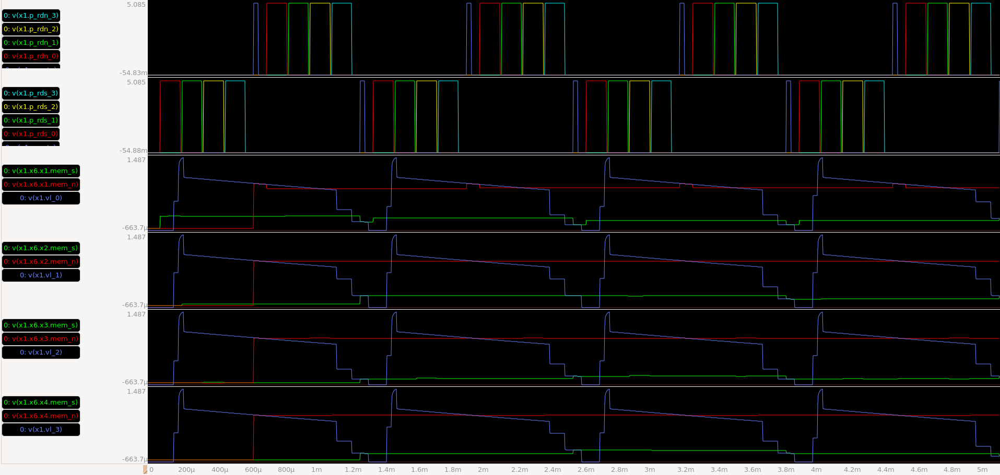
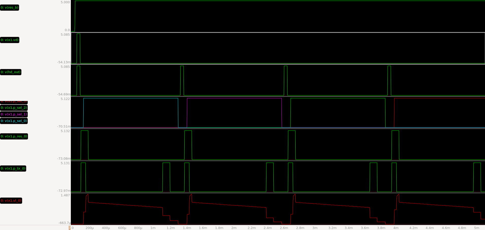
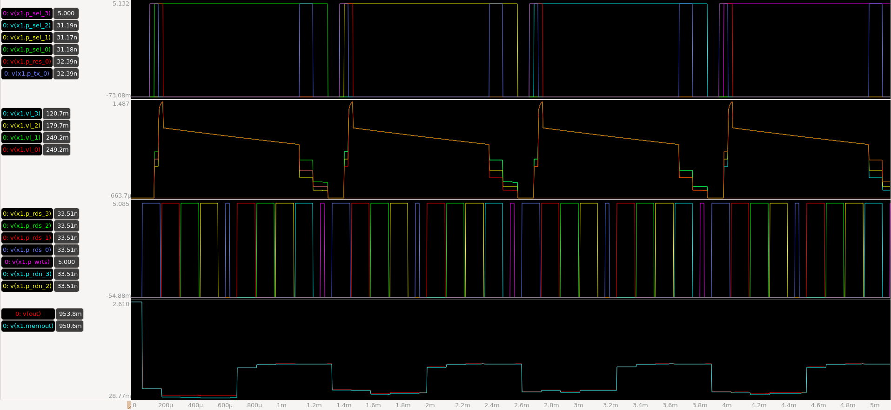

## 概要
2026年8～9月に設計したイメージセンサの設計データ

## Topセル
- 回路図  design/imager.sch
- レイアウト  design/imager.gds
- 全体sim用テストベンチ   design/tb_imager.sch

## レイアウトの注意点
アンプのカスコード接続部分で、MOSが並列に置かれている部分について、省面積化のため、
中間端子（電流源MOSのドレインかつカスコードMOSのソース）は並列接続していない。
電流源MOSのソース同士、カスコードMOSのドレイン同士は並列接続されている。

中間端子同士を接続してもしなくても回路的には等価だが、正規のLVSルールでは上記のレイアウトはFailしてしまう。
LVSルールのうち05_Compare.lvsファイルをコピーし、76行目(`schematic.combine_devices`の前)に`split_gates`を挿入し、NMOS, PMOSを指定してPassさせている。

- 正規ルールでエラー箇所がセル"amp_r2r"のみであること
- カスタムルールでPassすること
の2点を確認し、LVS Passとした。

## 仕様書
[ImageSensor仕様書.pdf](ImageSensor仕様書.pdf)

## 全体の動作確認結果

※あとで各ブロックの動作も含めてデザインレポートにまとめる
